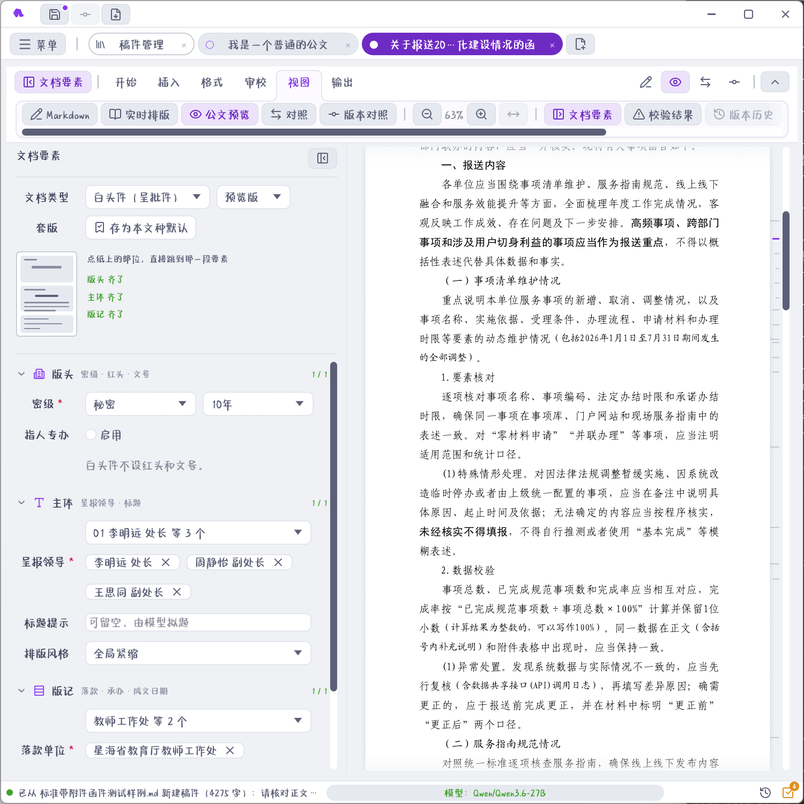
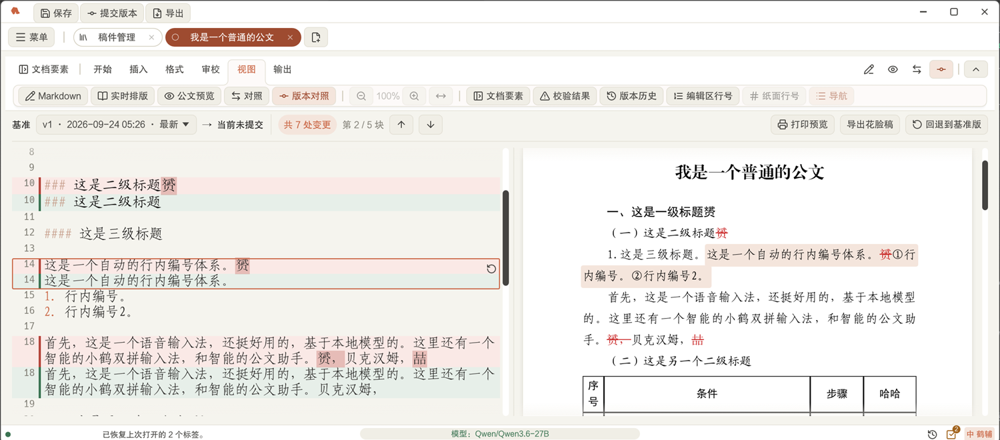
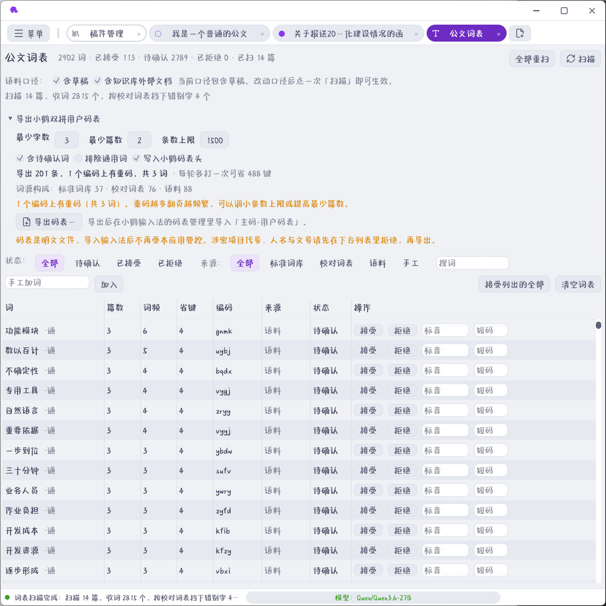
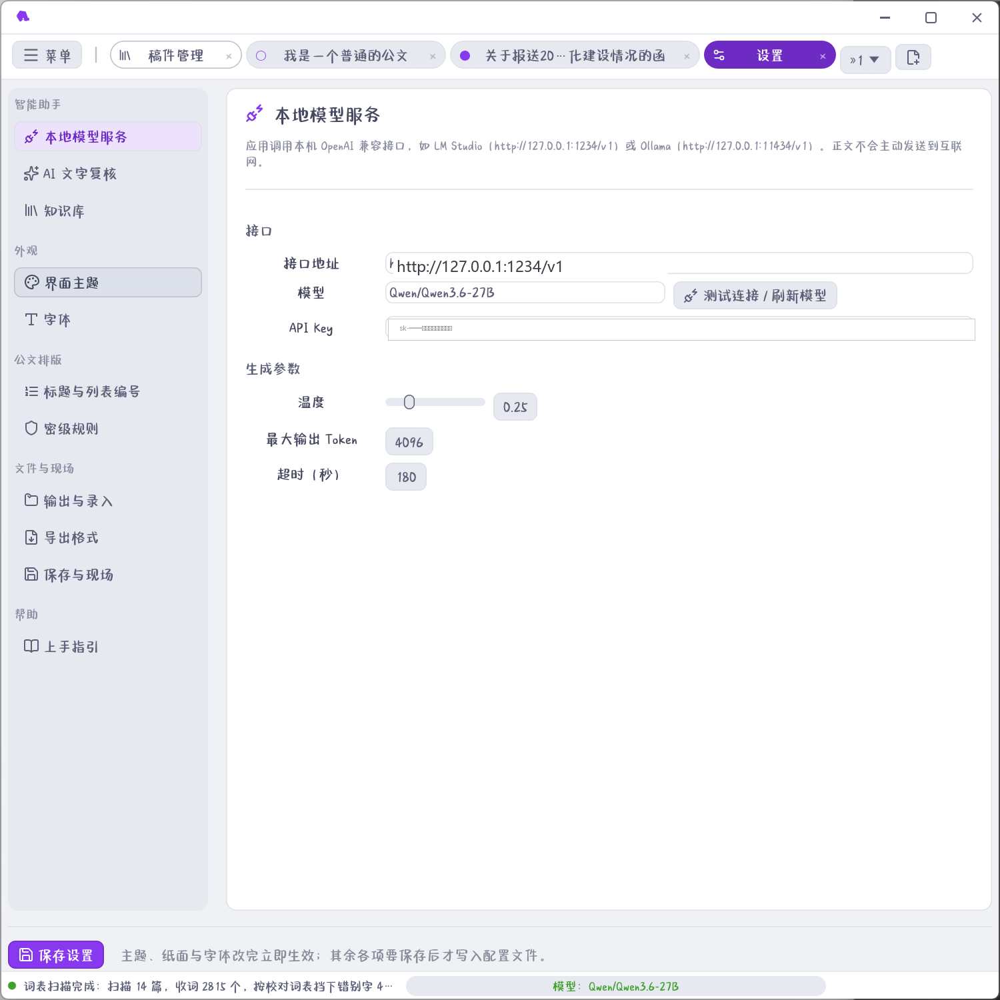
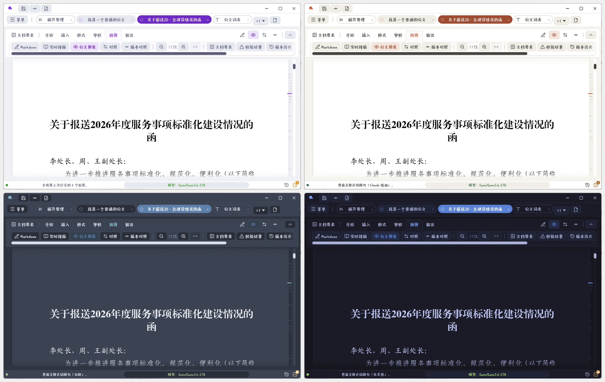

<p align="center">
  
</p>

<h1 align="center">公文助手</h1>

<p align="center">
  <strong>把办文规则交给程序，把判断与表达留给人。</strong><br/>
  面向机关办公室、综合科与文秘人员的离线公文工作台：<br/>
  从拟稿、核稿、送签到印发、归档，用确定性规则守住要素、版式与流程边界。
</p>

<p align="center">
  <a href="https://github.com/billowsand/gongwen/releases"></a>
  <a href="https://github.com/billowsand/gongwen/actions/workflows/ci.yml"></a>
  
  <a href="LICENSE"></a>
</p>

<p align="center">
  <a href="#为什么是公文助手">业务价值</a> ·
  <a href="#一篇公文怎样在这里走完">办文流程</a> ·
  <a href="#界面一览">界面一览</a> ·
  <a href="#快速开始">快速开始</a> ·
  <a href="docs/manual.md">使用手册</a>
</p>

<p align="center">
  
</p>

<p align="center"><sub>同一份稿件里完成 Markdown 起草、公文纸面预览、要素填报、校验定位与版本对照。</sub></p>

## 为什么是公文助手

一篇公文从「写完」到「能发」，中间还隔着多轮核稿：主送、抄送有没有串位，文号、日期、密级是否合规，附件引用能否对上，落款是否跨页，印发份数有没有算错。很多问题并不难，却分散在全文和不同办文节点里；越临近送签，越依赖经办人的记忆与耐心。

公文助手不把这些风险再包装成一张更长的检查表，而是把规则做进编辑、预览和导出流程：

| 办文现场 | 系统怎样接住 | 业务结果 |
| --- | --- | --- |
| 起草时，正文与要素分散填写，改一处容易漏一处 | 单位、人员、文号、密级、日期独立建模，正文只承载正文 | 要素不再靠复制粘贴维持一致 |
| 核稿时，需要在几十个细节间来回跳转 | 必错、疑似、提示分级呈现，逐条定位到问题位置 | 核稿从「通篇找错」变成「按项处置」 |
| 送签前，既要看内容，也要看落到纸面后的效果 | 预览、Word、PDF 共用编号、栏宽和版式度量 | 屏幕所见更接近最终成品 |
| 印发时，份数、份号、页码与版记必须互相吻合 | 自动合计印数，涉密件逐份编号，每份独立归页 | 减少最后一道环节的机械差错 |
| 改稿时，领导关心「改了什么」，经办人还要保留过程 | 提交版本、增删对照、花脸稿与基准版回退 | 修改有据可查，送审表达更清楚 |
| 归档时，定稿与盖章扫描件容易散落 | 草稿 → 发布 → 归档，终态冻结并集中管理盖章件 | 一篇公文形成完整、可追溯的闭环 |

> [!IMPORTANT]
> **AI 不是规则的替代品。** 它只能提交待采纳的修订建议，不能直接改正文，也不能改单位、人员、文号、密级、日期等公文要素；任何 AI 产物落地前仍要经过确定性闸门。

## 一篇公文怎样在这里走完

| 01 立稿 | 02 拟稿 | 03 核稿 | 04 送签 | 05 印发 | 06 归档 |
|:---:|:---:|:---:|:---:|:---:|:---:|
| 选文种<br/>建要素 | Markdown 写作<br/>实时预览 | 规则扫描<br/>逐条处置 | 版本对照<br/>导出花脸稿 | Word / PDF<br/>打印与份号 | 冻结定稿<br/>收存盖章件 |

这条路径里，程序负责可重复验证的事情，人负责政策判断、事实确认和最终表达。即使不配置任何模型，排版、校对、版本管理、导出和归档也能完整使用。

## 核稿保障：把容易出错的地方变成确定性检查

以下检查不是泛泛的「AI 提醒」，而是由本地程序按字段、词表和文档结构逐项判定。结果进入统一审校面板，保留「必错 / 疑似 / 提示」三档，不让低风险提示淹没真正需要处置的问题。

<details open>
<summary><strong>份数、单位与人员：一次维护，多处一致</strong></summary>

<br/>

**份数与印发**

- 「共印 X 份」**不用填也不用算**：主送 + 抄送 + 承办单位自动合计，表单一改份数跟着变，永远不会两处对不上；
- 涉密件勾选「逐份编号」，导出 PDF 自动含 N 份、份号 01…N，**每份页码各自归 1**。

**单位名称与排序**

- 主送、抄送多选时**勾选顺序不影响输出**——成稿顺序一律按词库里的排序走，排名先后只维护一处；
- 选下级单位自动补全上级全称；同一上级的多个下级用顿号连接、跨上级用逗号分组，不会重复罗列上级名；
- 外部行文自动改用单位的「对外名称」；同一单位同时出现在发文、主送、抄送里会被拦下——**不能给自己发文**。

**人名与电话的一致性**

- 联系人从词库选人就自动带出绑定电话，电话框只读回显，从源头杜绝抄错；
- 手填电话与词库中该人的号码不一致必报；联系人必须属于同行承办单位（人随事走）；联合发文的承办单位和联系人成对录入，数量天然一一对应。

</details>

<details open>
<summary><strong>文号、日期与行文语气：规则随文种和方向切换</strong></summary>

<br/>

**文号、密级、日期**

- 文号按「机关代字〔年份〕序号」三件套录入，即时拼出成品预览「X政函〔2026〕12号」；年份必须四位、序号只能填数字；正文里写成方括号 `[2026]` 会提示改六角括号〔〕；
- 密级与保密期限挂钩：秘密 ≤ 10 年、机密 ≤ 20 年、绝密 ≤ 30 年，超上限直接拦；
- 成文日期只在导出这一刻检查：过期必报（精确到「距今 N 天」），编辑期间不打扰；正文里残留的「今天 / 明天 / 下周三」必报并要求换算成具体日期，日期与星期不符也报。

**结语与行文语气**

- 白头件、红头呈批件缺「妥否，请指示。」必报；出现两处以上请示结语报「疑似一文多事」；**普通文种里夹带请示结语直接判必错**；
- 函是平行文：对不相隶属单位写「要求 / 责成 / 责令 / 务必」会提示宜写「请贵单位」；上行文提事项应用「建议、请、恳请」；
- 同一篇里既称「贵局」又称「你局」必报——单看每句都对，只有通读全文才发现前后不一。

</details>

<details>
<summary><strong>附件与纸面版式：引用、落款、页码都要落到成品上</strong></summary>

<br/>

**附件**

- 附件名称**自动写**：正文结束后、落款之前自动列「附件：×××」，取自附件区的正式标题，不用在正文里手抄；
- 正文写「附件共三份」实际只有两份、「见附件 2」实际只有一份——这类对不上的引用必错。

**版式细节**

- 正文没跨到第二页时，落款页自动标注「（此页无正文）」；正文跨页则不出，按实际量高判定，不靠猜；
- 段末孤字双保险：编辑时即时粗估提示，编译后由 TeX 排版器**实测坐标回传**精确结果——是「量过」，不是「估的」；
- 页码严格按 GB/T 9704—2012 编排：一字线、上距版心下边缘 7 mm，双面打印页码居外侧。

</details>

## 排版：丰富灵活，但一致性不打折

**紧缩模式分两档**：「全局紧缩」把全篇最深一级标题与紧随的正文并为一行；「节内紧缩」以节为边界各自合并，只收局部。合并后的段落保留标题与正文各自的字体，三个输出端（预览 / Word / PDF）效果一致。

**编号全自动**：标题编号链「一、→（一）→ 1. →（1）」由导出器统一生成——先清掉正文里残留的旧编号再重编，增删段落永不跳号；正文列表不分有序无序，一律按设置里的编号样式排。万一别处粘来的手写序号有跳号、重号、错序，有专门规则全篇兜底。

**表格不用调**：列宽按内容自动排版，横向合并的单元格把宽度需求按跨度摊到各列，合并表头不会单独撑大某一列；表格在竖页排不下时**该附件自动转横页**，下一个附件前恢复竖页——逐附件独立判定，打印时横页自动放正。

**长单位名撑不破版式**：承办区三栏宽度一次算定、三端共用——联系人栏姓名归一（两字名加空格、四字名压缩），电话栏按最长号码定宽，承办单位栏一律不换行、放不下就按比例横向压窄字形。标题超出一行不到两个字宽时横向压缩字形保持单行；两行标题自动枚举断点，首行不短于末行、头不轻脚不重。

## 开箱即用：不装 Office，也能出成品

- **内置完整的排版引擎与字体**：发布包自带 Tectonic 编译器、固定版本的离线 TeX 环境和全套公文字体（方正小标宋、黑体、楷体、仿宋、宋体），**没有装 Word 的机器上也能直接编译出 PDF**；Windows 安装包不足百兆。
- **生僻字不丢字**：仿宋、楷体是 GB2312 字库，人名里的「喆」「赟」在上面没有字形，排版器会把字直接丢掉——本程序给所有字体位置挂了兜底字体（内置宋体，覆盖全部 GBK 汉字），预览、Word、PDF 三端都排得出来；要排 GBK 以外的字，可在设置里另选一支本机字体兜底。
- **应用内直接打印**：Windows 走原生 GDI 打印对话框（可选打印机、页码范围、份数），与装没装 PDF 阅读器无关；macOS 与 Linux（含麒麟等国产系统）走 CUPS。
- **PDF 应用内预览**：纯 Rust 渲染，连续滚动、跳页、缩放，导出的成品和归档的盖章扫描件都能在标签页里直接翻看。
- **导入旧材料**：Word / Excel / PPT / ODF / RTF / EPUB / CSV 等 23 种格式可直接转成 Markdown 新建文档。
- **界面随人**：界面字体直接用本机字体，不随应用打包；主题见下文「界面一览」。

## 文稿管理：从起草到归档的全流程

- **版本管理**：随时提交版本（带名称和备注），任意两版增删对照；「导出花脸稿」把删掉的字画波浪线、新增的字套方框排成一张纸送签，字体行距与定稿完全一致；可一键回退到基准版。
- **永不丢稿**：改动定时自动保存；新稿一动就静默建档；退出程序时逐篇汇总提示「未保存 / 未提交版本」；下次启动恢复上次打开的全部标签现场。
- **同事间共享**：稿件导出为 ZIP（可设密码），**包内随附完整标准词库**，另一台电脑导入时按编码与姓名增量合并，不覆盖对方已有词条——人换电脑、文换机器，要素保持一致。
- **归档闭环**：草稿 → 发布 → 归档全生命周期；归档是唯一终态，归档后标题、日期、正文一律冻结，只可增删盖章扫描 PDF 附件；批量导出时盖章件自动以「（盖章）」命名区分。

## AI：只解决传统大模型在公文里没解决的问题

AI 能力放在确定性能力之后，因为它的设计前提是「先管住，再帮忙」：

- **三条红线**：AI 永远不直接写入正文（只提「修订建议」，逐条采纳才落地）；永远碰不到单位、人员、文号、密级、日期等公文要素；产物落地前必须过事实比对、要素校验、词表复扫三道确定性闸门，采纳后还会对改动段落重跑校验，引入新问题自动回滚。**宁可漏报，不可误改。**
- **不掌握真实数据就不许写数据**：起草前强制「提取事实单 → 人工逐项确认」；拿不准的地方必须写「【待核实：…】」占位，签发前「存疑清零」是流程里的一关。
- **力度词按行文方向自动切换**：函用「请贵单位」，请示用「建议」，通知用「要」。
- **知识库与仿写**：本机知识库检索（RAG）辅助起草；四种仿写策略（结构仿写 / 同类改稿 / 局部更新 / 续期换届）；小模型逐句复核语病，温度锁 0，六道程序闸门拦截幻觉。
- **数据不出本机**：默认连接本机 LM Studio / Ollama（OpenAI 兼容接口），正文不会主动发送到互联网，涉密单位可用。

## 技术：首次实现 Markdown 到公文的精准还原

- **预览就是成品**：预览不是「大概其的样子」，而是把 Markdown 连同表单锁定的要素**按导出后的样子画出来**——标题编号、承办区栏宽、版式度量在预览、Word、PDF 三端共用同一套计数器与换算，屏幕上看到什么编号，印出来就是什么编号。
- **刻度条导航，替代 Word 导航窗格**：预览右缘一列极淡细刻度映出全文结构（一条一个标题、按层级定长短、当前位置高亮），鼠标靠近推出亚克力大纲板、挪开即收回——不占版心宽度，不干扰推稿子；导航里的字体随纸上层级（一级黑体、二级楷体），附件区段单独标出。
- **孤行不靠估算**：TeX 编译时埋入探针坐标，编译后类文件把末行位置回写给应用，实测结果压住粗估提示。
- **导出闸门只有一道**：「正文为空」。要素缺失、名称不规范都只进审校面板提示，不挡编译——你往往正是要拿这份 PDF 去看版式、请人过目。

## 界面一览

界面不是把 Word 的按钮重新排一遍，而是围绕办文动作组织：左侧管要素，中央看纸面，右侧处置问题；需要对照时，再切换到大纲、修订建议或版本视图。常用动作都围绕当前稿件展开，不必在多个工具之间来回搬运内容。

### 要素与纸面并排：填的是字段，看到的是成品

<p align="center">
  
</p>

左侧按「版头 / 主体 / 版记」分组填写，缩略导航图会标出缺项所在区段；右侧同步呈现公文纸面。文种改变后，只显示当前文种需要的字段和规则，避免让经办人在无关选项里找内容。

### 校验结果不是一串提示，而是一张待办清单

<p align="center">
  
</p>

「必错」优先暴露格式和要素冲突，「疑似」保留人工判断空间，「提示」承接版式与表达建议。每一项都带原文、依据与定位入口；能确定替换的才提供修改，不能确定的只提醒，不擅自替作者下结论。

### 从正文结构到改稿痕迹，都有专门视图

<table>
  <tr>
    <td width="50%"></td>
    <td width="50%"></td>
  </tr>
  <tr>
    <td valign="top"><strong>大纲不挤占版心</strong><br/>右缘刻度映出标题层级与当前位置；鼠标靠近才展开完整大纲，长文定位之后立即收回。</td>
    <td valign="top"><strong>改了什么，一眼说清</strong><br/>基准版与当前稿逐处对照，可只看变化、回退基准版，或导出符合送审习惯的花脸稿。</td>
  </tr>
  <tr>
    <td width="50%"></td>
    <td width="50%"></td>
  </tr>
  <tr>
    <td valign="top"><strong>词表越用越顺手</strong><br/>从标准词库、校对词表与语料收词，累计词频和省键数；人工确认后可导出输入法码表。</td>
    <td valign="top"><strong>模型服务留在本机</strong><br/>对话、文字复核、Embedding 与 Rerank 分开配置；不配置模型也不影响确定性功能。</td>
  </tr>
</table>

### 十二套界面主题，明暗随心

浅色、深色各一段共 12 套主题，菜单「外观主题」即点即换；公文纸面可随主题联动，也可强制明 / 暗——夜里推稿子不刺眼，白天投影不打折。

<p align="center">
  
</p>

## 文种、导出与平台

| 维度 | 支持情况 |
| --- | --- |
| 文种 | 公函、电话通知、普通公文、会议议程、白头件（呈批件）、红头呈批件、研究报告（共 7 种；研究报告可导出 TeX/PDF 与 Word） |
| 导出 | Markdown、DOCX（Word）、TeX、PDF（内置 Tectonic，兼容本机 XeLaTeX）、花脸稿、稿件 ZIP |
| 校对 | 内置 155 条校对词表（错别字 / 近义混淆 / 语病 / 套话虚词 / 称谓规范 / 公文用语六组，必错一键替换）+ 25 条文档级规则 |
| 导入 | 23 种格式文件新建文档（Word / Excel / PPT / ODF / RTF / EPUB / CSV…），词库与校对词表支持 Excel 导入导出 |
| 平台 | Windows x64 安装程序、macOS Apple Silicon DMG、Linux ARM64/AMD64 deb（含麒麟等国产系统打印兼容）、Arch/Omarchy 运行包与 PKGBUILD（均附 SHA-256） |

## 快速开始

**下载安装**：到 [GitHub Releases](https://github.com/billowsand/gongwen/releases) 下载对应平台安装包，安装后即可离线使用。各平台详细说明见 [安装指南](docs/install.md)。

**首次使用三步走**：

1. 在「标准词库」维护本单位的单位与人员（可下载 Excel 模板批量导入）；
2. 「起草」页选文种、填要素——写到哪一步，校验就跟到哪一步；
3. 需要 AI 起草时，在「设置」中配置本地模型服务（LM Studio / Ollama）；不配也能用，排版、校对、导出全部功能不受影响。

**从源码构建**：Rust stable（edition 2024），`cargo run` 即可。

## 文档

- [使用手册](docs/manual.md)：完整用户手册，21 章 + 3 附录，覆盖写作全流程、AI 能力、词表知识库与设置。应用内也可读：菜单 →「使用帮助」或按 `F1`
- [安装指南](docs/install.md)：各平台发布包、Arch/Omarchy 与 fcitx5 候选窗说明、从源码构建
- [AI 架构设计](docs/ai-architecture.md)：三条红线、确定性闸门与修订建议总线的设计细节

## 项目结构与开发

```text
src/                应用代码（约 9.7 万行 Rust，1000+ 自动化测试）
assets/             图标与界面资源
examples/           示例公文
vendor/             随仓库分发的第三方源码（mdx、字在输入法内核）
scripts/            版本号更新与便携包构建脚本
runtime/            便携 TeX 运行时、字体与输入法词库（不进入 Git）
gonghan-gwa.cls     LaTeX 文档类
config.example.json 示例配置
```

```powershell
cargo fmt --all -- --check
cargo clippy --all-targets -- -D warnings
cargo test --all-targets
```

GitHub Actions：CI 在 Windows / Linux / macOS 三平台执行格式、静态检查和测试；推送 `v*` 标签后自动构建各平台安装包与 SHA-256 校验和并创建 Release。

## 许可

本项目以 [GPL-3.0-or-later](LICENSE) 协议开源。改用 GPL 是因为随包集成了字在输入法（青简）
的拼音引擎与词库，那部分代码是 GPL-3.0-or-later，链接进同一个可执行文件后整个程序都按 GPL 分发。
第三方组件、随包数据与字体的许可与署名见 [THIRD_PARTY_NOTICES.md](THIRD_PARTY_NOTICES.md)。
