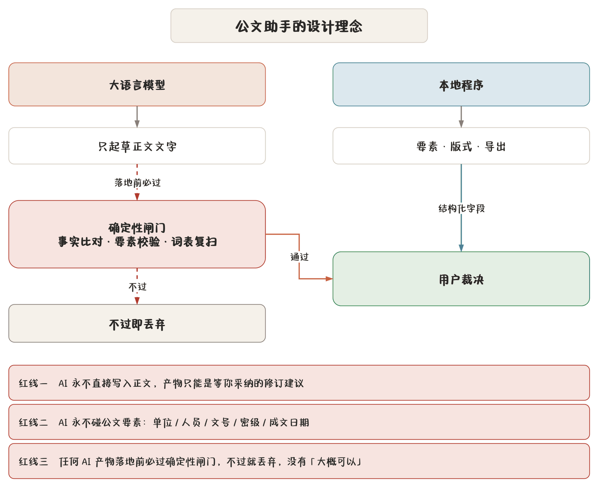

## 这是什么

公文助手是一台**离线运行**的中文公文写作桌面应用。它把「写公文」这件依赖经验、容易出错的事，拆成两半：

- **模型只负责起草正文。** 大语言模型写出来的是草稿文字，永远是待你采纳的建议。
- **行文要素、版式规则与导出结果由本地程序控制。** 文号、密级、成文日期、版头版记、页码字体——这些决定一份文件像不像公文的东西，一个字都不交给模型。

程序不联网也能用。模型接的是本机的 LM Studio 或 Ollama，稿件库、词库、知识库全部存在你自己机器上。

## 设计理念

传统做法是把公文连同格式要求一股脑丢给大模型，再祈祷它排对版式、写对文号。实际结果是：版头时有时无、密级标注随缘、人名单位写法前后不一、导出的 Word 花掉。

公文助手反着来：

1. **要素由你填，程序记。** 发文单位、机关代字、文号序号、主送抄送、承办联系人、密级与保密期限——这些是结构化字段，存进配置，按文种保存成默认模板。模型根本看不到它们，更改不了它们。
2. **版式由程序排，规则写死。** 从 Markdown 到公文版式的映射是确定性的：标题用小标宋、一级标题黑体、二级标题楷体、正文仿宋，页码宋体，版头反线、版记短线的位置按规范算。同一份稿子导出一百次，版式一模一样。
3. **校验是裁判，不是参考。** 要素缺了、称谓不规范、日期写法不对，程序当场指出。这些规则不因模型说什么而放宽。

## AI 的三条红线

AI 能力在这个程序里是**加装件**，不是地基。三条红线是硬约束，写在代码路径上：

> **红线一** AI 永远不直接写入正文。它的产物只能是需要你采纳的「修订建议」，你点接受之前，正文一个字都不变。

> **红线二** AI 永远不碰公文要素。单位、人员、文号、密级、成文日期这些字段模型碰不到，也回写不了。

> **红线三** 任何 AI 产物落地前必须过确定性闸门：事实比对、要素校验、词表与规则复扫。闸门不过就丢弃，没有「大概可以」。

推论是：**确定性规则是 AI 的裁判，不是竞争者。** 不会为了迁就模型的输出而放宽校验规则。详见 [AI 的边界与保障](chapter:12-ai-guard)。

## 数据只在本机

- 配置与稿件库在系统配置目录的 `LocalTools/GongwenAssistant/` 下，路径见 [数据、备份与迁移](chapter:21-data)。
- 插入的图片、PDF 附件复制进同一目录，文档里只存相对路径。
- 埋点（检查器使用统计）留在本机单独文件，不上传。
- 导出的稿件 ZIP 可以设密码；密码若选择记住，也只写在本机一个权限受限的文件里。

「关于公文助手」弹窗里那句话是认真的：**本软件为内部使用工具，所有数据仅保存在本机。**

## 谁适合用

- 经常写公函、通知、请示、呈批件，被版式和要素折腾过的人；
- 要出研究报告（含数学公式、参考文献）的人；
- 希望单位名称、人名、电话一次维护、处处一致的人；
- 想用 AI 提效但不放心把要素交给模型的人。

若你只想快速出第一份稿子，直接看 [五分钟出第一份稿子](chapter:03-quickstart)。
