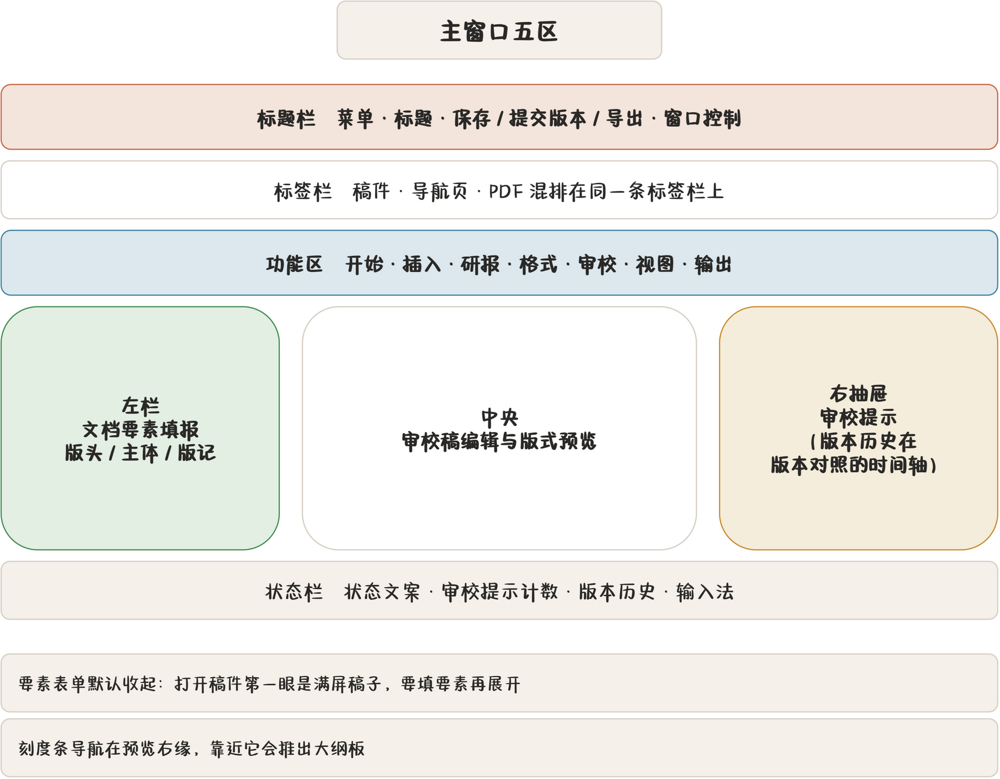
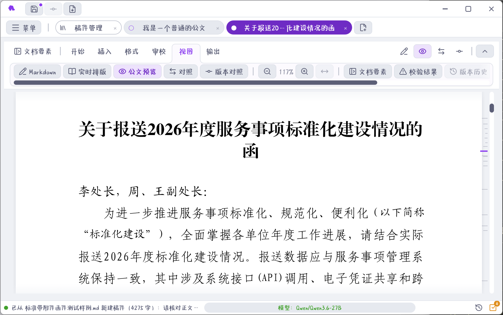

## 窗口五区

启动后的主窗口从上到下是这样的：

| 区域 | 在哪 | 干什么 |
|---|---|---|
| 标题栏 | 最顶 | 菜单按钮、窗口标题、保存 / 提交版本 / 导出快捷入口、窗口控制 |
| 标签栏 | 标题栏下 | 已打开的稿件、导航页、PDF 混排在同一条标签栏上 |
| 功能区 | 标签栏下 | 开始 / 插入 / 研报 / 格式 / 审校 / 视图 / 输出 七个分区 |
| 左栏 + 中央 | 主体左侧与中间 | 左边文档要素填报区，中央审校稿编辑与预览 |
| 右抽屉 ×2 | 主体右侧 | 版本历史、审校提示，都可收起 |
| 状态栏 | 最底 | 状态文案、审校提示计数、版本历史入口、输入法状态 |

功能区第二行可以整体收起，收起后只剩分区卡标题，正文能多出一条工具栏的高度。

## 起草页长什么样

打开一篇稿件后，中央是**审校稿**——你的 Markdown 正文就在这里写。左边是要素表单，右边是抽屉。

要素表单**默认收起**。这是有意的：打开稿件第一眼应该是满屏的稿子，而不是一堆输入框。要填要素时点功能区左端的开关展开。

展开后，表单按纸面部位分三段：

- **版头**：密级、红头、文号；
- **主体**：主送、标题、正文体例；
- **版记**：抄送、承办、落款、成文日期。

表单顶部有一张**版面缩略导航图**：一张小纸画成三色块，点哪块跳哪段，缺项在图上标出来。填的时候随时知道自己在纸的哪个位置。

## 标签模型

标签栏上有三类标签，混排在一起：

- **稿件**：打开的一篇公文。标签上带状态标记（未保存是空心圈），双击可改名。
- **导航页**：稿件管理、标准词库、校对词表、公文词表、AI 管理、知识库、设置、使用帮助。同一页不会重复开，已经开着就切过去。
- **PDF**：应用内打开的 PDF 查看器，比如导出的成品或盖章扫描件。

这么设计是为了**看设置不必丢掉稿件上下文**：切到设置改个字体，再点回稿件标签，稿子还在原来的位置。

八个导航页一览：

| 页面 | 管什么 |
|---|---|
| 稿件管理 | 稿件库：草稿、发布、归档、版本、盖章附件、ZIP 导入导出 |
| 标准词库 | 单位树、人员与联系方式，一次维护多处一致 |
| 校对词表 | 错别字、近义混淆、语病等六组校对规则 |
| 公文词表 | 从稿件收词，导出输入法码表 |
| AI 管理 | 优化提示词库与内置输出标准 |
| 知识库 | 导入历史成稿、建索引、检索与问答 |
| 设置 | 模型、字体、主题、密级、输入法等十三个分区 |
| 使用帮助 | 你正在读的这份手册（`F1` 随时打开） |

## 五种视图

中央区有五种显示模式，在功能区右端或「视图」分区切换：

| 视图 | 看到什么 | 适合 |
|---|---|---|
| 源码 | 带语法高亮的 Markdown | 写稿、改结构 |
| 实时排版 | 非活动行按公文版式排，只有光标行显示标记 | 边写边看版式 |
| 版式预览 | 按公文字体行距渲染的纸面效果 | 对版、看成品 |
| 分栏 | 左源码、右版式 | 对照着改 |
| 版本对照 | 左栏 diff（可改字、可逐块还原）、右栏花脸稿预览 | 看自己改了什么 |

细节见 [拟稿：源码编辑与五种视图](chapter:06-editor)。预览区右缘还有一条**刻度条导航**，鼠标靠近会推出大纲板，点标题跳段落。

## 主题与纸面

十二套主题即点即换，菜单底部「外观主题」或设置页都能切。明色七套、深色五套，切换立即生效并保存。

**纸面明暗**是另一回事：屏幕上的公文预览可以跟随主题、白纸黑字或深色纸面，但**导出一律白纸黑字红头**。深色纸面只影响你看屏幕的舒适度，不会把红头印成灰的。

## 界面字体

界面字体不随应用打包：Windows 默认微软雅黑，Linux 默认 Noto Sans SC，macOS 默认苹方，也可以在设置里另选本机字体。屏幕上的公文预览用的是另一套**公文字体**（见 [设置全解](chapter:20-settings) 的字体分区），两套互不干扰。
