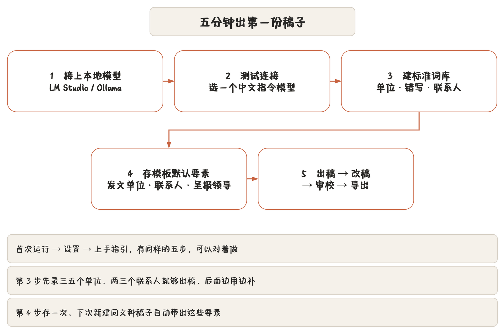

## 五步流程

第一次用这个程序，按下面五步走一遍就能出第一份稿子。设置页「帮助 → 上手指引」里也有同样的五步。

### 1. 接上本地模型

到「设置 → 本地模型服务」填接口地址：

- **LM Studio**：先启动 Local Server，地址一般填 `http://127.0.0.1:1234/v1`。
- **Ollama**：先执行 `ollama serve`，地址填 `http://127.0.0.1:11434/v1`。

对话、Embedding、Rerank 三个配置互相独立，不用模型可以留空。Ollama 的接法有专门说明，见 [知识库与问答](chapter:18-knowledge)。

### 2. 测试连接并选模型

点「测试连接 / 刷新模型」，从下拉里选一个**中文指令模型**。起草用大模型，「AI 文字复核」另配一个小模型也行（不配就都走起草模型）。

连不上的排查：服务有没有起来、端口对不对、防火墙拦没拦。详见 [附录 B 常见问题](chapter:b-faq)。

### 3. 建标准词库

到「标准词库」页维护三样东西：

- **单位全称**（含简称、别名、机关代字、层级编码）；
- **常见错写**（进了校对词表的错误写法）；
- **联系人电话**（人员挂在承办单位下）。

这一步是「一次维护，多处一致」的来源：要素表单的候选、AI 的事实闸门、校对词表、公文词表合并，都从这里取。词库可以等下再细调，先把最常用的几个单位和人录进去。

也可以用 Excel 批量来：「下载空白模板」→ 填好 → 「导入 Excel」。见 [标准词库](chapter:15-vocabulary)。

### 4. 为每类模板存默认要素

在起草页左栏选好文种，把发文单位、联系人、呈报领导这些**每次都不变**的字段填一次，然后保存为该文种的默认配置。下次新建同文种的稿子，这些字段自动带出来。

七种文种的差别见 [立稿与要素填报](chapter:05-profiles)。不熟的话先用**公函**或**普通公文**。

### 5. 出稿、改稿、审校、导出

1. **生成草稿**：用「AI 起草工作台」或直接在中央区写 Markdown。工作台五种工作流见 [AI 起草工作台](chapter:13-ai-workbench)。
2. **在右侧改稿**：正文永远在你自己手里，AI 给的是建议。
3. **处理审校提示**：右下状态栏点开审校抽屉。**必错**级清零，**疑似**级自己判断，**提示**级可整组关掉。见 [核稿：审校与校验](chapter:09-proofread)。
4. **导出签发稿**：功能区「输出」分区选格式，点导出。见 [导出、打印与文件命名](chapter:11-export)。

## 一个最小例子

假设要发一份商洽函，最快路径：

1. 菜单 → 新建空白文档（`Ctrl+N`），文种选**公函**；
2. 左栏版头填机关代字与序号（比如「办函〔2026〕12 号」），主体填主送单位，版记填承办与联系人；
3. 中央区写正文，`#` 起标题，正文写商洽事项；
4. 点右下角审校抽屉，把必错项一键替换掉；
5. 功能区「输出」勾上 DOCX 与 TeX，点导出。

输出目录下会多一个以函号命名的文件夹，里面是 `.docx`、`.tex`、`.pdf` 与源码包。命名规则见 [导出、打印与文件命名](chapter:11-export)。

## 接下来读什么

| 你想 | 看 |
|---|---|
| 弄清一份公文从拟到归档怎么走 | [办文全流程与 SOP](chapter:04-workflow) |
| 把要素填对，让文种选对 | [立稿与要素填报](chapter:05-profiles) |
| 熟悉编辑器与功能区 | [拟稿](chapter:06-editor)、[功能区](chapter:07-ribbon) |
| 用好 AI | [AI 的边界](chapter:12-ai-guard)、[AI 起草工作台](chapter:13-ai-workbench) |
| 备份与换机器 | [数据、备份与迁移](chapter:21-data) |
