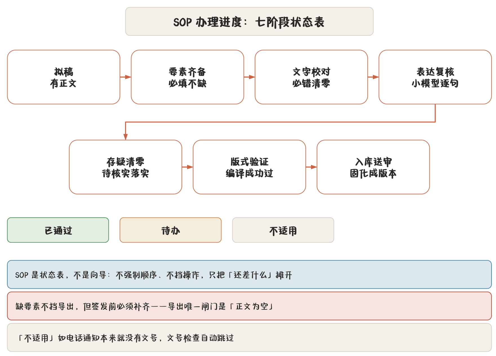

## 六步办文

一份公文在这里从无到印发归档，对应六步：

| 步 | 环节 | 在程序里做什么 |
|---|---|---|
| 01 | 立稿 | 新建空白 / 从文件导入 / 基于已有公文新建，选文种、填要素 |
| 02 | 拟稿 | 源码或实时排版写正文，插表格图片附件，AI 起草与润色 |
| 03 | 核稿 | 处理审校提示、要素校验、存疑清零、AI 文字复核 |
| 04 | 送签 | 提交版本、版本对照、导出花脸稿送审 |
| 05 | 印发 | 导出 DOCX / PDF、打印、盖章扫描件回传 |
| 06 | 归档 | 发布 → 归档，稿件冻结，只留盖章件增删 |

这六步不强制顺序。程序不拦着你先导出再补要素——但它会一直提醒你缺了什么。

## SOP 七阶段：办理进度状态表

起草页可以打开「办理进度」面板（SOP），它把核稿环节拆成七项，做成一张**状态表**：

| 阶段 | 检查什么 | 为什么必须做 |
|---|---|---|
| 拟稿 | 有正文 | 有正文才谈得上后面各步 |
| 要素齐备 | 必填要素不缺 | 缺要素不挡导出，但签发前必须补齐 |
| 文字校对 | 必错级问题清零 | 必错是确定性规则，不看模型脸色 |
| 表达复核 | 小模型逐句查语病、称谓、标点 | 机器初筛，人做判断 |
| 存疑清零 | 正文里的待核实占位落实 | 「待核实」进了签发稿就是事故 |
| 版式验证 | 排版编译成功过一次 | 孤行与版式要量过才算量过 |
| 入库送审 | 存入稿件库并固化成版本 | 改动要有据可查 |

每项三种状态：**已通过 / 待办 / 不适用**。「不适用」比如电话通知没有文号，文号检查自动跳过。

> **注意** SOP 是状态表，**不是向导**。它不强制顺序、不挡操作，只是把「还差什么」摊开给你看。你完全可以从第 5 步跳回第 2 步改稿，状态表跟着更新。

「缺要素不挡导出，但签发前必须补齐」这句话是认真的：程序唯一的导出闸门是**正文为空**（见 [导出](chapter:11-export)）。要素缺失只进审校面板，不做阻断——因为赶时间时先出个格式对的稿子再补文号，是真实的工作节奏。

## 稿件状态机

稿件在稿件库里的生命周期是三个状态：

- **草稿**：可编辑。可以发布，也可以直接归档。
- **发布**：送审 / 印发后的状态。可退回草稿，也可归档。
- **归档**：**唯一终态**，没有出边。正文与要素全部冻结，唯一还能改的是**盖章扫描 PDF 附件**的增删。

退回草稿是唯一的「反悔」路径。归档之后想改内容，只能基于这篇新建一份（见 [稿件管理](chapter:19-manuscripts)）。

## 版本与改动痕迹

核稿到送签之间，改动要有痕迹：

- **保存**写回稿件库，是「现在这样」；
- **提交版本**是「这一刻的快照」，带名称与备注，以后可回退、可对照；
- **版本对照**看任意两版的增删；
- **花脸稿**把改动画成送审样式：删掉的字留在原位画红色删除线，新增的字就地套蓝色方框，一张纸就能送领导签批。

详见 [版本、对照与花脸稿](chapter:10-versions)。

## 一条主线串起来

把上面这些接在一条线上：

1. 新建公函（立稿）→ 要素填好存为该文种默认；
2. 写正文，AI 材料成文先出事实单、你确认后再起草（拟稿）；
3. 审校抽屉清零必错项，SOP 上「文字校对」转绿（核稿）；
4. 提交版本「送签稿」，导出花脸稿给领导（送签）；
5. 定稿导出 DOCX 与 PDF，打印，收回盖章扫描件挂到稿件详情（印发）；
6. 状态推到发布、再到归档（归档）。

每一步程序都留了记录，但**哪一步做、什么时候做，你说了算**。
