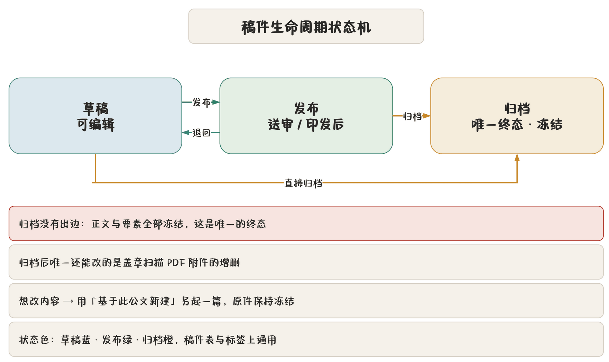

## 六步办文

一份公文在这里从无到印发归档，对应六步：

| 步 | 环节 | 在程序里做什么 |
|---|---|---|
| 01 | 立稿 | 新建空白 / 从文件导入 / 基于已有公文新建，选文种、填要素 |
| 02 | 拟稿 | 用 Markdown 源码写正文，插表格图片附件，AI 起草与润色 |
| 03 | 核稿 | 处理审校提示、要素校验、存疑清零、AI 文字复核 |
| 04 | 送签 | 提交版本、版本对照、导出花脸稿送审 |
| 05 | 印发 | 导出 DOCX / PDF、打印、盖章扫描件回传 |
| 06 | 归档 | 发布 → 归档，稿件冻结，只留盖章件增删 |

这六步不强制顺序。程序不拦着你先导出再补要素——但它会一直提醒你缺了什么。

## 核稿：这份稿子还差什么

核稿阶段没有单独的「进度表」，**还差什么直接写在它本来就该在的地方**：

| 你要看的 | 去哪儿看 |
|---|---|
| 要素缺不缺 | 左栏要素区每个分组后的「缺 N 项」；缺字段上带红点 |
| 必错清没清零 | 状态栏右侧「审校提示 N 条」徽章，或功能区「开始 → N 条提示」 |
| 待核实落实了没有 | 审校抽屉里的「正文含“待核实”字段」；正文中占位单独上色 |
| 排版量过没有 | 导出后状态栏的孤行实测提示与抽屉顶部的红框 |
| 存库、提交版本了没有 | 标签上的 ● 有改动未写库 / ○ 已存库但未提交版本；悬停标签看明细 |

这些位置本来就是各处操作结果的落点，多开一个面板只会把同一句话说两遍，还容易出现两处结论打架。

「缺要素不挡导出，但签发前必须补齐」这句话是认真的：程序唯一的导出闸门是**正文为空**（见 [导出](chapter:11-export)）。要素缺失只进审校面板，不做阻断——因为赶时间时先出个格式对的稿子再补文号，是真实的工作节奏。

> **注意** 这一节只报状态，不挡操作。先做哪一步、要不要按顺序，你自己定：真实写公文并不线性，先润色后填要素是常事，排版出了问题回头改正文也是常事。

## 稿件状态机

稿件在稿件库里的生命周期是三个状态：

- **草稿**：可编辑。可以发布，也可以直接归档。
- **发布**：送审 / 印发后的状态。可退回草稿，也可归档。
- **归档**：**唯一终态**，没有出边。正文与要素全部冻结，唯一还能改的是**盖章扫描 PDF 附件**的增删。

退回草稿是唯一的「反悔」路径。归档之后想改内容，只能基于这篇新建一份（见 [稿件管理](chapter:19-manuscripts)）。

## 版本与改动痕迹

核稿到送签之间，改动要有痕迹：

- **保存**写回稿件库，是「现在这样」；
- **提交版本**是「这一刻的快照」，带名称与备注，以后可回退、可对照；
- **版本对照**看任意两版的增删；
- **花脸稿**把改动画成送审样式：删掉的字留在原位画红色删除线，新增的字就地套蓝色方框，一张纸就能送领导签批。

详见 [版本、对照与花脸稿](chapter:10-versions)。

## 一条主线串起来

把上面这些接在一条线上：

1. 新建公函（立稿）→ 要素填好存为该文种默认；
2. 写正文，AI 材料成文先出事实单、你确认后再起草（拟稿）；
3. 审校抽屉清零必错项与待核实占位（核稿）；
4. 提交版本「送签稿」，导出花脸稿给领导（送签）；
5. 定稿导出 DOCX 与 PDF，打印，收回盖章扫描件挂到稿件详情（印发）；
6. 状态推到发布、再到归档（归档）。

每一步程序都留了记录，但**哪一步做、什么时候做，你说了算**。
