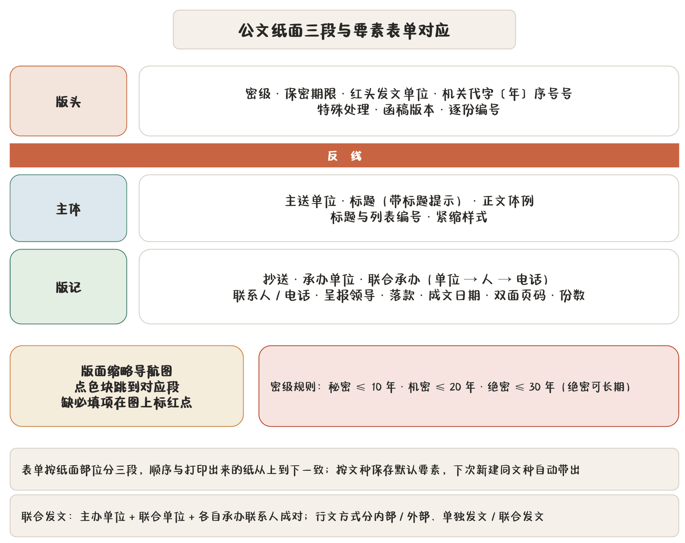

## 七种文种

新建稿件先选文种。文种决定版式要素、文号规则、页码位置和导出形态，选错了后面都是白填。

| 文种 | 适用 | 特性 |
|---|---|---|
| 公函 | 商洽、征求意见、告知、答复等平行行文 | 有文号、有份号位、函稿版式 |
| 电话通知 | 沿用函稿版式的简式通知 | **无文号**，底部无版记 |
| 普通公文 | 无红头无版记的纯正文公文 | 最简：无红头、无发文单位、无主送、无落款、无版记 |
| 会议议程 | 会议时间地点、参会人员、议程安排 | 多会议时间、会议地点、参会人员字段 |
| 白头件（呈批件） | 内部情况报告、请示、领导呈批 | 呈批件版式，无红头 |
| 红头呈批件 | 带红头、文号、首页批示栏的内部呈批件 | 有文号，**承办条目上限 4 条** |
| 研究报告 | 按研究报告规范出 TeX / PDF 与 Word | 封面分项目类、研究类两种样式，另有文献系统 |

> **提示** 切换文种**保正文、只换版式**。已经写好的内容不会丢，但要素表单的字段集会跟着变——原来填的电话通知没有文号栏，换成公函就多出文号栏，需要补填。

研究报告的用法单独成章，见 [研究报告专章](chapter:08-research)。

## 要素三分区

要素表单按纸面部位分三段，和打印稿从上到下的顺序一致：

### 版头

| 字段 | 说明 |
|---|---|
| 密级 | 不标注 / 内部 / 秘密 / 机密 / 绝密，默认「机密」 |
| 保密期限 | 默认「20 年」，受密级规则约束（见下） |
| 发文单位 | 红头上的单位名称 |
| 联合发文 | 单独发文 / 联合发文；联合时填联合发文单位与主办单位 |
| 机关代字 | 如「办函」，是函号的前半截 |
| 发文年份 | 如「2026」 |
| 发文序号 | 如「12」 |
| 特殊处理 | 指人专办等标注 |
| 函稿版本 | 预览版 / 正式版 |
| 逐份编号 | 份号是否逐份编号 |

### 主体

| 字段 | 说明 |
|---|---|
| 主送单位 | 主送对象 |
| 标题 | 文件标题；留空时用「标题提示」回退 |
| 标题提示 | 起个头，供模型与文件名回退用 |
| 正文体例 | 正文的编号与段落风格 |
| 标题与列表编号 | 节内/全局编号规则，见 [设置全解](chapter:20-settings) |
| 紧缩样式 | 正常 / 全局紧缩 / 节内紧缩 |

### 版记

| 字段 | 说明 |
|---|---|
| 抄送单位 | 抄送对象 |
| 承办单位 | 承办部门 |
| 联合承办 | 联合承办单位与各自联系人（单位 ↔ 人 ↔ 电话成对） |
| 联系人 / 电话 | 从标准词库带出 |
| 呈报领导 | 白头件、呈批件用 |
| 落款单位 | 署名单位 |
| 落款用简称 | 落款处是否用简称 |
| 成文日期 | 可手动填，也可「自动」跟当天 |
| 会议时间 / 地点 | 仅会议议程显示 |
| 双面页码 | 双面打印时页码位置 |
| 份数 | 印发份数 |

> **提示** 承办联系人在标准词库里维护一次，要素表单里直接选。换了人只改词库一处，所有稿子跟着走。见 [标准词库](chapter:15-vocabulary)。

## 密级与保密期限规则

密级不是随便写的，程序按规则卡：

| 密级 | 保密期限上限 | 允许「长期」 |
|---|---|---|
| 秘密 | 10 年 | 否 |
| 机密 | 20 年 | 否 |
| 绝密 | 30 年 | 是 |

填了超上限的期限，校验会拦下提示。不标注密级与「内部」不走这套期限规则。

密级也决定导出成品里密级标注的位置与字色。这些都由程序算，模型碰不到——见 [AI 的边界与保障](chapter:12-ai-guard)。

## 行文方式

**内部 / 外部**切换的是语气与行文方向：内部行文可用「请示」「报告」这类上行语气，外部平行行文用「商洽」「告知」。程序会按方向切换文号与行文语气规则。

**单独发文 / 联合发文**：联合发文时要填主办单位、联合发文单位、联合承办单位与各自的联系人。落款与版记按联合规则排。红头呈批件的承办条目有上限（4 条），超出请改用普通呈批件或拆件。

## 版面缩略导航图

表单顶部那张小纸是**版面缩略导航图**：

- 三色块对应版头（红）、主体（白）、版记（灰）；
- 点色块跳到对应表单段；
- **缺项会在图上标出来**——哪块发虚说明那段还有必填项没填。

填长表单时不用来回滚，抬头看一眼缩略图就知道还差哪块。

## 按文种保存默认要素

每个文种都有一份「默认配置」（`TemplateProfile`）。发文单位、机关代字、承办联系人、呈报领导这些**每次都一样**的字段，填一次保存，下次新建同文种稿子自动带出。

- 在要素表单里改完点保存，即更新该文种的默认配置；
- 切换文种时，原配置按旧文种存回，新文种取自己的配置，**正文不动**；
- 想基于已有稿子另起一篇，用稿件管理的「基于此公文新建」——要素连同版式一起带过去。

## 版式细节开关

| 开关 | 作用 |
|---|---|
| 函稿版本 | 预览版留改稿痕迹，正式版清稿 |
| 紧缩样式 | 正常行距；全局紧缩整篇压行距；节内紧缩只在节内压 |
| 双面页码 | 双面打印时奇偶页码分置外侧 |
| 逐份编号 | 份号是否逐份递增 |

这些开关只影响版式，不影响正文文字。
