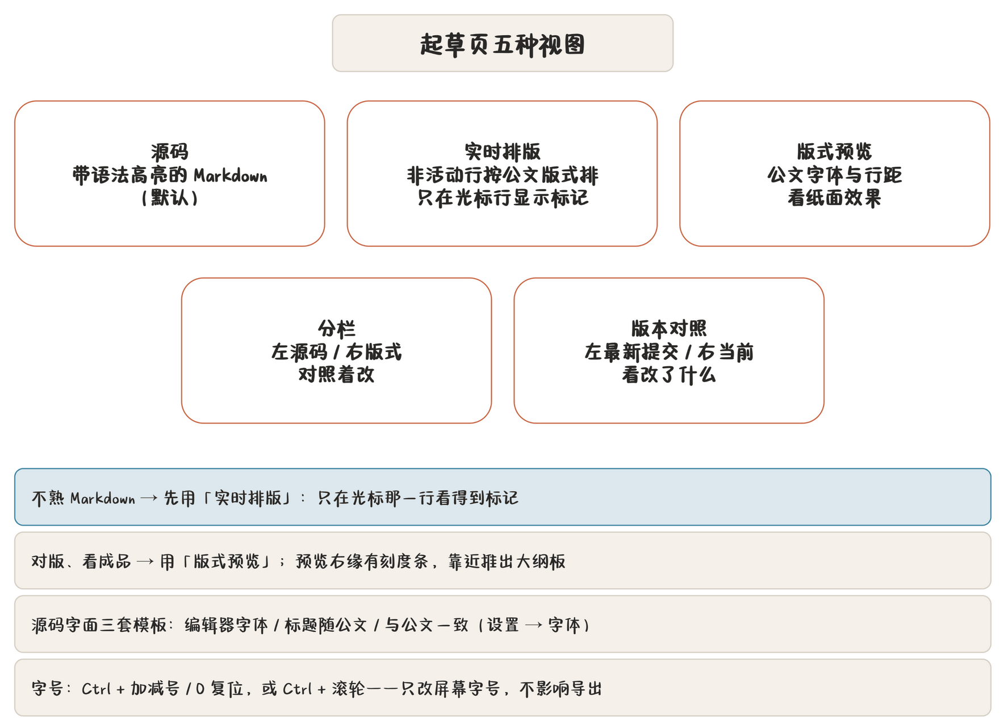
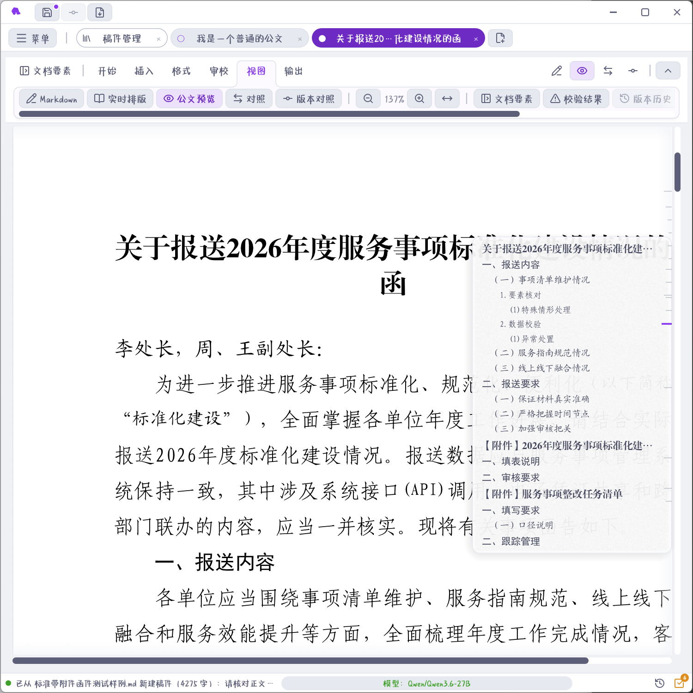

## 五种视图模式

中央区右端有五个视图图标（「视图」分区里也有），切换显示方式：



| 模式 | 显示 | 什么时候用 |
|---|---|---|
| 源码 | 带语法高亮的 Markdown | 默认模式。写稿、改结构、查标记 |
| 实时排版 | 非活动行按公文版式排，**仅光标行显示 Markdown 标记** | 边写边看版式，不用来回切 |
| 版式预览 | 按公文字体与行距渲染的纸面效果 | 对版、看成品、检查页眉页脚 |
| 分栏 | 左源码、右版式并排 | 对照着改 |
| 版本对照 | 左最新提交版本，右当前未提交内容 | 看这次改了什么 |

> **提示** 不熟 Markdown 的人可以先开**实时排版**：只在光标行看到 `#`、`**` 这些符号，其他行已经是排好的公文样子。写完切到版式预览验收。

## 源码编辑器

源码模式整篇默认用编辑器字体，`#`、`##` 靠符号数量分辨层级。觉得标记不醒目的，可以在「设置 → 字体 → 源码编辑器的 Markdown 字面」换模板：

| 模板 | 效果 |
|---|---|
| 编辑器字体 | 六处全用编辑器字体，标记最醒目（默认） |
| 标题随公文 | `#` 小标宋、`##` 黑体、`###` 楷体、`####` 及以下仿宋，正文仍用编辑器字体 |
| 与公文一致 | 正文也换仿宋，源码看着最接近打印稿 |

也可以不挑模板，给文档标题、一级/二级/三级及以下标题、正文、「标记及行内代码」六处分别指定字面，模板一栏会显示「自定义」。

这里的公文字面与预览、导出**同源**——在「编译字体」里把正文换成本机仿宋，编辑器里的仿宋跟着换。本设置只改屏幕上的字面，字号、行距与导出结果都不受影响。`#`、`|`、`**` 这类只在源码里出现的符号默认留在编辑器字体上，仍然一眼可辨。

## Markdown 要点

起草页的 Markdown 是「公文子集」，不是网页 Markdown：

- `#` 一级标题、`##` 二级、`###` 三级——层级决定公文字体与编号；
- `**粗体**` 对应公文里的着重号（黑体或加粗，按「编译字体」里的粗体字面走）；
- `- ` 项目符号、`1. ` 有序列表，编号规则可在设置里配（见 [设置全解](chapter:20-settings)）；
- `|` 表格独占一块，`` 图片**独占一行**；
- 行内代码与围栏代码块在公文里按正文字面排，不换等宽字体（研究报告除外）；
- **公文文种不支持公式**，`$` 始终是普通字符。公式只有研究报告支持（见 [研究报告专章](chapter:08-research)）。

### 序号表格

常见的「序号 + 标题 + 内容 + 备注」分组表，在表前加一行标记就自动编号、自动合并：

```markdown
<!-- [序号表] -->
| 序号 | 标题 | 内容 | 备注 |
| --- | --- | --- | --- |
| 大标题一 |  |  |  |
|  | 标题1 | 内容1 |  |
|  | 标题2 | 内容2 |  |
| 大标题二 |  |  |  |
|  | 标题3 | 内容3 |  |
```

- **分组行**：首格写标题、其余各格留空的那一行（`| 大标题一 |  |  |`）。它整行自动合并、排版时靠左，前面按设置里的「序号表格分组」补上 `（一）`、`一、` 之类的编号；手写的编号会被清掉重编，所以照旧写 `| （一）大标题一 |||` 也一样。首格只写数字的行不算分组行；
- **数据行**：首列整个留给编号，那一格留空即可（也可以照旧手填数字，程序按组重排）。写在那儿的**文字**会被编号盖掉——标题要写在第二列；
- 表头首格留空会自动填「序号」；
- 分组行照 GFM 的规矩仍是完整的表格行，**只写一格的行会被当成表格结束**——写成 `| 大标题一 |  |  |`，或照旧写 `| 大标题一 |||`；
- 标记行只管**紧邻**的那张表格，中间隔了正文就不生效；删掉这行即恢复成普通表格。

编号与合并由程序生成，**源码里看不到**：预览（实时排版、分栏）与导出的 Word / PDF 里才有。这与 `##` 标题的自动编号是同一套做法。

### 公文构件

「插入」分区提供的公文构件，插进去都是**字面文本加注释标记**，导出时按规范处理：

| 构件 | 插入内容 | 干什么 |
|---|---|---|
| 正文区段标记 | `<!-- [正文] -->` | 标出正文起始，附件在此之后 |
| 附件区段标记 | `<!-- [附件] -->` | 标出附件区段，版记之前 |
| 今天中文数字日期 | 如「二〇二六年三月十五日」 | 成文日期的标准写法 |
| 中文双引号对 | 「」 | 避免半角引号混入 |
| 待核实占位 | `【待核实】` | 先占位后落实，SOP「存疑清零」盯的就是它 |

`【待核实】`值得单说：写稿时拿不准的人名、数字、文号，先插这个占位，**审校面板会把它列成必办项**，落实一处销一处。签发前 SOP 的「存疑清零」没过，就说明还有没核实的地方。

## 查找替换

`Ctrl+F` / `Cmd+F` 打开查找条：

- 打开时若编辑器有选中且不超过 200 字，自动填入查询；
- `Enter` / `Shift+Enter` 上下一条，`Esc` 关闭；
- 替换支持一键替换**必错级**校对命中（见 [核稿](chapter:09-proofread)）。

## 字号缩放

源码编辑器字号：`Ctrl` + `+` 放大、`Ctrl` + `-` 缩小、`Ctrl` + `0` 复位，或按住 `Ctrl` 滚鼠标滚轮。这个只改屏幕字号，不影响导出。

## 版式预览与导航



版式预览与实时排版共用公文排版引擎，字体、行距、页边距与导出同源。预览区右缘有一条 **14px 刻度条**：

- 刻度条按节标出标题位置；
- 鼠标靠近，推出**大纲板**（亚克力半透明），点标题跳段落；
- 刻度条上会标出孤行探测的位置——排版编译后程序实测坐标，孤行以可点击提示给出。

刻度条刻意不做侧栏：预览本身要满宽才看得清版式，一条细刻度比常驻大纲栏划算。

## 自动保存与现场

- 每 2 分钟自动保存一次当前改动到稿件库（`Ctrl+S` 是立即保存）；
- 退出时若有未保存或未提交版本，弹汇总确认；
- 下次启动**恢复上次全部标签现场**：开着哪几篇、停在哪一章，都回来。

未提交的改动不会自动变成版本——版本是你显式「提交」的快照，见 [版本、对照与花脸稿](chapter:10-versions)。
