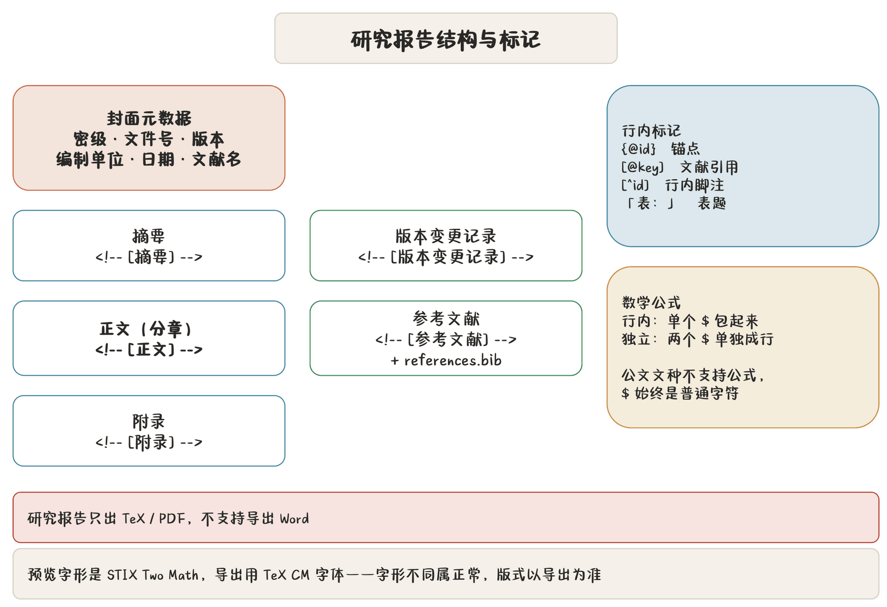

## 研究报告是什么文种

研究报告是七种文种里最特殊的一个：按内置研究报告规范生成 **TeX / PDF 与 Word**（Word 走研究报告自己的转换器，不用公文版式）。它带封面元数据、分章结构、交叉引用、文献引用、脚注、表题，以及 **LaTeX 数学公式**。



## 从文件夹新建

菜单 → 「从文件夹新建研究报告」：

1. 选一个文件夹；
2. 按**文件名升序**合并**第一层**的 `.md` 文件（子目录不进）；
3. 第一篇的顶层标题会被移除（用作报告名），其余照搬；
4. 同时导入文件夹里的本地图片与 `.bib`（BibTeX）。

适合把分章写好的调研材料一次性合成一篇报告。

## 封面元数据

研究报告有一组独立的封面字段，与公文要素分开：

| 字段 | 用途 |
|---|---|
| 密级 / 保密期限 | 封面左上角；公开件不标 |
| 文件类型 | 印在封面版头，并决定封面样式（见下） |
| 文件编号 | 封面右上角 |
| 版本稿次 | 加括号印在题名下方，如（V1.2）（送审稿） |
| 标识行 | 印在文种下方：项目编号、期号、课题编号或原文出处 |
| 署名行 | 研究类封面印在落款上方：课题组、编译审校等 |
| 外文原题 | 外文翻译专用，以西文斜体印在中文题名下方 |
| 撰写单位 / 撰写时间 | 封面落款；时间自动写成汉字数字，如二〇二六年九月 |
| 文献名 / 文献内容 | 参考文献表名与 BibTeX 内容 |

## 封面样式

七种文件类型共用一张封面网格：密级与编号、文种、标识行、通栏反线、题名与稿次、
落款，位置和字号完全一致，全部黑色印刷。文件类型可从下拉里选，也可手填：

| 类别 | 文件类型 | 反线 | 落款上方 |
|---|---|---|---|
| 项目类 | 立项论证报告、建设实施方案、技术实现方案、项目总结报告 | 单线 | 四格阶段条，当前阶段加粗 |
| 研究类 | 战略咨询报告、专题研究报告、外文翻译（及其他） | 一粗一细双线 | 署名行 |

手填的类型按关键词归类（含「立项」「实施方案」「技术方案」「验收」等归项目类），
认不出的按研究类排。预览、PDF、Word 三处封面按同一组毫米坐标排。

**题名自动断行。** 封面题名一行放 16 个字，放不下时按公文标题的回行规矩自动分行，
不用手工换行：

- 用 jieba 分词并标词性，只在词边界换行；词表里接受过的本单位专名整体不拆；
- 标点不落行首，开括号、开引号不落行尾，“（二期）”“（试行）”这类短括注整体不拆；
- “的”不起行，“第3期”“2026年度”这类数字与量词不分家；
- 优先断在“的”之后、“与”“和”“关于”等连词介词之前，尽量不拆复合名词；
- 各行长短尽量均衡，首行不短于末行；多分一行能让意群完整时才多分。

同一套规矩也用于公文标题的换行。某处断得不理想，多半是分词没认出专名，把它加进
「词表」即可。

> **红线** 封面元数据是公文要素的同类：**AI 永不回写**这些字段。模型只起草正文。

## 区段标记

研究报告用注释标记划区段，「研报」分区一键插入：

| 标记 | 区段 |
|---|---|
| `<!-- [摘要] -->` | 摘要 |
| `<!-- [正文] -->` | 正文起始 |
| `<!-- [部分] -->` | 部分段：其后每个 `#` 开一个部分 |
| `<!-- [附录] -->` | 附录 |
| `<!-- [版本变更记录] -->` | 版本变更记录 |
| `<!-- [参考文献] -->` | 参考文献 |

区段标题**只印一次**——同一个区段里有多处标记或多级标题，不会重复出标题。程序按区段切章、编页码。

## 部分与不编号标题

长报告要分成几大部分时，在报告题名之后写一个 `<!-- [部分] -->`，其后**每个 `#` 开一个部分**：

- 部分标题独占一页（双面印刷时背面留白），编号“第一部分”“第二部分”由程序生成，标题里不用写；
- `##` 起照常是章、节，**章号跨部分连续**——第二部分的第一章接着第一部分往下数；
- 附录、参考文献等区段标记结束部分段；
- 部分进目录，与章同一级。

前言、结束语这类标题不要编号时，在标题**上一行**写 `<!-- [不编号] -->`（「研报」分区一键插入）：

- 管这个标题连同它的全部下级标题；遇到同级或更高一级的标题自动恢复编号，不用写收尾标记；
- 不编号的标题不占章节号（前言之后的第一章仍是“第1章”），照样进目录；
- 不编号章里的图表题注不带章号，全篇的不编号章共用一套流水号（前言“表1”、结束语接着“表2”）；
- 写在部分段的 `#` 上，就是一个不编号的部分，其下各章也都不编号。

```markdown
<!-- [不编号] -->
## 前言

<!-- [部分] -->

# 现状分析

## 研究背景          ← 第1章

# 对策建议

## 总体思路          ← 第2章

<!-- [不编号] -->
## 结束语
```

校验会提示：不编号标记后面没紧跟标题、写在报告题名前、不编号标题上挂了锚点，以及部分标记之后没有 `#`。

## 目录

目录**不是默认就有的**：稿子里写了 `<!-- [目录] -->` 才排目录，没写就不排。「研报」分区的「目录」按钮一键插入。

- **排在哪里**：目录排在标记所在的位置，另起一页。常见写法是放在最前面（封面之后、摘要之前），也可以放在摘要之后；
- **单独页码**：目录页用一套大写罗马页码 **I、II、III**，不占正文页号——目录前后的正文页码接着往下数，目录放在最前面时正文从 1 起；
- **摘要单独编号**：目录插在摘要与正文之间时（`<!-- [正文] -->` 写在目录前后都行），摘要改用小写罗马页码 **i、ii、iii**，目录之后正文从 1 起；
- **只排一次**：写了多处只认第一处；
- 目录收录到节一级：摘要、各章与节、附录、参考文献进目录，小节以下不进。

```markdown
<!-- [目录] -->

<!-- [摘要] -->

本报告……

<!-- [正文] -->

## 研究背景
```

Word 版同样只在标记处插入目录，打开后按提示**更新域**即可生成目录条目。页码与 PDF 同一套规矩：封面不编页码，页脚居中印“— N —”，目录、摘要、正文各自分节编号。目录插在正文中间时，目录之后的页码靠域公式接着往下数，Microsoft Word 能正确显示，LibreOffice 等不支持嵌套域公式的软件显示不对。

## 锚点、交叉引用、脚注、表题

| 写法 | 含义 | 示例 |
|---|---|---|
| `{#id}` | 锚点 | 在小节标题行尾打 `{#sec2}` |
| `{@id}` | 交叉引用 | `见 {@sec2}` |
| `[@key]` | 文献引用 | `已有研究指出……[@zhang2024]` |
| `[^id]:(内容)` | 行内脚注 | `样本来自三省六市[^s1]:(2025年抽样)` |
| `表：` | 表题 | 表格上方一行 `表：三省样本分布` |

交叉引用写在正文里引用锚点（如「见 {@sec2}」），导出时解析成编号引用。文献引用 `[@key]` 对应 BibTeX 里的 key，导出时生成引用标号与文末文献表。

**表题**要写成「表：」开头的一整行，排在表格上方，导出时按表题规范排（居中、表号与表题分排）。

表格与公文同一套写法：`||` 横向合并、`^^` 纵向合并；表前加一行 `<!-- [序号表] -->` 就是序号表格（首列自动编号、分组行整行合并靠左，见 [拟稿：源码编辑与五种视图](chapter:06-editor)）。表题写在标记行上方：

```markdown
表：年度任务分工
<!-- [序号表] -->
| 序号 | 事项 | 责任单位 |
| --- | --- | --- |
| 重点工作 |  |  |
|  | 完成年度计划编制 | 办公室 |
```

## 数学公式

研究报告正文支持 LaTeX 数学公式：

- **行内公式**：`$...$` 包起来，如 `质能方程 $E=mc^2$ 表明……`
- **独立公式**：`$$...$$` 包起来并**单独占一段**：

```text
$$\int_0^1 x^2\,dx = \frac{1}{3}$$
```

导出 PDF 用 amsmath / mathtools 排版，支持分数、上下标、求和、积分、矩阵、`cases` 等常见构造。`$` 需要写成字面字符时用 `\$` 转义。

> **注意** 公文文种**不支持公式**，`$` 在公文里始终是普通字符。公式是研究报告专属能力。

### 预览与导出的差异

| | 预览 | 导出 PDF |
|---|---|---|
| 渲染 | 应用内置渲染器即时画 | 内置 Tectonic 用 TeX 排 |
| 数学字形 | STIX Two Math | TeX 的 CM 数学字体 |
| 两端对齐 | 含行内公式的段落按左对齐显示 | 仍是两端对齐 |

**字形不同属正常现象，版式尺寸以导出为准。** 预览渲染器不支持的写法（如公式里夹中文的 `\text{中文}`）在预览里显示为带源码的占位框，导出 PDF 不受影响。

## 导出产物

研究报告导出会产出：

| 文件 | 说明 |
|---|---|
| `研究报告-名称-时间戳.tex` | 主 TeX |
| `md2tex.cls` | 版式类 |
| `data/chapterXX.tex` | 分章 |
| `appendix/appendixXX.tex` | 附录 |
| `references.bib` | 文献库 |
| `研究报告-名称-时间戳.pdf` | 编译出的 PDF |
| `研究报告-名称-时间戳.docx` | Word 版（研究报告自己的转换器，封面、目录、页码与 PDF 对齐） |
| `研究报告-名称-时间戳-源码包.zip` | Markdown 源码包：正文、图片与 `references.bib` |

版式以 PDF 为准；Word 版用于需要改稿或按 Word 流转的场合。

## 用本机字体编译

研究报告与公文共用「编译字体」设置：勾「使用本机字体编译」后按所选字体加载，`.tex` 拿到别的机器上按**字体名**加载，目标机器装了同名字体才有一致效果。详见 [设置全解](chapter:20-settings) 的字体分区。

生僻字走兜底字体链：仿宋、楷体是 GB2312，人名里的「喆」「赟」「堃」这类字自动换用兜底宋体（覆盖 GBK）。要排 GBK 以外的字，另选字库更大的本机字体当兜底。
