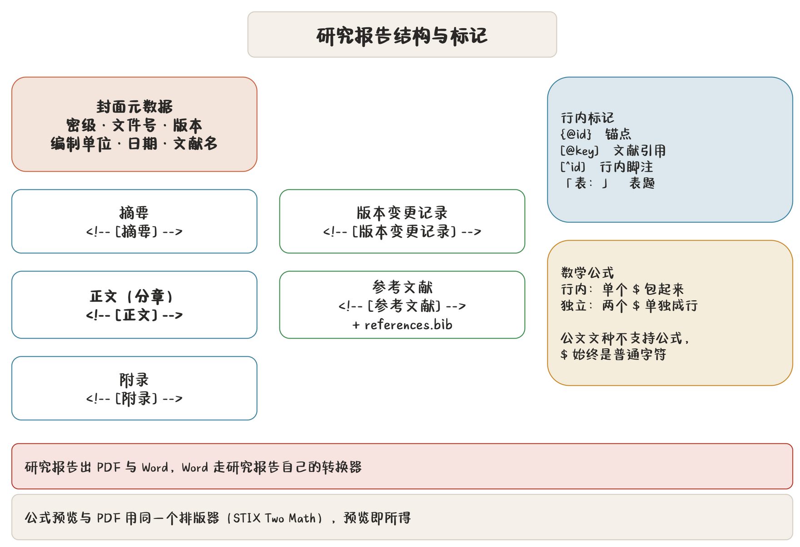

## 研究报告是什么文种

研究报告是八种文种里最特殊的一个：按内置研究报告规范生成 **PDF 与 Word**（Word 走研究报告自己的转换器，不用公文版式）。它带封面元数据、分章结构、交叉引用、文献引用、脚注、表题，以及 **LaTeX 写法的数学公式**。



## 从文件夹新建

菜单 → 「从文件夹新建研究报告」：

1. 选一个文件夹；
2. 按**文件名升序**合并**第一层**的 `.md` 文件（子目录不进）；
3. 第一篇的顶层标题会被移除（用作报告名），其余照搬；
4. 同时导入文件夹里的本地图片与 `.bib`（BibTeX）。

适合把分章写好的调研材料一次性合成一篇报告。

## 封面元数据

研究报告有一组独立的封面字段，与公文要素分开：

| 字段 | 用途 |
| --- | --- |
| 模板 | 经典研究报告（默认）、研究终端；随稿件及版本保存 |
| 配色 | 研究终端可选暗场阅读或白图打印，控制预览与 PDF |
| 密级 / 保密期限 | 封面左上角；公开件不标 |
| 文件类型 | 印在封面版头，并决定封面样式（见下） |
| 文件编号 | 封面右上角 |
| 版本稿次 | 加括号印在题名下方，如（V1.2）（送审稿） |
| 标识行 | 印在文种下方：项目编号、期号、课题编号或原文出处 |
| 署名行 | 研究类封面印在落款上方：课题组、编译审校等 |
| 外文原题 | 外文翻译专用，以西文斜体印在中文题名下方 |
| 撰写单位 / 撰写时间 | 封面落款；时间自动写成汉字数字，如二〇二六年九月 |
| 参考文献 | 选一个 `.bib`（BibTeX）文件，内容随稿件保存；下方显示共几条、已引几条，`.bib` 有错时指出第几行。在外部改了 `.bib`，点「重新读入」换成新内容（只在本次打开稿件后读入过时出现） |

## 模板与配色

在要素页「封面信息」中选择模板：

- **经典研究报告**：现有的正式研究报告版式，旧稿件自动使用此模板。
- **研究终端**：参考 vividdraft 的图纸视觉语言，使用细网格、页框、元数据栏、无衬线中文和等宽西文；章节、目录、摘要、图表、文框、公式、文献仍沿用研究报告的语义与编号。

研究终端提供 **暗场阅读**（深底、浅字、青色标注、琥珀强调）和 **白图打印**（白纸、墨字、朱红强调）。PDF 使用所选配色；Word 使用白图适配样式，保留可编辑正文、目录字段与公式，版面以 PDF 为准。模板与文件类型相互独立：项目类继续突出阶段条，研究类显示署名，外文翻译保留原题。

研究终端的目录使用部分编号栏、圆形章号、缩进节号与页码引线；部分独占一页，显示所属章节及起始页，并以线刻大编号收尾；章首页把圆形章号与大标题并排，节号放入方框。部分明细自动从正文生成，附录单独编号。连续预览中的目录可点击定位正文，实际页码和完整引线以 PDF 为准。

终端正文的各级节号（包括 `1.1.1`、`1.1.1.1`）统一放入细线编号框。普通 `>` 引文和 `> [!名称]` 文框共用浅底卡片、细边框与首尾角标：普通引文不编号，出处靠右；`> [!引理]`、`> [!推论]` 等文框保留原名称并各自编号，标题靠左，类型签牌靠右。卡片内继续支持公式、列表与交叉引用。

预览保留点回源码和行号，采用连续纸面，实际分页与总页数以 PDF 为准。

## 封面样式

经典模板的七种文件类型共用一张封面网格：密级与编号、文种、标识行、通栏反线、题名与稿次、
落款，位置和字号完全一致，全部黑色印刷。文件类型可从下拉里选，也可手填：

| 类别 | 文件类型 | 反线 | 落款上方 |
| --- | --- | --- | --- |
| 项目类 | 立项论证报告、建设实施方案、技术实现方案、项目总结报告 | 单线 | 四格阶段条，当前阶段加粗 |
| 研究类 | 战略咨询报告、专题研究报告、外文翻译（及其他） | 一粗一细双线 | 署名行 |

手填的类型按关键词归类（含「立项」「实施方案」「技术方案」「验收」等归项目类），
认不出的按研究类排。预览、PDF、Word 三处封面按同一组毫米坐标排。

**题名自动断行。** 封面题名一行放 16 个字，放不下时按公文标题的回行规矩自动分行，
不用手工换行：

- 用 jieba 分词并标词性，只在词边界换行；词表里接受过的本单位专名整体不拆；
- 标点不落行首，开括号、开引号不落行尾，“（二期）”“（试行）”这类短括注整体不拆；
- “的”不起行，“第3期”“2026年度”这类数字与量词不分家；
- 优先断在“的”之后、“与”“和”“关于”等连词介词之前，尽量不拆复合名词；
- 各行长短尽量均衡，首行不短于末行；多分一行能让意群完整时才多分。

同一套规矩也用于公文标题的换行。某处断得不理想，多半是分词没认出专名，把它加进
「词表」即可。

> **红线** 封面元数据是公文要素的同类：**AI 永不回写**这些字段。模型只起草正文。

## 区段标记

研究报告用注释标记划区段，「研报」分区一键插入：

| 标记 | 区段 |
| --- | --- |
| `<!-- [摘要] -->` | 摘要 |
| `<!-- [正文] -->` | 正文起始 |
| `<!-- [部分] -->` | 部分段：其后每个 `#` 开一个部分 |
| `<!-- [附录] -->` | 附录 |
| `<!-- [版本变更记录] -->` | 版本变更记录 |
| `<!-- [参考文献] -->` | 参考文献 |

区段标题**只印一次**——同一个区段里有多处标记或多级标题，不会重复出标题。程序按区段切章、编页码。

## 部分与不编号标题

长报告要分成几大部分时，在报告题名之后写一个 `<!-- [部分] -->`，其后**每个 `#` 开一个部分**：

- 部分标题独占一页（双面印刷时背面留白），编号“第一部分”“第二部分”由程序生成，标题里不用写；
- `##` 起照常是章、节，**章号跨部分连续**——第二部分的第一章接着第一部分往下数；
- 附录、参考文献等区段标记结束部分段；
- 部分进目录，与章同一级。

前言、结束语这类标题不要编号时，在标题**上一行**写 `<!-- [不编号] -->`（「研报」分区一键插入）：

- 管这个标题连同它的全部下级标题；遇到同级或更高一级的标题自动恢复编号，不用写收尾标记；
- 不编号的标题不占章节号（前言之后的第一章仍是“第1章”），照样进目录；
- 不编号章里的图表题注不带章号，全篇的不编号章共用一套流水号（前言“表1”、结束语接着“表2”）；
- 写在部分段的 `#` 上，就是一个不编号的部分，其下各章也都不编号。

```markdown
<!-- [不编号] -->
## 前言

<!-- [部分] -->

# 现状分析

## 研究背景          ← 第1章

# 对策建议

## 总体思路          ← 第2章

<!-- [不编号] -->
## 结束语
```

校验会提示：不编号标记后面没紧跟标题、写在报告题名前、不编号标题上挂了锚点，以及部分标记之后没有 `#`。

## 目录

目录**不是默认就有的**：稿子里写了 `<!-- [目录] -->` 才排目录，没写就不排。「研报」分区的「目录」按钮一键插入。

- **排在哪里**：目录排在标记所在的位置，另起一页。常见写法是放在最前面（封面之后、摘要之前），也可以放在摘要之后；
- **单独页码**：目录页用一套大写罗马页码 **I、II、III**，不占正文页号——目录前后的正文页码接着往下数，目录放在最前面时正文从 1 起；
- **摘要单独编号**：目录插在摘要与正文之间时（`<!-- [正文] -->` 写在目录前后都行），摘要改用小写罗马页码 **i、ii、iii**，目录之后正文从 1 起；
- **只排一次**：写了多处只认第一处；
- 目录收录到节一级：摘要、各章与节、附录、参考文献进目录，小节以下不进。

```markdown
<!-- [目录] -->

<!-- [摘要] -->

本报告……

<!-- [正文] -->

## 研究背景
```

Word 版同样只在标记处插入目录，打开后按提示**更新域**即可生成目录条目。页码与 PDF 同一套规矩：封面不编页码，页脚居中印“— N —”，目录、摘要、正文各自分节编号。目录插在正文中间时，目录之后的页码靠域公式接着往下数，Microsoft Word 能正确显示，LibreOffice 等不支持嵌套域公式的软件显示不对。

## 锚点、交叉引用、脚注、表题

| 写法 | 含义 | 示例 |
| --- | --- | --- |
| `{#id}` | 锚点 | 在小节标题行尾打 `{#sec:yanjiu-beijing}` |
| `{@id}` | 交叉引用 | `见 {@sec2}` |
| `[@key]` | 文献引用（序号上标） | `已有研究指出……[@zhang2024]。` |
| `@key` | 文献引用（序号平排，作句子成分） | `见文献@zhang2024`、`王某等@zhang2024认为` |
| `[^id]:(内容)` | 行内脚注 | `样本来自三省六市[^s1]:(2025年抽样)` |
| `表：` | 表题 | 表格上方一行 `表：三省样本分布` |

**锚点不必手敲**：光标放在章节标题、图片、流程图、表格或文框里，点「研报」分区的「锚点」，程序在对应的行尾挂一个自动起名的锚点：

| 光标所在 | 挂在哪一行 | 自动起的 id |
| --- | --- | --- |
| `#` 部分标题 | 标题行 | `part:` + 标题拼音 |
| `##` 章标题 | 标题行 | `chap:yanjiu-beijing` |
| `###` 起的节、小节标题 | 标题行 | `sec:shuju-laiyuan` |
| 有图注的图片 | 图片行 | `fig:zongti-jiagou` |
| 表格或表题 | 表题行 | `tbl:sansheng-yangben` |
| 文框 | 首行 | 专栏 `box:`、案例 `case:`、例子 `ex:`，其他名称取名称拼音 |

冒号后面是标题前几个词的拼音。全文已有同名 id 时自动加 `-2`、`-3`，不会重复。这一处已有锚点就不再挂第二个；光标在正文段落、不编号标题、没有图注的图片、没有表题的表格或引文上时不挂，状态栏会说明原因。自动起的 id 可以改，改了要连同 `{@id}` 引用一起改。

**锚点不能重复**：同一个 id 定义两次，导出 PDF 时交叉引用检查不通过，整个导出会中止。审校抽屉会逐处列出多出来的定义（「第 N 行的锚点 {#…} 与第 M 行重复」），点一下跳到那里；「交叉引用」下拉底部也会提示重复的个数。保留第一处，把后面的删掉重挂即可。

交叉引用写在正文里引用锚点（如「见 {@sec:yanjiu-beijing}」），导出时解析成编号引用。不必手敲 id：「研报」分区的「交叉引用」下拉按锚点所在位置分成**结构**（部分、章、节、小节，按层级缩进）、**图**、**表**、**文框**四组，每条列出纸面编号与题名（如「第1章 研究背景」「图 1.2 总体架构」），点一下插入。挂在不编号标题或普通段落上的锚点没有号可引，不列出，下拉底部会报个数。

文献引用对应 BibTeX 里的 key，导出时生成方括号序号与参考文献表，按 GB/T 7714—2015 顺序编码制：**序号按正文首次引用的先后排**，只有引过的文献进表。有两种写法：

- `[@key]`（多篇写成一组 `[@a; @b]`）：序号**上标**，紧贴前一个字，与脚注号同样大小。“已有研究指出……[@zhang2024]。”印成“……指出[1]。”，[1] 在右上角。同一组的序号从小到大排，三个及以上连号压成区间，如 [1–3]、[2,4]；
- `@key`（不带方括号）：序号作句子成分时用，与正文平排。“见文献@zhang2024”“王某等@zhang2024认为”印成“见文献[1]”“王某等[1]认为”。这种写法的 key 要以英文字母或下划线开头；只有文献库里有这个 key 才算引用，否则 `@` 连同后面的字原样印出，正文里的账号、邮箱不受影响。确实要印出一个与 key 同名的 `@…` 时写成 `\@…`；
- 上标序号一般放在句号、逗号等标点**前面**（“……研究表明[@key]。”）。写在标点后面时，序号会悬在标点右上方，审校抽屉会逐处提示，点一下跳到那里。引号、括号后面的引用不提示。

「研报」分区的「文献引用」下拉不用记 key，插入的是上标写法 `[@…]`：

- 分**已引**、**未引**两组，各带条数，下次展开停在上次那组。已引按序号排，未引按 `.bib` 里的先后排；
- 每行是序号（未引的显示“—”）、第一作者与年份、题名和文献类型（期刊、专著、学位论文、报告、标准……）；指针停在一行上，显示它在参考文献表里的整条著录与引用处数，与 PDF 印的是同一行；
- 顶部搜索框按 key、作者、题名、年份筛选，↑↓ 选行、回车插入；
- 单击插入一条并收起；勾选几条（或 Ctrl+单击）后点底部「插入」，写成一组 `[@a; @b]`；
- 光标在已有的 `[@…]` 里或紧挨在它后面时，选中的文献**并入这一组**，不会插出 `[@a][@b]`；
- 底部会提示：正文里不在文献库中的 key（PDF 印成 `[?]` 并中止导出）、`.bib` 的出错行、稿中没有 `<!-- [参考文献] -->`（文献表会排在全文末尾）；
- 还没导入 `.bib` 时，下拉里直接有「导入 .bib…」。

源码里每组 `[@…]` 与每处算作引用的 `@key` 下面有一道细虚线，组里有 key 不在文献库里时画成橙色；指针停在上面片刻，弹出卡片列出每条文献的序号与著录。预览里的序号同样分上标与平排，参考文献表排在参考文献区段的标题下（没有这个区段就排在全文末尾），序号与著录和 PDF 一致。

**表题**要写成「表：」开头的一整行，排在表格上方，导出时按表题规范排（居中、表号与表题分排）。

表格与公文同一套写法：`||` 横向合并、`^^` 纵向合并；表前加一行 `<!-- [序号表] -->` 就是序号表格（首列自动编号、分组行整行合并靠左，见 [拟稿：源码编辑与四种视图](chapter:06-editor)）。表题写在标记行上方：

```markdown
表：年度任务分工
<!-- [序号表] -->
| 序号 | 事项 | 责任单位 |
| --- | --- | --- |
| 重点工作 |  |  |
|  | 完成年度计划编制 | 办公室 |
```

**图片宽度**由程序按图的比例自动定，不再一律铺满版心，PDF、Word 与预览三处一样大：

- 按面积定宽：每张图约占版心面积的 38%，宽图接近满宽，方图、竖图相应收窄；
- 图高不超过版心高的 60%，手机截图这类竖图不会撑满一整页；
- 位图不放大到低于 150 DPI，小图标不会被拉到发糊；PDF 附件是矢量图，不受这条限制；
- 宽度取整到四档（版心宽的 100%、80%、60%、45%），全篇的图整齐划一；极长的竖图、很小的位图放不进最窄一档时按实际上限排；
- 图一律居中，图题排在图下方。

## Mermaid 图表

正文里可以直接写图表，程序用本机 Rust 引擎生成预览、PDF 和 Word 插图。
图题紧跟结束围栏，研究报告的图号自动编排，也可在图题末尾加锚点供正文引用：

````markdown

```mermaid
flowchart LR
  A[资料收集] --> B[分析研判] --> C[形成建议]
```
图：研究工作流程 {#fig:process}

详见图 {@fig:process}。
````

支持流程（`flowchart` / `graph`，泳道用 `subgraph` 分组表达）、序列
（`sequenceDiagram`）、甘特（`gantt`）、饼（`pie`）和时间线（`timeline`）五种。
饼图的中文扇区名要加英文引号（`"人员经费" : 45`）。图内暂不支持 `%%{init}%%`
配置、HTML 和点击链接，其余图种（含桑基图、雷达图）也先不支持。公文使用同样
的围栏写法，图题不加锚点或图号。导出时保留 Mermaid 源码以便继续修改。

**样式**：菜单「图表样式」或「设置 → 外观」里选配色，预览与导出的 Word、PDF
一致。共五项：

| 样式 | 适合 |
| --- | --- |
| 按文种自动（默认） | 公文用「墨线」，研究报告用「藏青」 |
| 墨线 | 白底黑线、不填色，黑白打印与复印不走样，适合红头公文 |
| 素灰 | 浅灰填色、深灰线条，层次清楚，打印仍是灰阶 |
| 藏青 | 藏青线条、雾蓝填色、米黄判断框，研究报告里克制的一点颜色 |
| 青瓷 | 青瓷绿线条、淡青填色，比藏青柔和，适合长报告 |

字体与字号随文种走，不随图的大小变：公文用仿宋小四，研究报告用黑体小五。
小图按原大居中，宽图、长图才整体缩小到版心以内。

## 引文与文框

行首写 `>`（大于号加空格）的连续几行是一个**引用块**。研究报告把它排成两种样式：

不必手敲 `>`：「研报」分区的「引文」按钮和「文框」下拉（专栏、案例、例子、做法）一键生成。选中几行再点，这几行整体包成引文或文框；光标停在空行上点，插入一个带占位文字的模板，占位文字已选中，直接打字替换。光标在已有的引文里再点「引文」，或在文框里选同一个名称，就去掉 `>` 恢复成普通段落；在文框里选另一个名称是改名。

**引文**：大段照录政策原文、讲话、法规条文时用。楷体、与正文同字号，整段左右各缩进两字；以 `——` 开头的一行是出处，靠右排。不自动加引号。

```markdown
> 坚持统筹发展和安全，……推动公共数据有条件无偿使用。
>
> ——《××关于加快公共数据资源开发利用的意见》
```

**文框**：案例、外地经验、名词解释、例子这类与主线论证分开的材料用。首行写 `> [!名称] 标题`，方括号里写什么就印什么——专栏、案例、例子、做法都行。排成细框、浅灰底的方框，标题行印「案例 2.1　标题」。

```markdown
> [!案例] 某市“场景牵引”授权运营做法 {#case:city}
>
> 一是先定场景、后给数据。……

> [!专栏] 新加坡的数据治理经验
>
> ……
```

- **每种名称各编各的号**：上例印「案例 2.1」「专栏 2.1」，互不相扰。编号与图表同一套规矩：章号.序号，不编号章里是流水号，附录里是 A.1；文框不占表号。名称要写得一致，「案例」和「典型案例」会被当成两种。
- 首行行尾可以挂锚点，正文写「见案例{@case:city}」引用，印成「见案例2.1」。名称由你自己写，程序只填号。
- 标题可以不写：`> [!例子]` 的标题行只印「例子 2.1」。
- 块内一行一段，空的 `>` 行只起分隔作用；一整行空行（不带 `>`）结束整块。块内可写列表（`> - 内容`，编号 ⑴ ⑵ 自动生成），不写标题和表格。
- 文框里的脚注印成括注（与表格单元格同一规矩）；引文、文框（含标题）里的行内公式照常排。
- 行首 `>` 后面要有空格才算引用，`>5%` 仍是正文；行首确实要印一个 `>` 时写成 `\>`。
- 公文文种没有这两种版式，`>` 各行按普通段落排，文框的名称和标题变成一段加粗文字。

## 数学公式

研究报告正文支持 LaTeX 数学公式：

- **行内公式**：`$...$` 包起来，如 `质能方程 $E=mc^2$ 表明……`。正文、标题（含封面题名）、引文、文框、表格单元格里都能写
- **独立公式**：`$$...$$` 包起来并**单独占一段**：

```text
$$\int_0^1 x^2\,dx = \frac{1}{3}$$
```

- 居中 / 居右区、引文、文框里，**整行**写成 `$$...$$` 也是独立公式：居中 / 居右区里跟着这一行对齐，引文、文框里居中。行中间夹着的 `$$` 不算公式。

公式由程序内置的排版器排（与预览同一个），支持 amsmath / mathtools / amssymb 里的常见构造：分数、上下标、求和、积分、矩阵、`cases`、`aligned`、`$\mathbb{R}$` 黑板粗体、`$\mathfrak{F}$` 哥特体等。`$` 需要写成字面字符时用 `\$` 转义。

> **注意** 排版器不认识的命令（如 `\mathscr`、`\bm` 这类要额外宏包的命令）不会让导出失败：那个公式按源码原样印出，导出结果里会提示是哪一条。花体字母用 `\mathcal` 代替。

> **注意** 公文文种**不支持公式**，`$` 在公文里始终是普通字符。公式是研究报告专属能力。

### 预览与导出

预览与导出 PDF 用的是**同一个公式排版器**（数学字形 STIX Two Math），预览里看到的公式就是 PDF 上的公式。唯一的区别：预览里含行内公式的段落按左对齐显示，PDF 里仍是两端对齐。` ext{中文}` 嵌在任何位置都能排，中文用随包字体。PDF 里的公式是矢量图形，放大不失真，但不能像正文那样选中复制。

## 导出产物

研究报告导出会产出：

| 文件 | 说明 |
| --- | --- |
| `研究报告-名称-版本名称.pdf` | PDF：封面、目录、正文、附录与参考文献 |
| `研究报告-名称-版本名称.docx` | Word 版（研究报告自己的转换器，封面、目录、页码与 PDF 对齐） |
| `研究报告-名称-版本名称-源码包.zip` | Markdown 源码包：正文、图片与 `references.bib` |

版式以 PDF 为准；Word 版用于需要改稿或按 Word 流转的场合。

## 字体

研究报告的字体固定用随包分发的方正书宋、方正黑体、公文楷体（与公文同一支，汉字为方正楷体）、方正小标宋（西文与数字一律 TeX Gyre Termes、代码 JetBrains Mono），不受设置里「编译字体」的影响，换一台机器排出来也一样。Termes 在标题类文字（章节与部分标题、目录的章条目、图表题的「表 1-1」「图 2-3」、文框标题、封面的黑体字与大标题）里用粗体，正文、页码、列表序号用常规体，正文里的 `**加粗**` 照样加粗。

方正书宋覆盖 GBK，人名里的「喆」「赟」「堃」这类字照常排；GBK 以外的字（如「𠮟」）没有字面，请避免使用。

研究终端统一用方正黑体与 JetBrains Mono，缺字继续回退方正书宋；同样使用随包字体。
