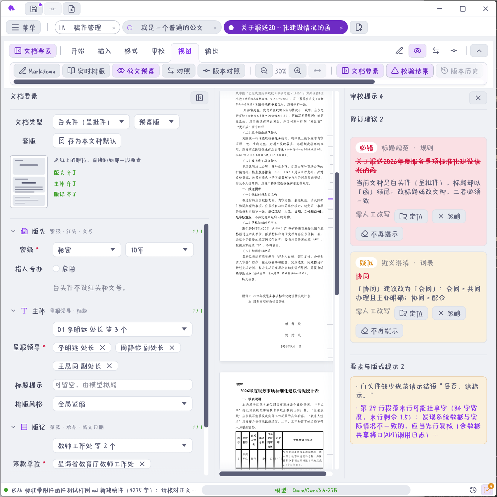

## 审校提示三档

右下状态栏点「审校提示」开抽屉。命中分三级，颜色与处置各不相同：

| 级别 | 颜色 | 含义 | 怎么处置 |
|---|---|---|---|
| **必错** | 红 | 确定性错误，规则说错就是错 | **一键替换**，签发前必须清零 |
| **疑似** | 黄 | 可能有问题，要看上下文 | 人判断：改或不改 |
| **提示** | 弱 | 风格建议、套话提醒 | 可整组关掉 |

> **注意** 必错级**不看模型脸色**。错别字、公文用语写法、称谓规范这些是确定性规则，模型说没问题也没用。SOP 的「文字校对」阶段盯的就是必错清零。

## 校对词表六组

内置校对词表（`proofread-lexicon.tsv`，155 条）分六组：

| 组 | 查什么 | 例子 |
|---|---|---|
| 错别字 | 形近、音近错字 | 「按装」→「安装」 |
| 近义混淆 | 用错的近义词 | 「截止」与「截至」 |
| 语病 | 搭配不当、成分残缺 | 「召开会议」误为「举行会议」的场合 |
| 套话虚词 | 冗余套话 | 「进行了认真的研究」 |
| 称谓规范 | 单位与人名称谓 | 简称误用于正式称谓处 |
| 公文用语 | 公文专门用语 | 「特此函告」类固定说法 |

外加 **15 条文档级规则**，查的是跨句的行文问题：文号格式、日期写法、成文日期落款、附件说明位置、称谓前后一致等。

用户层可在「校对词表」页叠加自定义条目，与内置词表合并生效。导出 Excel 备份（固定名「公文助手校对词表.xlsx」）。详见 [校对词表](chapter:16-proofread-table)。

## 要素校验

要素校验查的是**公文要素本身**：

- 密级与保密期限是否超上限（秘密≤10 年、机密≤20 年、绝密≤30 年）；
- 文号三要素（机关代字、年份、序号）是否齐；公函必须有文号，电话通知不该有文号；
- 主送、落款、成文日期是否缺；
- 承办联系人电话格式；
- 联合发文时主办单位与联合单位是否成对；
- 红头呈批件的承办条目是否超 4 条。

> **提示** 「缺要素不挡导出，但签发前必须补齐」——这句是程序的硬约定。导出唯一闸门是**正文为空**，要素缺失只进审校面板。SOP 的「要素齐备」阶段就是提醒你签发前补齐。详见 [办文全流程与 SOP](chapter:04-workflow)。

## 存疑清零：待核实占位

写稿时拿不准的人名、数字、文号，先插 `【待核实】` 占位：

1. 「插入」分区点「待核实」，正文里出现 `【待核实】`；
2. 审校面板把它列成**必办项**，逐条可点定位；
3. 落实一处销一处——把占位换成真内容，条目自动消失；
4. SOP 的「存疑清零」阶段没过，说明还有没核实的地方。

这套机制的用意是：**让「忘了核实」变成可见的待办**，而不是靠记性。

## AI 文字复核

「表达复核」是 AI 的活儿，但它产出的也只是建议：

- 由**独立的小模型**逐句查语病、称谓、标点；温度锁 0，同输入同输出；
- 可以与起草模型分开配置（「设置 → AI 文字复核」），不配就都走起草模型；
- 结果是**待确认的修订建议**，一条条采纳，正文不变；
- 采纳后自检：改动段落重跑校验，引入新问题自动回滚。

细节见 [AI 优化、提示词与文字复核](chapter:14-ai-polish)。

## 规则校验与重新校验

- 编辑过程中校验**增量跑**，改一处查一处；
- 功能区「审校 → 重新校验」是**全篇重扫**，改完批量替换后建议点一次；
- 校验结果随当前视图刷新，切换稿件时各自保留。

## 抽屉里的交互

| 操作 | 效果 |
|---|---|
| 点条目 | 正文定位到命中处 |
| 一键替换（必错） | 按建议写法替换，条目销掉 |
| 忽略 | 本条这次不管，下次校验还会上来 |
| 记住（忽略并记忆） | 永久忽略该条，重扫不再冒头 |
| 整组关（提示级） | 关掉整组提示，可再开 |

「记住」是永久的，误操作可以在校对词表页清空忽略记录。

## 词表复扫闸门

任何 AI 产物落地前都会**重跑一遍词表与规则**（`proofread` / `proofread_rules` 复扫）。AI 建议里若引入了错别字、不规范称谓，闸门会把它拦下丢弃——不会因为它来自模型就放行。这是三条红线的第三条，见 [AI 的边界与保障](chapter:12-ai-guard)。
