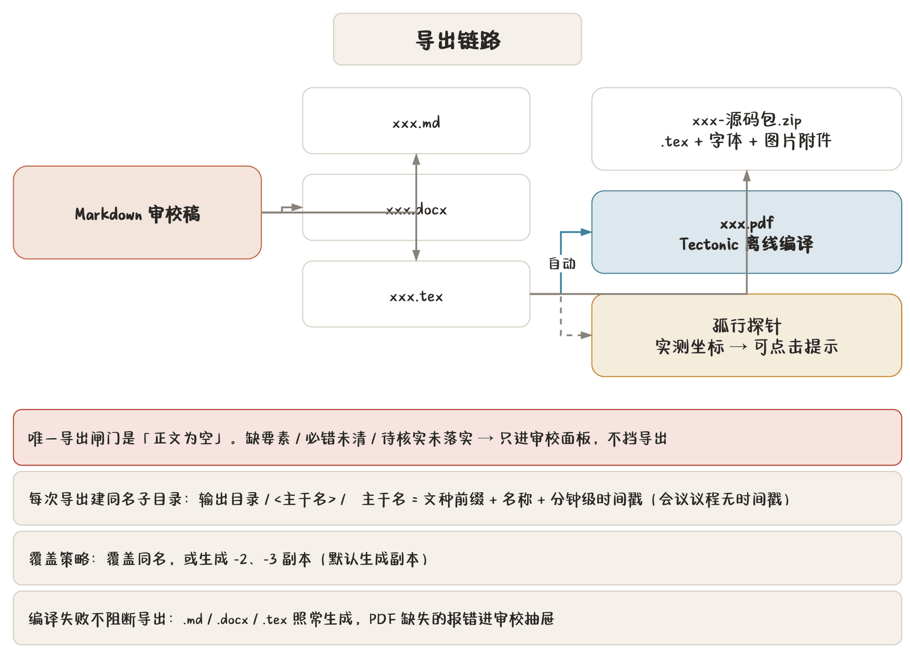

## 导出在哪、怎么导

入口有两处：

- 功能区「输出」分区（最全，含格式勾选）；
- 标题栏快捷访问的「导出」按钮（用上次的勾选）。

导出链路一图流：



程序做的事：

1. 生成 Markdown / DOCX / TeX 三种文本产物（按勾选）；
2. 自动检测 `.tex` → 内置 Tectonic **离线编译 PDF**（研究报告走研究报告专用编译）；
3. 编译后回读**孤行探针**实测坐标，生成带正文位置的可点击提示；
4. 编译失败**不阻断导出**——PDF 缺失记「编译错误」，在审校抽屉用红色提示框显示，其余产物照常可用。

## 三个勾选与覆盖策略

| 勾选 | 产物 |
|---|---|
| Markdown | `.md` 源码 |
| Word | `.docx` |
| TeX | `.tex` + **自动编译 `.pdf`** |

默认三者全勾。**PDF 不是独立勾选项**——有 `.tex` 就编 PDF。

> **提示** 只要 Word 不要 PDF？取消 TeX 勾选即可。反过来，公文的 PDF 必须从 TeX 编出来，不能从 Word 转——版式一致性就靠这条链路保证。

**覆盖策略**二选一：

- **覆盖同名**：同名文件直接盖掉；
- **生成副本**（默认）：同名时加 `-2`、`-3` 后缀，一次都不丢。

## 文件命名规则

每次导出在输出目录下建一个**同名子目录**，主干名按文种起：

| 文种 | 主干名格式 | 例 |
|---|---|---|
| 公函 | `{函号}-名称-时间戳` | `办函〔2026〕12号-关于商洽的函-202603151430` |
| 电话通知 | `电话通知-时间戳` | `电话通知-202603151430` |
| 普通公文 | `普通公文-名称-时间戳` | `普通公文-关于X的通知-202603151430` |
| 会议议程 | `名称-会议时间`（**无时间戳**） | `办公会-3月20日上午9时` |
| 白头件 | `白头-名称-时间戳` | `白头-关于X的请示-202603151430` |
| 红头呈批件 | `红头呈批-{函号}-名称-时间戳` | `红头呈批-办函〔2026〕12号-X-202603151430` |
| 研究报告 | `研究报告-名称-时间戳` | `研究报告-X课题-202603151430` |

- **时间戳精确到分钟**（`%Y%m%d%H%M`），同一分钟导两次会撞名，靠覆盖策略区分；
- 函号 = 机关代字〔年〕序号号；无序号回落用机关代字；全缺用「公函」；
- 会议议程**不带时间戳**，同名靠覆盖策略；
- 文件名经净化，非法字符替换掉。

## 输出目录结构

```text
输出目录/
  办函〔2026〕12号-关于商洽的函-202603151430/
    办函〔2026〕12号-关于商洽的函-202603151430.docx
    办函〔2026〕12号-关于商洽的函-202603151430.tex
    办函〔2026〕12号-关于商洽的函-202603151430.pdf
    办函〔2026〕12号-关于商洽的函-202603151430-源码包.zip
```

输出目录在「设置 → 输出与录入」里选，默认是**当前工作目录**。设置页可直接打开该目录。

源码包 `.zip` 里是 `.tex`、字体配置、图片与附件，拿到别的机器（装了 Tectonic）可以复现编译。

## 成品三入口

「输出」分区的三个图标是 TEX / PDF / WORD 成品入口：

- 按本次主干名前缀在输出目录里找**最近一次**产出；
- 找到就点亮，点了直接用系统程序打开；
- 找不到（这次还没导过）就灰着，点了提示先导出。

「打开输出目录」定位到本次导出的子文件夹。

## 研究报告的导出

研究报告的产物更多，见 [研究报告专章](chapter:08-research)。要点：

- **不出 `.docx`**；
- 除主 `.tex` 外还有 `md2tex.cls`、`data/chapterXX.tex`、`appendix/appendixXX.tex`、`references.bib`；
- 数学公式由 TeX 链路排版，预览字形与导出不同属正常。

## 批量导出 PDF

稿件管理页勾选多篇 → 「导出 PDF」：

- 后台逐篇编译，不卡界面；
- 盖章扫描件自动以「（盖章）」命名；
- 全部产物打包成一个 ZIP 下载到你选的位置。

适合换季归档时一次性出一批 PDF。

## 打印

PDF 查看器里有「打印」按钮：

- 弹系统打印对话框；
- 逐页光栅化后打印，可能花几秒，放后台线程，主界面照常可用；
- 结果经状态栏回报。

双面打印的页码位置在要素表单「双面页码」开关里配。

## 导出闸门只有一道

> **注意** 唯一会挡导出的是**正文为空**。要素缺失、必错未清、待核实未落实，都**不挡导出**——但都会进审校面板。

这个设计是刻意的：赶时间时先出个格式对的稿子补文号是真实节奏。SOP 的「要素齐备」阶段就是提醒你签发前补齐。**把审校面板当待办清单用，别当路障。**

## 导出后 PDF 编译失败怎么办

编译失败不回滚导出：

1. `.md` / `.docx` / `.tex` 照常生成；
2. 审校抽屉出现红色提示框，写明编译错误；
3. 修好后重新导出（用覆盖策略管住文件数）。

常见原因：本机字体被删、TeX 语法错（多见于研究报告公式）、图片路径失效。排查见 [附录 B 常见问题](chapter:b-faq)。
