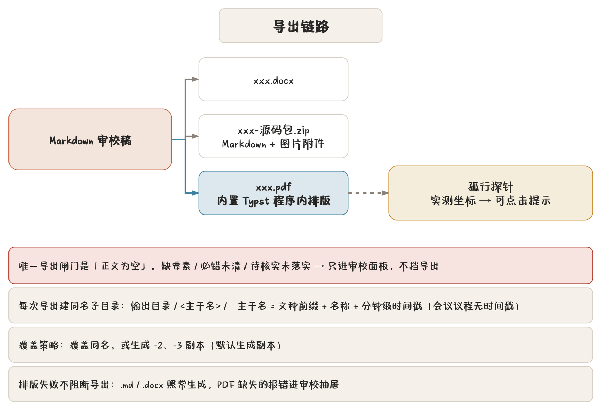

## 导出在哪、怎么导

入口有两处：

- 功能区「输出」分区（最全，含格式勾选）；
- 标题栏快捷访问的「导出」按钮（用上次的勾选）。

导出链路一图流：



程序做的事：

1. 生成 Markdown / DOCX（按勾选）；
2. 勾了 PDF 就排 PDF：内置 **Typst** 引擎在程序里直接排版，一份公文几十毫秒，完全离线，不依赖本机装任何排版软件；研究报告用它自己的版式模板，同样在程序里排；
3. 排完版回读**孤行探针**实测坐标，生成带正文位置的可点击提示；
4. 排版失败**不阻断导出**——PDF 缺失记「排版错误」，在审校抽屉用红色提示框显示，其余产物照常可用。

## 三个勾选与覆盖策略

| 勾选 | 产物 |
|---|---|
| Markdown | `.md` 源码 |
| Word | `.docx` |
| PDF | `.pdf` |

默认三者全勾。

> **提示** 只要 Word 不要 PDF？取消 PDF 勾选即可。反过来，公文的 PDF 由排版引擎按公文版式直接排出，不能从 Word 转——版式一致性就靠这条链路保证。

**覆盖策略**二选一：

- **覆盖同名**：同名文件直接盖掉；
- **生成副本**（默认）：同名时加 `-2`、`-3` 后缀，一次都不丢。

## 文件命名规则

每次导出在输出目录下建一个**同名子目录**，主干名按文种起：

| 文种 | 主干名格式 | 例 |
|---|---|---|
| 公函 | `{函号}-名称-版本名称` | `办函〔2026〕12号-关于商洽的函-送审稿` |
| 电话记录单 | `电话记录单-版本名称` | `电话记录单-初稿` |
| 电话通知 | `电话通知-版本名称` | `电话通知-送审稿` |
| 普通公文 | `普通公文-名称-版本名称` | `普通公文-关于X的通知-送审稿` |
| 会议议程 | `名称-会议时间-版本名称` | `办公会-3月20日上午9时-送审稿` |
| 白头件 | `白头-名称-版本名称` | `白头-关于X的请示-送审稿` |
| 红头呈批件 | `红头呈批-{函号}-名称-版本名称` | `红头呈批-办函〔2026〕12号-X-送审稿` |
| 研究报告 | `研究报告-名称-版本名称` | `研究报告-X课题-送审稿` |

- **后缀使用实际对应的提交版本名称**，如“送审稿”“定稿”；尚未入库、从未提交或提交后正文 / 行文要素有修改，都用“待提交”。保存到稿件库不等于提交版本；
- 函号 = 机关代字〔年〕序号号；无序号回落用机关代字；全缺用「公函」；
- 载入历史版本且未修改时，用该历史版本的名称；所有文种（含会议议程）统一使用版本后缀；
- 重复导出同一版本或“待提交”稿时，按覆盖策略复用目录或追加 `-2`、`-3`，目录与内部文件共用主干名；
- 文件名与版本名称经净化，非法字符替换掉，过长名称截短。

## 输出目录结构

```text
输出目录/
  办函〔2026〕12号-关于商洽的函-送审稿/
    办函〔2026〕12号-关于商洽的函-送审稿.docx
    办函〔2026〕12号-关于商洽的函-送审稿.pdf
    办函〔2026〕12号-关于商洽的函-送审稿-源码包.zip
```

输出目录在「设置 → 输出与录入」里选，默认是**当前工作目录**。设置页可直接打开该目录。

源码包 `.zip` 里是 Markdown 正文与它引用的图片（研究报告另带 frontmatter 与 `references.bib`），拿到别的机器导入公文助手就能复现。

有公文引用时，主 `.md` 已展开成《名称》（文号），供普通 Markdown 工具使用；
包内另带 `-可编辑.md`，保存引用标记和快照。需要继续管理引用时导入可编辑文件，
或直接用稿件库的离线 ZIP 同步。Word / PDF 都使用本篇快照，不要求本机存在来源稿件。

## 成品三入口

「输出」分区的两个图标是 PDF / WORD 成品入口：

- 按本次主干名前缀在输出目录里找**最近一次**产出；
- 找到就点亮，点了直接用系统程序打开；
- 找不到（这次还没导过）就灰着，点了提示先导出。

「打开输出目录」定位到本次导出的子文件夹。

## 研究报告的导出

研究报告的产物更多，见 [研究报告专章](chapter:08-research)。要点：

- PDF 是一个文件：封面、目录、正文、附录与参考文献都在里面；
- 勾选 Word 时走研究报告自己的 mdx 转换器，封面、目录与分节页码与 PDF 对齐；
- 数学公式与预览用同一个排版器，预览看到的公式就是 PDF 上的公式。

## 批量导出 PDF

稿件管理页勾选多篇 → 「导出 PDF」：

- 后台逐篇排版，不卡界面；
- 盖章扫描件自动以「（盖章）」命名；
- 全部产物打包成一个 ZIP 下载到你选的位置。

适合换季归档时一次性出一批 PDF。

## 打印

PDF 查看器里有「打印」按钮：

- 弹系统打印对话框；
- 逐页光栅化后打印，可能花几秒，放后台线程，主界面照常可用；
- 结果经状态栏回报。

双面打印的页码位置在要素表单「双面页码」开关里配。

## PDF 查看器

导出的成品与归档的盖章扫描件都在标签页里用**内置查看器**打开——纯 Rust 渲染，不依赖系统 PDF 阅读器。工具栏：

| 控件 | 说明 |
|---|---|
| 页码框 | 直接跳到第 N 页（右边写总页数） |
| **连续** | 默认。所有页上下相连，自由滚动 |
| **单页** | 按页翻看，滚轮一格翻一屏；**窗口够宽时从左到右并排多页**（最多 6 页）。也可用 `PageUp` / `PageDown`、方向键翻页 |
| 缩放 | `−` / `+`、百分比、`100%`、`适合宽度`、`适合页面`；按住 `Ctrl` 滚动滚轮同样缩放 |
| 打印 | 见上一节 |
| 系统打开 | 复杂或加密的外来 PDF 走系统程序兜底；「在文件管理器中定位」直接指到文件 |

打开时先取全部页面的点尺寸，滚动条一开始就是准的；只有视口内的页才光栅化，一页要一两秒的重页由几条渲染线程分担，不堵住后面的轻页。

**选字与复制**：鼠标移到文字上会变成文本光标，按住拖动即可选字，跨行跨页都行；拖出视口会自动滚动。`Shift` 加选，`⌘C` / `Ctrl+C` 或右键「复制」取走选中的文字，`Esc` 或单击取消。复制出的文字里西文词间按间隙补回空格，中文之间不补。

## 导出前检查

> **注意** **正文为空**或**公文引用结构损坏**会挡导出。引用未定义、重复定义、快照损坏或标记破损时，请先修复，避免正式成品印出错误标记。其他要素缺失、必错未清、待核实未落实，仍会进审校面板，通常不挡导出。

这个设计是刻意的：赶时间时先出个格式对的稿子补文号是真实节奏。导出成功后状态栏末尾会缀上「仍有 N 项要素问题待补齐」，左栏要素区的「缺 N 项」也一样。**把审校面板当待办清单用，别当路障。**

## 导出后 PDF 排版失败怎么办

排版失败不回滚导出：

1. `.md` / `.docx` 照常生成；
2. 审校抽屉出现红色提示框，写明排版错误；
3. 修好后重新导出（用覆盖策略管住文件数）。

常见原因：本机字体被删、研究报告的随包字体缺失（runtime 不完整）、图片路径失效。研究报告公式写错不会让 PDF 失败，排不出的公式按源码印出并在提示里列出。排查见 [附录 B 常见问题](chapter:b-faq)。
