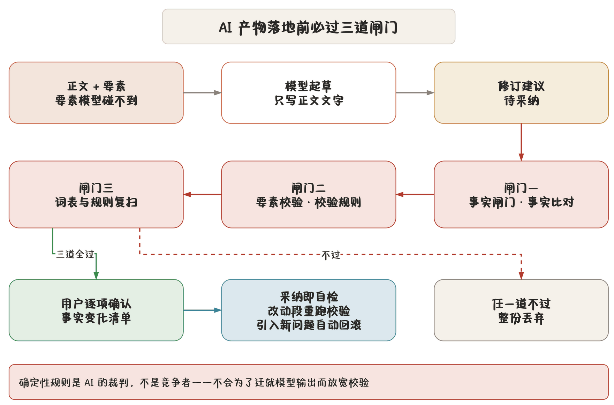

## 三条红线

AI 在这个程序里是**加装件**。三条红线是硬约束，写在代码路径上，不是口号：

> **红线一** AI 永远不直接写入正文。它的产物只能是需要你采纳的「修订建议」。你点接受之前，正文一个字都不变。

> **红线二** AI 永远不碰公文要素。单位、人员、文号、密级、成文日期这些字段模型碰不到，也回写不了。

> **红线三** 任何 AI 产物落地前必须过确定性闸门：事实比对、要素校验、词表与规则复扫。闸门不过就丢弃。

推论：**确定性规则是 AI 的裁判，不是竞争者。** 不会为迁就模型输出而放宽校验规则。错别字规则说错就是错，模型说没问题也没用。

## 修订建议总线

AI 产出统一走「修订建议」（`Revision`）这条总线：

| 字段 | 含义 |
|---|---|
| 建议内容 | 替换后的文字 |
| 锚点 | 在正文里的定位范围 |
| 说明 | 为什么改（模型给的理由） |
| 事实变化 | 关键事实的改动清单（若有） |
| 状态 | 待确认 / 已采纳 / 已忽略 |

为什么必须这样：AI 直接改正文有两个致命问题——你不知道它改了什么，它可能改错你没法追。做成建议后：

1. **改动可见**：提案审阅窗左边是当前稿、右边是建议稿，逐处对照；
2. **可逐条取舍**：五条建议采纳三条是常态；
3. **可回滚**：采纳后自检出问题，自动回退那次采纳。

### 锚点漂移

你正在改稿时，AI 建议的锚点会「漂」——原文位置变了。程序处理方式：

- 锚点按**文本匹配**而非字节偏移，改几行不影响定位；
- 实在对不上就标记「锚点失效」，建议作废不乱贴；
- 采纳前会重新校验锚点是否仍然成立。

## 事实闸门

AI 最危险的不是写得差，是**把事实改错**：单位名写成简称、人名写错字、日期改了、数字变了、引用的文件号对不上。

程序在两个时刻跑事实闸门：

1. **生成前**：抽取关键事实，写进提示词要求模型**不得改动**（`protected_facts_prompt`）；
2. **采纳后**：比对采纳后的正文与原始关键事实，发现未授权改动就拦下。

关键事实分五类：

| 类 | 例 |
|---|---|
| 单位 | 发文单位、主送、抄送、承办 |
| 人员 | 联系人、呈报领导 |
| 日期 | 成文日期、会议时间 |
| 数字 | 份数、文号序号、电话、金额 |
| 文件依据 | 被引文件的文号与标题 |

这些事实从两处来：公文要素字段（模型本来就碰不到）与正文里识别出的关键片段，以及**标准词库**里的单位与人员全称。

### 事实变化必须逐项确认

提案审阅窗里，若建议改动了关键事实，会单列一块**事实变化清单**：

- 每条写明改了什么（如「『市财政局』→『市财政和预算局』」）；
- 必须**逐项核对**，勾选确认；
- 有未确认的事实变化，「接受」按钮不亮。

这是有意做成两段式的：文字润色可以整块看，事实改动必须一条条过。

## 采纳即自检

点「接受」不是终点：

1. 建议内容写入正文；
2. **改动过的段落立刻重跑校验**（要素校验 + 词表复扫 + 规则）；
3. 引入新问题（新错别字、称谓不规范、要素不一致）就**自动回滚那次采纳**；
4. 状态栏提示「采纳后自检发现问题，已回滚」。

所以你不会出现「AI 改完之后多了一个错别字」而不自知。闸门挡不住的，自检兜底。

## 确认的分级

不同 AI 操作要的确认强度不同：

| 级别 | 何时用 | 交互 |
|---|---|---|
| 整块确认 | 不涉关键事实的纯文字润色 | 看左右对照，一次接受 |
| 逐项确认 | 涉关键事实的改动 | 事实清单逐条勾选 |
| 事前确认 | 材料成文、知识起草的事实单 | **先出事实单、逐项确认，再起草** |

第三种最严格：材料成文先把材料拆成**可编辑的事实单**（程序拆分，**不调模型**），你逐项改定确认，然后才按确认后的事实单起草。模型从头到尾没机会自己定事实。

详见 [AI 起草工作台](chapter:13-ai-workbench)。

## 大小模型分工

| 角色 | 用什么模型 | 干什么 |
|---|---|---|
| 起草 | 大模型（中文指令模型） | 仿写、扩写、润色、成文 |
| 复核 | 小模型（可独立配置） | 逐句查语病、称谓、标点；温度锁 0 |

小模型的铁律：

- **只出建议不改正文**（红线一）；
- **输出形态由程序内置约束**，用户改不了也关不掉——这保证建议永远能被解析、能被闸门检查；
- 同输入同输出（温度 0），便于回归测试。

## AI 不做什么

为免误解，明确列出 AI **不做**的事：

- 不填要素、不改要素、不决定文号；
- 不决定版式（字体、行距、页码、版头版记位置）；
- 不直接改正文；
- 不跳过闸门；
- 不联网、不上传你的稿子——模型就在你机器上。

AI 能做的：起草正文文字、提出修改建议、按你确认的事实成文。**判断权始终在你。**
