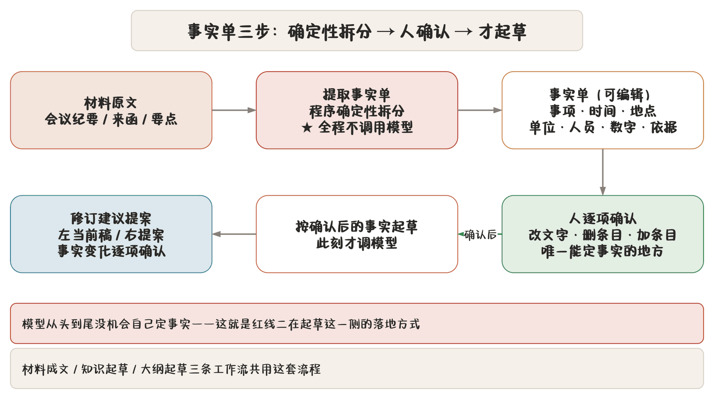

## 工作台入口与五种工作流

「开始」分区点「AI 起草」打开工作台：

| 工作流 | 干什么 | 何时用 |
|---|---|---|
| **仿照起草** | 载入基准稿做仿写 | 有同类旧稿，要出新稿 |
| **知识起草** | 依据主题和知识库起草 | 有历史成稿积累 |
| **材料成文** | 从材料形成事实单，确认后成文 | 手里有原始材料 |
| **大纲起草** | 先列大纲、人确认后再逐节填 | 长文、结构优先 |
| **受控润色** | 只生成修改提案 | 已有稿子要润 |

五个工作流共用一件事：**AI 只出建议，正文由你采纳。**

## 仿照起草

载入一篇基准稿（从稿件库选或当前稿），四种仿写策略：

| 策略 | 用途 | 例 |
|---|---|---|
| 结构仿写 | 抄结构不抄内容 | 按商洽函框架写新商洽事项 |
| 同类改稿 | 同文种换事实 | 去年的通知换今年的时间地点 |
| 局部更新 | 只改指定部分 | 换掉其中一段事项 |
| 续期换届 | 机构换届、任期续期 | 委员会换届通知 |

四种策略的差别在**约束强度**：结构仿写最松（可改写每一段），续期换届最紧（时间、届次这类要素严格替换，其余照搬）。

> **红线** 无论哪种策略，公文要素（单位、人员、文号、密级、日期）都不在模型的改动范围内。仿的是正文写法，不是要素。

## 知识起草

「依据主题和知识库起草」：

1. 填主题（写什么）与文种；
2. 程序**先出事实单**（时间、单位、事项等要你定的点）；
3. 你逐项确认；
4. 程序按主题 + 文种到知识库**检索同文种片段**（RAG）；
5. 模型结合检索片段与确认后的事实起草。

知识库要先建好，见 [知识库与问答](chapter:18-knowledge)。检索不到就退回纯主题起草，会提示「知识库无同文种片段」。

## 材料成文

「先从材料形成可编辑事实单，确认后再按当前文种和版式生成 Markdown」：

1. 粘贴或导入材料原文（可以是会议纪要、来函、口头要点）；
2. 点「提取事实单」——**程序按材料原文拆分，不调用模型**；
3. 事实单逐项可改：改文字、删条目、加条目；
4. 确认后按当前文种与版式起草。

> **提示** 「提取不调模型」这点很关键：事实单是**确定性拆分**的结果，模型没机会在拆分阶段就把事实改错。模型只在你确认之后、按你确认的事实写正文。

事实单里典型字段：事项、时间、地点、单位、人员、数字、依据文件。缺的项自己补，多的项删掉。

## 大纲起草

「先列大纲、人确认后再逐节填」：

1. 给主题与要点；
2. 模型出**大纲**（节标题 + 每节要点）；
3. 你在大纲窗里调整：改标题、换顺序、加节删节；
4. 确认后**逐节**填内容，每节填完可单独看、单独改。

适合长文（工作报告、调研报告）。逐节填的好处是：一节写砸了只重写那节，不用整篇重来。

## 受控润色

「AI 只生成修改提案；单位、人名、日期、数字和文件依据发生变化时必须另行确认」：

| 选项 | 说明 |
|---|---|
| 润色范围 | 全文 / 当前选区 |
| 提示词 | 从提示词库选，或写临时提示词 |
| 临时素材 | 用完即弃的补充上下文 |

流程：

1. 选范围与提示词；
2. 模型出**修改提案**（不是直接改）；
3. 提案审阅窗左右对照；
4. 涉关键事实的改动**单列清单逐项确认**；
5. 接受后自检，有问题自动回滚。

提示词库管理见 [AI 优化、提示词与文字复核](chapter:14-ai-polish)。

## 提案审阅窗

所有工作流的产出都进同一个「审阅 AI 修改提案」窗：

| 区域 | 内容 |
|---|---|
| 左 | 当前审校稿 |
| 右 | AI 提案 |
| 中 | 增删对照，逐处可跳 |
| 下 | 事实变化清单（若有）、接受 / 忽略按钮 |

> **提示** 「接受前不会覆盖正文或自动导出」——这是硬约定。你关掉窗、程序崩了，正文都是原来的样子。

接受后：

- 提案写入正文；
- **重新执行审校**（要素 + 词表 + 规则）；
- 新问题自动回滚那次采纳。

忽略后提案作废，可在会话里重新生成。

## 事实单：三步走

材料成文、知识起草、大纲起草共用事实单流程：

1. **提取**（不调模型）：程序从材料原文确定性拆分；
2. **确认**（人）：逐项改定，这是唯一能定事实的地方；
3. **起草**（调模型）：按确认后的事实单写正文，提示词里附「不得改动」清单。

模型从头到尾没机会自己定事实。这是红线二（不碰要素）在起草侧的落地方式。

## 用起来的几个建议

- **仿照起草**选基准稿要选**同文种**，跨文种仿写效果差；
- **材料成文**的材料越原始越好——会议纪要比整理好的摘要强，因为事实更全；
- **大纲起草**别偷懒跳过大纲确认，逐节填之前结构定了，后面很少返工；
- **受控润色**先用全文跑一遍看整体，再用选区精修局部；
- 任何工作流出来的提案，**先看事实变化清单再看文字**——事实对了，文字好改。
