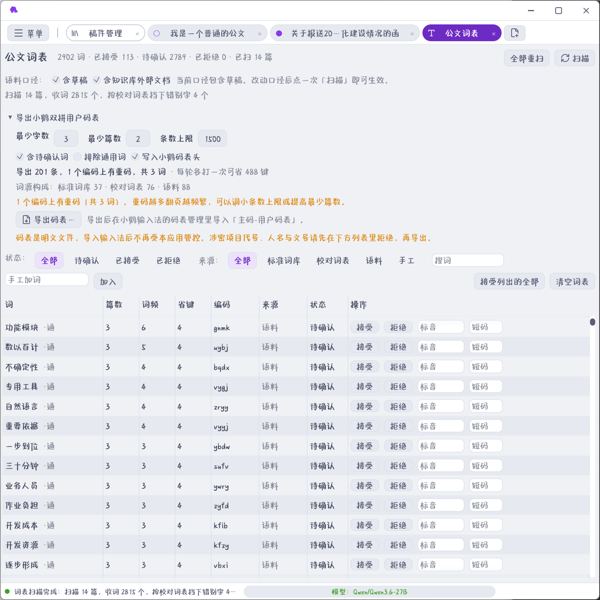

## 公文词表是什么

「公文词表」页把**长期积累的公文变成输入法词库**，让打字和成文用的是同一套名称。

它是 SQLite 表（与稿件库同一文件），不是配置项。核心循环：

**扫描收词 → 合并标准写法 → 人工确认 → 导出码表 → 导入输入法**



页面自上而下就是这条循环：先定语料口径并扫描，再在导出面板里调参数看省了多少键，最后在列表里逐词定夺。

## 扫描：累积

点「扫描」处理正文变过的稿件：

- **按内容哈希记账**：已扫过且没改动的整篇跳过；
- 同一篇稿件反复保存**不会把词频算重**；
- 默认只统计**已发布与已归档**的稿件，草稿默认不计入（可在扫描选项里改）；
- 扫描有进度条，可随时看处理到哪篇。

范围可收窄（按文种、按状态、按时间），收窄后立即生效。

收词规则：

- **单字与非汉字永不入表**——单字进了码表只是浪费编码空间；
- 词按分词器切出，人名、单位名靠标准词库的用户词典保住整体；
- 重复出现累加**篇数**（不是次数）。

## 合并：标准写法自动进来

扫描时自动并入两类写法，**都置为已接受**：

| 来源 | 并入什么 |
|---|---|
| 标准词库 | 单位全称、对外名称、简称、别名、机关代字 |
| 校对词表 | 「建议写法」 |

同时：

- 校对词表里的「**错误写法**」进**黑名单**——既不入库也不导出；
- 所以**不会把写错过的字固化进输入法**。

> **提示** 这套合并是双向的：标准词库改了单位名，重扫一遍词表就同步过来。不需要手工搬运。

## 确认：人工定夺

扫描结果里每条词可以：

| 操作 | 效果 |
|---|---|
| 接受 | 进词库，可导出 |
| 拒绝 | **永久记住**，重扫不再冒头 |
| 标读音/四码 | 人工指定读音或四码，**锁定**，重扫不覆盖 |

**拒绝过的词永久记住**——涉密的项目代号、人名、文号，扫出来就拒绝，下次不会再冒头。

**人工标过读音或编码的词条会锁定**——你花心思定过的编码，重扫不会冲掉。

## 排序：省键数 × 篇数

排序与筛选按**省键数**来，**不按词频**：

- 建议词组编码是**四码定长**：n 字词正常敲 `2n` 键，进用户码表一律 `4` 键；
- 所以省 `2n-4` 键——**二字词省 0 键，默认不导出**；
- 排序权重是 **省键数 × 出现篇数**。

三字词省 2 键、四字词省 4 键，越长越划算。出现篇数多的优先——常写才值得占编码空间。

> **注意** 导出默认有**条数上限**：用户码表与主码表合用同一个编码空间，词收得越多重码越多、翻页越频繁。宁可少而精。

## 导出公文四码词表

「导出」生成公文四码词表：

| 特性 | 说明 |
|---|---|
| 编码 | UTF-8 **带 BOM** |
| 格式 | 文字、制表符、四码 |
| 重码 | 同时写出**重码报告** |
| 内容 | 只含**已接受**且**不在黑名单**的词 |

导入方法：在「设置 → 输入法 → 词表管理」选择「导入公文四码表」。

重码报告要看看：同码的词会互相抢候选，翻页频繁。报告里列出冲突对，可以回去拒绝掉不那么常用的那条。

### 涉密提醒

> **警告** 导出的码表是**明文文件**，导入输入法后**不再受本应用管控**。涉密的项目代号、人名与文号请**先在词表页拒绝再导出**。

拒绝是永久的，会挡住重扫再冒头。导出前扫一眼列表，敏感词都拒绝掉。

## 词表的其他用途

也导出**重码报告**与**统计**（收了多少词、省了多少键）。导出文件名自动起（按词库规模与日期）。

即使不开启词表输入法，公文词表依然有用——它同时是**收词统计**与**写法审校**的依据。

## 词表输入法

应用内输入法只按编码查词表，不使用全拼、双拼、整句模型或自动调频。
最终候选来自基础表、公文词表、已启用的导入表与个人词条；同码同词合并，保留来源。

### 基础表

初始基础表为 `quan.txt`，保留其中的单字、词组、一至三码和四码。
首次运行优先使用用户目录已有的 `ime/base.txt`；没有时从随包 `runtime/ime/base.txt`
或开发资源 `assets/fuma/quan.txt` 载入。旧版导入的音形表也能迁移。
修改保存到用户目录，不覆盖初始资源。重新导入基础表可更新整张表。

### 公文四码词表

「公文词表」中已接受且编码为四码的词，维护后几秒内自动加载。
扫描发现的待确认词不会进入候选。词条可以直接指定四码，读音只用于生成编码建议。

「设置 → 输入法 → 词表管理」也可直接导入已有四码表：

```text
综合处室	zhcs
```

其中分隔符为制表符，也支持 `zhcs,1=综合处室`。基础表接受 1–4 个小写字母，
公文与个人词条使用四码。UTF-8、UTF-16、GBK 自动识别。
导入前显示新增、已有、重码、重复与无效记录；确认后立即生效。
每份导入表可单独停用或撤销，其他来源的同码同词仍然保留。

### 维护

- 查文字看编码，查完整编码看候选、来源和顺序；「只看重码」帮助整理冲突。
- 基础表与个人词条可以修改文字或编码；基础表修改前保留一个上次版本。
- 候选可设首选、上移、下移；顺序稳定，不根据使用频率自行变化。
- 停用某个「编码＋文字」对后不出候选，可随时恢复。
- 正文选中文字后右键「加入词表」，填写四码即可，不修改正文。
- 导出最终词表生成可再次导入的完整表；个人备份保存导入表、个人词条、屏蔽与排序。
- 基础表的更新不会清除公文表、个人词条和个人调整。

### 按键

小写字母进入编码；一至三码只查询表中明确的简码，不展开四码前缀。
空格选高亮、1–9 选当前页候选，设置的翻页键或 PageUp / PageDown 翻页。
退格、Delete、左右与 Home / End 编辑编码；Esc 清码，回车原样上屏编码。
单击 Shift 切中英，切到英文时已输入的编码原样上屏。

「四码唯一候选自动上屏」默认关闭；打开后单字与词组一致。
「第五码顶屏」默认打开：四码后继续输入字母时，先上屏当前候选，再开始下一编码。
四码没有候选时保留原编码，请退格修正或按 Esc 清码。空格不会把无码字母写进正文。

### 文件

| 文件 | 内容 |
|---|---|
| `config/ime/base.txt` | 当前基础表 |
| `config/ime/base.previous.txt` | 上次基础表 |
| `config/ime/tables.json` | 导入表、个人词条、屏蔽和排序 |
| `config/ime/tables.previous.json` | 恢复个人备份前的文件 |

旧拼音词库、语言模型与学习数据不再使用；旧用户文件不主动删除。
未导入基础表时，中文输入交给系统输入法。
