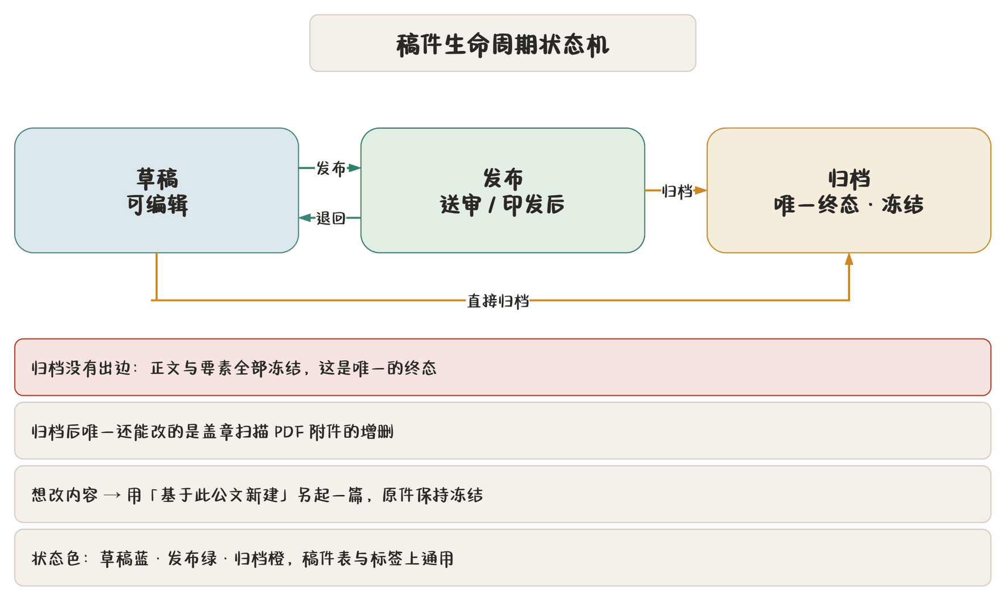

## 稿件库在哪

「稿件管理」页管稿件库（SQLite，`config_dir()/manuscripts.db`）。所有稿件、版本、盖章附件都在这一个文件里，与知识库、公文词表同库。

打开失败不阻塞启动：稿件管理页显示错误，其他功能照常。

## 生命周期状态机

| 状态 | 含义 | 能去哪 |
|---|---|---|
| 新建 | 历史遗留状态，已取消 | — |
| **草稿** | 可编辑 | 发布、归档 |
| **发布** | 送审/印发后 | 退回草稿、归档 |
| **归档** | **唯一终态** | 无 |

- **归档无出边**：归档后正文与要素**全部冻结**；
- 归档后唯一还能改的是**盖章扫描 PDF 附件**的增删；
- 想改内容，只能「基于此公文新建」另起一篇。

发布 → 退回草稿是唯一的反悔路径。状态色：草稿蓝、发布绿、归档橙。

## 列表与筛选

| 能力 | 说明 |
|---|---|
| 筛选 | 按状态、文种、关键字、时间范围 |
| 计数 | 各状态稿件数 |
| 勾选 | 批量操作 |
| 排序 | 按时间、按标题 |

筛选条件变化会自动重查。列表行显示状态点、密级、标题、文种、更新时间。

## 新建三条路

| 路径 | 用途 |
|---|---|
| 新建空白文档（`Ctrl+N`） | 从零写 |
| 从文件新建文档 | Word / Excel / PPT / ODF / RTF / EPUB / CSV 转 Markdown，可导 23 种 |
| 从文件夹新建研究报告 | 合并第一层 `.md`，导入图片与 BibTeX |
| **基于此公文新建** | 要素连同版式带过去 |

「基于此公文新建」是高频项：同类公文只改事项，比从零填要素省事得多。

### 从文件导入

导入走 `anydoc` 转 Markdown，纯文本与 `.md` 直接读。转完**归一化**（换行统一、空白整理）后进起草页。图片会一并收进 `images/`，文档里存相对路径。

## 版本

提交版本、版本历史、对照、回退、花脸稿见 [版本、对照与花脸稿](chapter:10-versions)。要点：

- 保存是「现在这样」，提交版本是「这一刻留档」；
- 版本可回退，**回退不清历史**；
- 花脸稿导出改稿痕迹（删波浪线、增方框）送审。

## 盖章扫描件

稿件详情里可挂**盖章扫描 PDF**：

| 特性 | 说明 |
|---|---|
| 一等公民 | 预览可直接打开（PDF 查看器） |
| 归档后唯一可改 | 归档冻结正文与要素，只留附件增删 |
| 批量导出命名 | 自动加「（盖章）」 |

印发环节把盖章件挂回来，归档就完整了。

## ZIP 导出与迁移

「导出 ZIP」把稿件（可多选）打包带走：

| 特性 | 说明 |
|---|---|
| 可设密码 | 密码单独存 `config_dir()/.zip-password`（Unix 权限 0600） |
| **随附词库** | 包内带 `vocabulary.json` **完整标准词库**（含单位、人员与联系方式） |
| 图片随包 | 相对路径的图片一并打包 |

导入 ZIP 时：

1. 预览页显示**包内词库规模**；
2. 默认勾选「**合并包内标准词库到本机**」；
3. 合并策略：按**层级编码/姓名**增量合并，**不覆盖**目标机器已有的词条；
4. 取消勾选则只导入稿件。

> **提示** 换机器的推荐姿势：源机导出 ZIP（勾记住密码方便），目标机导入（勾合并词库）。稿件、图片、词库一次到位。

旧版稿件包不带词库，导入不受影响。

## 批量导出 PDF

勾选多篇 → 「导出 PDF」：

- 后台逐篇编译，不卡界面；
- 盖章件自动加「（盖章）」命名；
- 全部打包成一个 ZIP。

适合换季归档一次性出一批 PDF。详见 [导出、打印与文件命名](chapter:11-export)。

## 删除与清理

- 删除有二次确认；
- 删除稿件时**清理孤儿图片**：只删仅被该稿件引用的图片，别的还在用的一律保留；
- 版本、附件随稿件删除；
- 批量删除需单独二次确认。

> **注意** 删除是**硬删**，没有回收站。删之前不确定就先导出 ZIP 备份。

## 自动保存与退出

- 每 2 分钟自动保存打开中的稿件；
- 退出时汇总确认未保存/未提交的篇目；
- 启动恢复上次全部标签现场。

见 [版本、对照与花脸稿](chapter:10-versions)。
