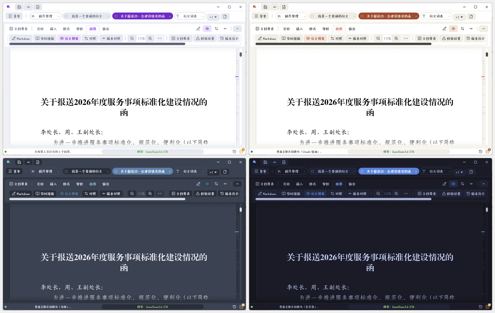

## 十个分区

「设置」页左栏十项，按「配什么」分成四摞：

| 组 | 分区 |
| --- | --- |
| 外观 | 界面主题、字体、输入法 |
| 公文排版 | 标题与列表编号、密级规则 |
| 文件与现场 | 输出与录入、导出格式、保存与现场 |
| 网络与帮助 | 网络代理、上手指引 |

主题、纸面与字体改完**立即生效**；其余各项要**保存**后才写入配置文件。

> **提示** 模型服务、文字复核、知识库检索、技能、数据接口、工具调试台都搬到了 **AI 管理**页
> （见 [AI 管理：模型、技能与润色预设](chapter:14-ai-polish)）。设置页左栏顶上留了一条「AI 设置在『AI 管理』」，
> 点一下直达。网络代理是全局的，起草、复核、知识库、数据接口都走它，所以留在这里。

## 网络代理

起草、文字复核、知识库的 embedding / rerank 请求，以及技能调用的数据接口，都走这里设的通道。

| 连接方式 | 说明 |
| --- | --- |
| 直连 | 不走任何代理，环境变量里设的也不认 |
| 跟随系统 | **默认**。先看 `HTTPS_PROXY` / `HTTP_PROXY` / `ALL_PROXY` 环境变量，没设再读 Windows「设置 → 网络和 Internet → 代理」里的手动代理；不支持 PAC 脚本 |
| 自定义代理 | 填代理地址，如 `http://127.0.0.1:7890`、`socks5h://127.0.0.1:1080` |

- 协议支持 `http`、`https`、`socks4`、`socks4a`、`socks5`、`socks5h`，没写协议按 `http`
- 需要认证时写成 `socks5://用户名:密码@主机:端口`
- `socks5h` 由代理端解析域名，本机 DNS 不可靠时用它
- 「不走代理」填逗号分隔的域名、IP 或网段，如 `intranet.gov.cn, 10.0.0.0/8`

> **注意** 本机地址（`localhost`、`127.0.0.1`）**始终直连**，本地 LM Studio / Ollama 不受代理影响。

代理改完**立即生效**，可以直接点「测试连接」验证，再保存写入配置文件。

> **提示** 设了代理又要调内网的数据接口时，把内网地址段填进「不走代理」，例如 `10.0.0.0/8`。

## 输出与录入

| 配置 | 说明 |
| --- | --- |
| 输出目录 | 导出产物的根目录，**默认当前工作目录** |
| 打开输出目录 | 直接定位 |
| 文档标题回退 | 标题留空时用什么回退 |

输出目录下的子目录结构见 [导出、打印与文件命名](chapter:11-export)。

「录入与编辑器」还可分别开关 Markdown 源码模式的左侧标题目录和右侧全文缩略图。两者默认显示；起草页顶部和「视图」分区也有即时开关。缩略图可用滚轮浏览，点击或拖动定位；开启时源码编辑区隐藏传统滚动条。

## 界面主题

十四套主题即点即换（明色八、深色六），菜单底部也有入口。另有**纸面明暗**三档：

| 档 | 效果 |
| --- | --- |
| 跟随主题 | 纸面明暗跟界面主题走 |
| 白纸黑字 | 强制白纸 |
| 深色纸面 | 屏幕上省眼 |

> **注意** 纸面明暗**只影响屏幕预览**，导出一律白纸黑字红头。

## 字体

字体分四层：

### 编译字体（公文五处）

| 位置 | 默认 | 用途 |
| --- | --- | --- |
| 标题 | 方正小标宋 | 文件标题 |
| 一级标题 | 方正黑体 | `#` |
| 二级标题 | 方正楷体 | `##`，兼主送机关、正文括号与斜体；西文、数字与符号取楷体_GB2312 字面 |
| 正文 | 方正仿宋 | 正文；西文、数字与符号取仿宋_GB2312 字面 |
| 页码 | 方正书宋 | 页码；数字保持宋体字面 |
| 粗体 | 专用粗体 | `**粗体**`，内置为方正黑体 |
| 兜底 | 方正书宋 | 缺字时替补 |

内置中文一律是覆盖 GBK 的方正系列。仿宋、楷体是随包的合成字体（公文仿宋、公文楷体）：汉字取方正仿宋 / 方正楷体，西文、数字、带圈数字「①②」、弯引号、破折号等非汉字取仿宋_GB2312 / 楷体_GB2312，所以正文、表格、各级仿宋与楷体标题、主送机关、括号楷体、列表编号的西文数字都是国标字面。页码数字另用一支取自宋体的随包拉丁子集，黑体与小标宋用自带字面。某处另选了本机字体，那一处就用本机字体自己的西文数字。

勾「**使用本机字体编译**」后给五处分别选本机字体，留「内置」就继续用内置。屏幕预览同步切换，所见即所得。

> **注意** 排版 PDF 时**按文件加载**所选字体；字体文件后来被删/卸载会自动退回内置，并在导出结果里提示。Word 里写的是字体名，在别的机器上打开要装了同名字体才一致。研究报告的字体固定，不受这一组设置影响。

**字体集合（`.ttc`）不可选**：`.ttc` 一个文件装多字面，按文件加载须指定是哪一个。请找单字面的 `.ttf`。列表只收 `.ttf` 与 `.otf`。

二级标题字体**同时充当正文斜体**，改它一并影响正文里的斜体。

### 兜底字体

内置字体（方正系列）全部覆盖 GBK，「喆」「赟」「堃」这类字直接就能排。兜底字体是给**另选了本机字体**的位置准备的：那支字体排不出的字自动换用兜底字体，**预览、Word、PDF 三端一致**，不必配置。

内置兜底是方正书宋，覆盖 GBK 两万余汉字，日常够用。要排 GBK 以外的字（如「𠮟」），在「兜底字体」另选字库更大的本机字体——这一项**不受**「使用本机字体编译」开关约束（它决定的是排不排得出来，不是版式）。所选字体也漏的字，仍由内置兜底接着兜。

### 界面字体

界面字体不随包：Windows 微软雅黑、Linux Noto Sans SC、macOS 苹方，可另选本机字体。与公文字体互不干扰。

### 源码编辑器 Markdown 字面

三套模板（编辑器字体 / 标题随公文 / 与公文一致）或六处自定义。只改屏幕字面，不影响导出。见 [拟稿：源码编辑与五种视图](chapter:06-editor)。

## 标题与列表编号

| 配置 | 说明 |
| --- | --- |
| 节内编号 | 每节从 1 重起 |
| 全局编号 | 整篇连编 |
| 列表编号 | `1.` 的编号风格 |
| 序号表格分组 | 分组行里 `（一）`、`一、` 这类编号的风格 |
| 空行规范 | 标题前后空行规则 |

公文规范与研究报告规范要求不同，按文种挑。

## 导出格式

| 配置 | 说明 |
| --- | --- |
| 默认勾选 | 新建稿子时 Markdown / Word / PDF 哪些默认勾上 |
| 覆盖策略 | 覆盖同名 vs 生成副本（默认副本） |

PDF 一律由内置 Typst 引擎在程序里直接排版（公文几十毫秒一份，研究报告同样），完全离线，不依赖本机装任何排版软件。

## 保存与现场

| 配置 | 说明 |
| --- | --- |
| 自动保存间隔 | 默认 2 分钟 |
| 恢复标签现场 | 启动时恢复上次开着的标签 |
| 退出确认 | 未保存/未提交时弹汇总确认 |

## 密级规则

| 密级 | 保密期限上限 | 允许「长期」 |
| --- | --- | --- |
| 秘密 | 10 年 | 否 |
| 机密 | 20 年 | 否 |
| 绝密 | 30 年 | 是 |

规则可按单位要求收紧，不能放宽到超标准。要素校验按这套规则卡。

## 输入法

词表输入法按编码精确查表。设置包括启用、全角标点、四码唯一候选自动上屏、
第五码顶屏，候选数量、翻页键、横竖排和字号，以及简码提示、词组提示、逐码提示三项编码提示。

词表维护在主菜单「输入法词表」页：基础表升级、公文四码表导入、查询维护、查码、体检与修改记录。
设置里的「打开输入法词表」直达；维护后立即生效，公文词表仅同步已接受且编码为四码的词。
具体操作见 [公文词表与输入法](chapter:17-lexicon)。

## 上手指引

五步速成 + 指向完整手册。见 [五分钟出第一份稿子](chapter:03-quickstart)。

### AI 技能包

「上手指引」底部可以导出 **AI 技能包**（Agent Skill，名为 `gongwen-markdown`）。它把本程序的 Markdown 公文子集、七种文种的正文规则、行文规范、各文种模板和一个自检脚本打成一套说明书，装进外部 AI 工具后，它们写出的 `.md` 可以**直接粘贴到起草页**，预览、导出与手写稿件完全一样。

| 按钮 | 产物 | 适合 |
| --- | --- | --- |
| 导出 .skill 技能包 | 单个 `gongwen-markdown.skill` 文件（zip 格式） | 需要上传技能包的工具；也可自己解压 |
| 导出为技能文件夹 | 在选定目录下生成 `gongwen-markdown/` 文件夹 | 直接读技能目录的命令行工具 |

安装包里也带了一份现成的技能包：安装目录下的 `skills/gongwen-markdown.skill`（macOS 在应用包的 `Contents/Resources/skills/`）。

常见工具的放置位置（以各工具当前文档为准）：

| 工具 | 放在哪里 |
| --- | --- |
| Claude Code | `~/.claude/skills/`（个人）或项目里的 `.claude/skills/` |
| Claude 桌面版 / 网页版 | 设置 → 技能（Skills）里上传 `.skill` 文件 |
| Codex | `~/.agents/skills/`（个人）或项目里的 `.agents/skills/`；老版本用 `~/.codex/skills/` |
| OpenCode | `~/.config/opencode/skills/` 或项目里的 `.opencode/skills/`，也认 `~/.claude/skills/` |
| pi | `~/.pi/agent/skills/` 或 `~/.agents/skills/` |
| DeerFlow | 在应用的技能面板安装 `.skill`，或把文件夹放进 `skills/custom/` |

「导出为技能文件夹」时选的是**上面这一级 skills 目录**，程序在里面建 `gongwen-markdown/`；再导一次会覆盖成新版本，目录里别的技能不动。

用法：在工具里说「用公文助手格式写一份关于××的函」，或直接点名 `gongwen-markdown` 技能。拿到结果后：

1. 新建对应文种的稿子，先在「文档要素」里填好单位、文号、主送、落款等——技能包刻意让模型**不写**这些，写了会印两遍；
2. 把 Markdown 粘进起草页（或用「从文件导入」打开 `.md`），切到版式预览验收；
3. 研究报告分章写成多个 `.md` 时，连同 `images/` 与 `references.bib` 放进一个文件夹，用「从文件夹新建研究报告」一次合成。

> **提示** 技能包里的 `scripts/check_gongwen_md.py` 可以让工具在交付前自检（手写编号、要素混入正文、附件标记、表格列数等）。它只是提前拦错，最终仍以本程序的审校面板为准。升级程序后建议重新导出一次，规则与新版保持一致。
