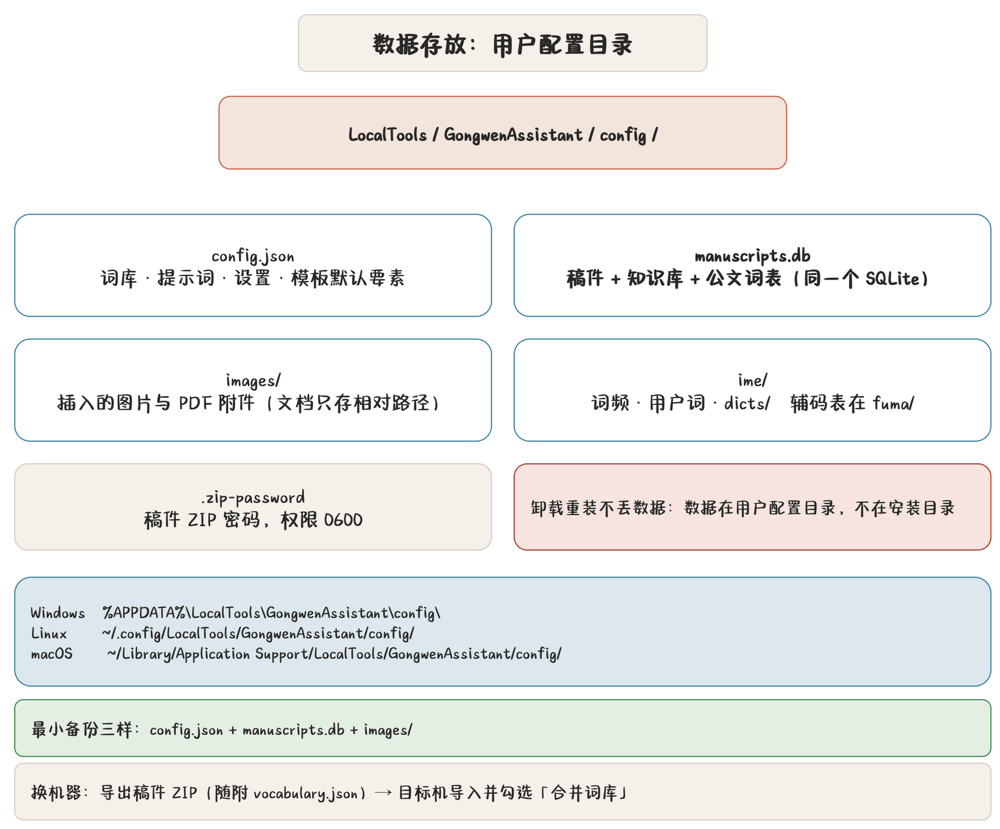

## 数据都在哪

程序的所有数据在**系统配置目录**的 `LocalTools/GongwenAssistant/` 下：

| 内容 | 路径 | 说明 |
|---|---|---|
| 配置 | `config/config.json` | 词库、提示词、设置、模板默认要素 |
| 稿件库 + 知识库 + 公文词表 | `config/manuscripts.db` | **三者共用一个 SQLite 文件** |
| 记住的 ZIP 密码 | `config/.zip-password` | Unix 权限 0600 |
| 插入的图片与 PDF 附件 | `config/images/` | 唯一命名，文档存相对路径 |
| 输入法学习数据 | `config/ime/` | 词频、用户词 |
| 输入法附加词库 | `config/ime/dicts/` | 公文词表导出的 |
| 辅码表 | `config/ime/fuma/` | 自己导入的 |
| 检查器埋点 | 单独文件，不进 config.json | 只留本机 |

各平台典型位置：

| 平台 | 配置目录 |
|---|---|
| Windows | `%APPDATA%\LocalTools\GongwenAssistant\config\` |
| Linux | `~/.config/gongwenassistant/` |
| macOS | `~/Library/Application Support/LocalTools/GongwenAssistant/config/` |

> **提示** 程序内置配置文件在**用户配置目录**，不在安装目录。所以卸载重装**不丢数据**——除非你主动删配置目录。

## 随包资源 vs 用户数据

| 随包（装在程序目录） | 用户（在配置目录） |
|---|---|
| 公文字体（`font/`） | config.json |
| TeX 版式类（`gonghan-gwa.cls`、`ulem.sty`） | manuscripts.db |
| 输入法词典（`runtime/ime/dict.qj`） | images/ |
| 整句模型（`runtime/ime/lm.qj`，可选 44 MB） | ime/ 学习数据 |
| 便携 TeX 运行时（`runtime/`，部分平台） | |

卸载时随包资源随程序走，用户数据留下。

## 输入法数据

| 文件 | 必需 | 说明 |
|---|---|---|
| `runtime/ime/dict.qj` | 是 | 程序词典，随包 |
| `runtime/ime/lm.qj` | 否 | 整句模型 44 MB，缺了只是长句能力退化 |
| `config/ime/` | — | 学习数据：词频、用户词 |
| `config/ime/dicts/` | — | 附加词库（公文词表导出的） |
| `config/ime/fuma/` | — | 辅码表，**自己导入** |

辅码表**不随包**：权利归方案作者，上游未获再分发授权。设置页自己导。

## 备份建议

### 最小备份（日常）

只备份**配置目录**：

- `config.json`（词库、提示词、模板默认要素）；
- `manuscripts.db`（稿件、版本、知识库、公文词表）；
- `images/`（稿件里引用的图片）。

这三样齐了，换机器就能完整恢复。

### 完整备份

配置目录整目录 + `config/ime/`（学习数据）。输入法学习数据丢了不致命，但重学要时间。

### 单篇迁移

用**稿件 ZIP**：可设密码，**随附完整标准词库**（`vocabulary.json`）。目标机导入时默认勾「合并包内标准词库到本机」，按层级编码/姓名增量合并，**不覆盖**已有的。

见 [稿件管理](chapter:19-manuscripts)。

### 词库单独备份

「标准词库」页「导出 Excel」存一份。注意 Excel **导入暂不支持**校对词表（那边带条件与正则，Excel 表达不全）；校对词表导出 Excel 只作备份与分发。

## 换机器

推荐流程：

1. 源机：导出**稿件 ZIP**（勾记住密码方便）；
2. 源机：「标准词库」导出 Excel 双保险；
3. 目标机：装好程序（含运行时）；
4. 目标机：导入 ZIP（勾合并词库）；
5. 目标机：核对标准词库（合并是增量的，不会覆盖你目标机已有的）；
6. 配置项重设一遍（模型接口地址等是本机的）。

## 配置示例

`config.example.json` 是**配置模板**（示例），不是你的实际配置。想看配置结构、想手工改配置，参照它。

`config.json` 与 `.env*` **不入库**（示例配置 `config.example.json` 是模板）。

> **警告** `config.json` 里有你的**完整标准词库（含人员电话）**。分享配置文件前先删敏感字段，或只分享 `config.example.json` 这类模板。

## 便携 TeX 运行时

TeX 编译用**内置 Tectonic**，离线可用。部分平台带便携 TeX 运行时（`runtime/`），不依赖系统装 TeX。

| 产物 | 编译方式 |
|---|---|
| 公文 PDF | `texcompile::compile_pdf_with_proof` |
| 研究报告 PDF | `texcompile::compile_research_pdf` |

拿 `.tex` 到别的机器编译：目标机装 TeX（Tectonic 或 TeX Live）+ 同名字体，就能复现。源码包 `.zip` 里带了字体配置与图片。

## 清理

| 想清 | 怎么做 |
|---|---|
| 孤儿图片 | 删除稿件时**自动清理**（只清仅被该稿引用的） |
| 输入法学习数据 | 删 `config/ime/`（不影响程序运行） |
| 检查器埋点 | 删埋点文件 |
| 全部数据 | 删整个配置目录（**不可逆**） |

> **警告** 删配置目录 = 删全部稿件、词库、知识库。删之前确认备份在手。

## 隐私

- **不联网**：模型接本机 LM Studio / Ollama，稿子不上传；
- **埋点只留本机**：检查器使用统计单独存文件，不上传；
- **ZIP 密码**记在本机权限受限文件；
- 「关于」里那句话是认真的：**本软件为内部使用工具，所有数据仅保存在本机。**
