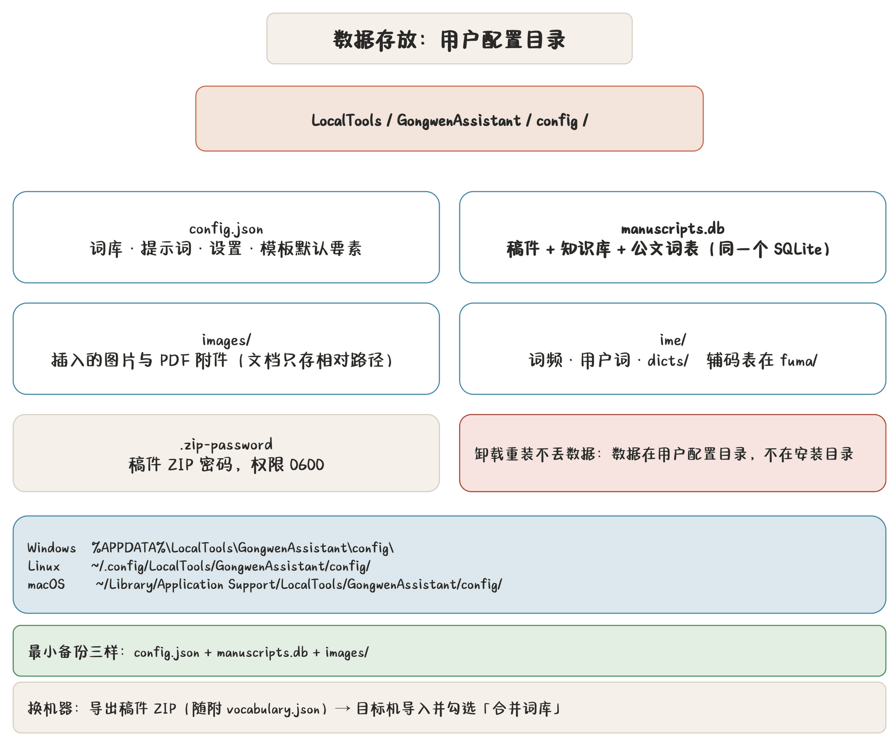

## 数据都在哪

程序的所有数据在**系统配置目录**的 `LocalTools/GongwenAssistant/` 下：

| 内容 | 路径 | 说明 |
|---|---|---|
| 配置 | `config/config.json` | 词库、提示词、设置、模板默认要素 |
| 稿件库 + 知识库 + 公文词表 | `config/manuscripts.db` | **三者共用一个 SQLite 文件** |
| 记住的 ZIP 密码 | `config/.zip-password` | Unix 权限 0600 |
| 插入的图片与 PDF 附件 | `config/images/` | 唯一命名，文档存相对路径 |
| 输入法基础表与个人词表 | `config/ime/` | 基础表、导入表、个人词条、排序与屏蔽 |
| 检查器埋点 | 单独文件，不进 config.json | 只留本机 |
| 数据接口配置 | `config/apis/` | 每个服务一份 OpenAPI，接口配置的真身 |
| 各服务的服务器地址 | `config/api-envs.json` | 一个服务一份地址 |
| 密钥名与值 | `config/api-secrets.json` | 只存在本机，不导出、不发给模型 |
| 接口测试记录 | `config/api-tests.json` | 只存用例结论与配置指纹，**不存返回内容** |

公文引用快照保存在本篇 Markdown 中，随稿件与历史版本入库，无需另拷引用数据库。
换机器使用稿件库离线 ZIP；单篇就能携带引用信息，同时带走来源稿件即可恢复来源查看。
普通 Markdown 主文件与外部复制只保留展开文字，继续管理引用应使用源码包的
`-可编辑.md` 或离线稿件 ZIP。

各平台典型位置：

| 平台 | 配置目录 |
|---|---|
| Windows | `%APPDATA%\LocalTools\GongwenAssistant\config\` |
| Linux | `~/.config/gongwenassistant/` |
| macOS | `~/Library/Application Support/LocalTools/GongwenAssistant/config/` |

> **提示** 程序内置配置文件在**用户配置目录**，不在安装目录。所以卸载重装**不丢数据**——除非你主动删配置目录。

## 随包资源 vs 用户数据

| 随包（装在程序目录） | 用户（在配置目录） |
|---|---|
| 公文字体（`font/`） | config.json |
| 排版模板（编进程序） | manuscripts.db |
| 初始基础词表（`runtime/ime/base.txt`） | ime/ 基础表与个人词表 |
| 研究报告字体（`runtime/fonts/`） | |

卸载时随包资源随程序走，用户数据留下。

## 输入法数据

`config/ime/base.txt` 是当前基础表，`base.previous.txt` 保留上次基础表；
`tables.json` 保存导入的公文表、个人词条、屏蔽与顺序。
备份时保存整个 `ime/` 目录，也可在词表管理中导出最终词表与个人备份。
旧 `dict.qj`、`lm.qj` 与拼音学习数据不再使用。

## 备份建议

### 最小备份（日常）

只备份**配置目录**：

- `config.json`（词库、提示词、模板默认要素）；
- `manuscripts.db`（稿件、版本、知识库、公文词表）；
- `images/`（稿件里引用的图片）；
- `apis/`（数据接口配置）；
- `api-envs.json`（各服务的服务器地址）；
- `api-secrets.json`（密钥名与值）；
- `api-tests.json`（用例结论与配置指纹）。

前四样齐了，换机器就能完整恢复；要用数据接口，后四样也一起带上。

> **注意** **密钥不导出**：「导出为 OpenAPI…」出来的文件里既不带密钥，也不带本机环境地址。换机器后密钥要在目标机重新填。

### 完整备份

配置目录整目录 + `config/ime/`（学习数据）。输入法学习数据丢了不致命，但重学要时间。

### 单篇迁移

用**稿件 ZIP**：可设密码，**随附完整标准词库**（`vocabulary.json`）。目标机导入时默认勾「合并包内标准词库到本机」，按层级编码/姓名增量合并，**不覆盖**已有的。

见 [稿件管理](chapter:19-manuscripts)。

### 词库单独备份

「标准词库」页「导出 Excel」存一份。注意 Excel **导入暂不支持**校对词表（那边带条件与正则，Excel 表达不全）；校对词表导出 Excel 只作备份与分发。

## 换机器

推荐流程：

1. 源机：导出**稿件 ZIP**（勾记住密码方便）；
2. 源机：「标准词库」导出 Excel 双保险；
3. 目标机：装好程序（含运行时）；
4. 目标机：导入 ZIP（勾合并词库）；
5. 目标机：核对标准词库（合并是增量的，不会覆盖你目标机已有的）；
6. 配置项重设一遍（模型接口地址等是本机的）。

## 配置示例

`config.example.json` 是**配置模板**（示例），不是你的实际配置。想看配置结构、想手工改配置，参照它。

`config.json` 与 `.env*` **不入库**（示例配置 `config.example.json` 是模板）。

> **警告** `config.json` 里有你的**完整标准词库（含人员电话）**。分享配置文件前先删敏感字段，或只分享 `config.example.json` 这类模板。

## PDF 排版

PDF 由程序内置的 **Typst** 引擎直接排版，公文与研究报告都是，完全离线，不依赖本机装任何排版软件。版式模板编进程序本体；字体来自程序目录下的 `runtime/fonts/`（公文另可在设置里换本机字体）。

## 清理

| 想清 | 怎么做 |
|---|---|
| 孤儿图片 | 删除稿件时**自动清理**（只清仅被该稿引用的） |
| 输入法学习数据 | 删 `config/ime/`（不影响程序运行） |
| 检查器埋点 | 删埋点文件 |
| 数据接口配置 | 删 `config/apis/`（接口定义没有了） |
| 密钥 | 删 `config/api-secrets.json` |
| 全部数据 | 删整个配置目录（**不可逆**） |

> **提示** `apis.json.bak` 是旧版自动迁移时留下的备份，**程序不再读取**。接口迁到 `apis/` 之后它就没用了，可以删。

> **警告** 删配置目录 = 删全部稿件、词库、知识库。删之前确认备份在手。

## 隐私

- **不联网**：模型接本机 LM Studio / Ollama，稿子不上传；
- **埋点只留本机**：检查器使用统计单独存文件，不上传；
- **ZIP 密码**记在本机权限受限文件；
- 「关于」里那句话是认真的：**本软件为内部使用工具，所有数据仅保存在本机。**
