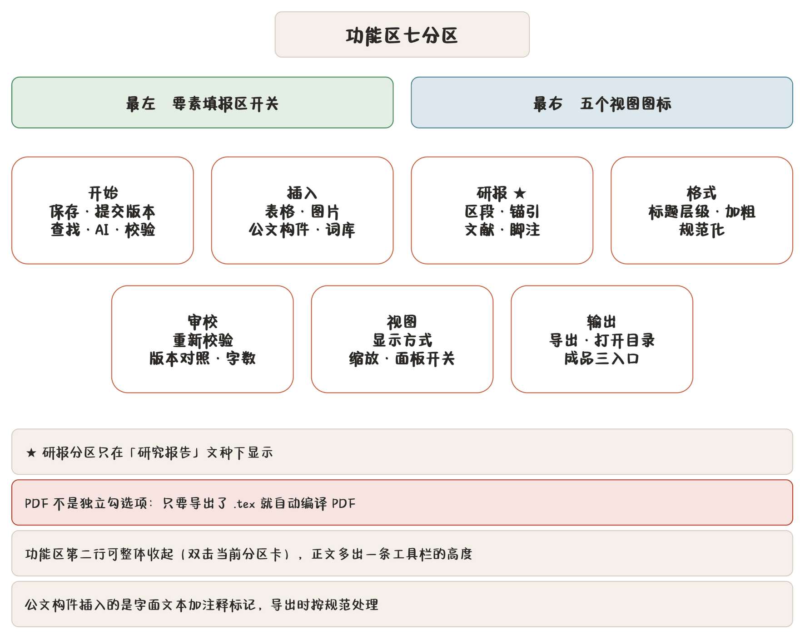

## 功能区七分区

功能区（Ribbon）分七张分区卡，左端常驻**文档要素填报区开关**，右端常驻五个视图模式图标。第二行可整体收起。

| 分区 | 含什么 |
|---|---|
| 开始 | 保存、提交版本、查找替换、AI 起草与优化、规则校验 |
| 插入 | 表格、图片、正文与附件标记、词库词条、日期与符号 |
| 研报 | **仅研究报告显示**：区段标记、锚点、交叉引用、文献引用、脚注、表题 |
| 格式 | 标题层级、加粗、项目符号、居中 / 居右，引号与空行的规范化 |
| 审校 | 重新校验、版本对照、查找替换、字数统计 |
| 视图 | 显示方式、预览缩放、各面板开关 |
| 输出 | 按格式导出、打开输出目录与最近一次成品 |

## 开始

| 按钮 | 做什么 |
|---|---|
| 保存 | 写回稿件库（`Ctrl+S`），未保存时按钮带小圆点 |
| 提交版本 | 把当前内容固化成带名称与备注的版本 |
| 查找替换 | 打开查找条（`Ctrl+F`） |
| AI 起草 | 打开 AI 起草工作台（五种工作流） |
| AI 优化 | 按选中提示词润色正文，出**修订建议** |
| 规则校验 | 重新跑要素校验与词表复扫 |

「AI 优化」点开是提示词选择面板，可以另写**临时提示词 / 临时素材**，用完即弃，不进提示词库。见 [AI 优化、提示词与文字复核](chapter:14-ai-polish)。

## 插入

### 表格与图片

- **表格**：插入 `|` 管道表骨架，光标停在首行填表头。表格在版式里按公文表格规则排，跨页续表。
- **插入序号表格**：插一张带 `<!-- [序号表] -->` 标记的表：首列编号、分组行的整行合并与靠左都由程序生成（见 [拟稿：源码编辑与五种视图](chapter:06-editor)）。列数取下拉里设的「列」。
- **设为 / 取消序号表格**：光标在表格里时可用。在表格上方加/删标记行，把现成的表格转成序号表格或转回来。
- **图片**：弹文件框多选，支持 PNG / JPG / WebP / BMP / GIF 与 **PDF 附件**。选中文件复制进配置目录 `images/`，文档里存相对路径 `images/xxx.png`。图片**必须独占一行**，插入时自动补空行保证。

PDF 附件是特殊的一等公民：预览取第一页光栅化后画在版心里，导出仍按原矢量嵌入。删除稿件时只清理由该稿件单独引用的孤儿图片，别的稿件还在用的一律保留。

### 公文构件

| 按钮 | 插入 | 用途 |
|---|---|---|
| 正文标记 | `<!-- [正文] -->` | 标出正文区段 |
| 附件标记 | `<!-- [附件] -->` | 标出附件区段 |
| 今日日期 | 中文数字日期 | 成文日期标准写法 |
| 中文引号 | 「」 | 避免半角引号 |
| 待核实 | `【待核实】` | 占位，待落实 |

### 词库词条

从标准词库插入单位全称、人名、电话。插的是**规范写法**，写错的话校对词表会拦。

### 日期与符号

常用公文符号（书名号、顿号、破折号、省略号等）与日期格式的快捷插入。

## 研报分区

只在**研究报告**文种显示。见 [研究报告专章](chapter:08-research)。

## 格式

| 按钮 | 做什么 |
|---|---|
| 标题层级 | 提升/降低当前行标题级别，改 `#` 数量 |
| 加粗 | `**粗体**`（`Ctrl+B`） |
| 项目符号 | 转成 `- ` 或 `1. ` |
| 居中 / 居右 | 在选中的几行（或光标所在行）上方插 `<!-- [居中] -->` / `<!-- [居右] -->`，后面紧跟正文时自动补一个空行收住；光标在区内时按钮亮起，再点一次取消，点另一个就改对齐方式 |
| 规范化 | 把半角引号换全角、整理空行，一次清一遍 |

「规范化」是确定性文本替换，不走模型，可放心多点。

## 审校

| 按钮 | 做什么 |
|---|---|
| 重新校验 | 重跑要素校验、词表与规则复扫 |
| 版本对照 | 打开版本对照窗 |
| 查找替换 | 同开始分区 |
| 字数统计 | 正文字数、段落数、表格数 |

## 视图

切换五种显示模式、预览缩放，以及**文档要素填报区、版本历史抽屉、审校提示抽屉**三个面板的开关。刻度条导航的开关也在这里。

## 输出

三个成品入口（TEX / PDF / WORD 图标）配合导出按钮：

- **导出**：按「输出」勾选生成 md / docx / tex，自动编译 PDF；
- **打开输出目录**：定位到本次导出的子文件夹；
- **打开成品**：三个图标按主干名前缀在输出目录里找最近一次产出，找到就点亮，点了直接打开。

> **注意** PDF **不是独立勾选项**：只要有 `.tex` 生成出来就自动编译 PDF。所以「只勾 DOCX」时不会出 PDF，「勾 TeX」时一定出 PDF。这是有意的——公文的 PDF 必须由 TeX 链路排版，不能从 Word 转。

完整导出规则见 [导出、打印与文件命名](chapter:11-export)。
