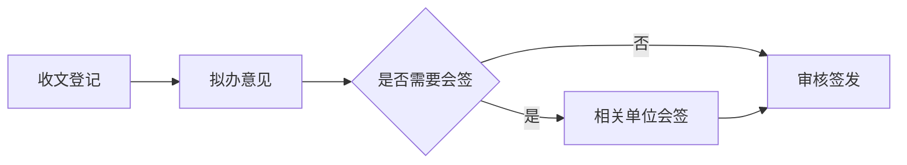

# Mermaid 图表：公文与研究报告的版式及接入方案

## 当前进度与边界

图种已接入五种：flowchart / graph（含泳道分组）、sequenceDiagram、gantt、pie、
timeline，全部由 merman 0.7 渲染（Rust 原生，不依赖 Node.js / Chromium；与 Zed
编辑器 Markdown 预览用的是同一个引擎）。曾经把序列、甘特、饼、时间线交给第二个
引擎 mermaid-rs-renderer，两套引擎的配色、线宽、标题字号各成一路，已撤掉，
只留 merman 一套主题。

配色五选一（见「样式」），字体字号随文种固定。泳道图用 `subgraph` 分组表达；
饼图中文扇区名要加英文引号（`"人员经费" : 45`）。与 Mermaid.js 的语法及像素
排版不保证完全一致。

**桑基图与雷达图**曾经接通过，但版式不成熟：桑基的节点柱过细、标签压链路，
单源图退化成色柱；雷达轴标签贴边、网格无刻度读数，与公文版式差距大。这两图种
在 check 里明确拒绝并提示后续开放；merman 本身支持，重新开放时照下文「各图种
统一」的做法补作用域 CSS 即可。

## 用户写法

围栏独占一块，前后与正文空行隔开。图题紧跟结束围栏的下一行，中间不留空行，
以免误连到另一张图；它不写入图形内部，由文种规则排版。研究报告的锚点写在图题
行尾；无图题的图不编号。

````markdown

图：公文办理流程 {#fig:banli-liucheng}

办理顺序见图 {@fig:banli-liucheng}。
````

公文里的图题写 `图：公文办理流程`，不使用 `{#fig:...}` 或 `{@fig:...}`；研究报告
沿用已有图编号和交叉引用规则。图形语义由 `mermaid` 围栏标识，不借用图片路径，也不把
图题、图号写进 Mermaid 节点。围栏内的 `%%{init}%%`、`click` 和 HTML 标签
首期拒绝，避免单图覆盖统一版式或引入外部资源。解析失败时预览显示占位提示；
导出报围栏起始行号与错误。

## 样式

配色与文种排版分成两根轴：**配色**由用户在菜单「图表样式」或设置页「外观」里选，
存在 `AppConfig::diagram_theme`（`DiagramTheme`），全局生效；**字体、字号、线宽**
随文种固定，不开放给单张图。所有配色白底、不用红色（红色留给红头、套红与修订标记），
颜色只帮着分层，黑白打印时靠线框与形状仍可读。

| 样式 | 节点填色 / 边框 | 连线 | 判断框 | 分组框 |
| --- | --- | --- | --- | --- |
| 墨线 | `#FFFFFF` / `#1A1A1A` | `#262626` | 白 | 白底、`#808080` 虚线 |
| 素灰 | `#F2F2F2` / `#4D4D4D` | `#5C5C5C` | `#E1E1E1` | `#FAFAFA`、`#A6A6A6` 虚线 |
| 藏青 | `#EAF0F7` / `#1F3A5F` | `#3E5674` | 米黄 `#FBF2DE` | `#F6F8FB`、`#8EA3BB` 虚线 |
| 青瓷 | `#E6F1ED` / `#2E6A5A` | `#4A7668` | 米白 `#F6F2E6` | `#F4F8F6`、`#90B3A7` 虚线 |

「按文种自动」（默认）：公文用墨线，研究报告用藏青。分类色一律浅中调：亮色靠色相
区分、深色只做锚点，目前只有饼图扇区按分类色循环。

| 项目 | 公文 | 研究报告 |
| --- | --- | --- |
| 文字 | 随包仿宋（`FangSong_GB2312`），小四 12 pt | 随包方正黑体（缺时退黑体），五号 10.5 pt |
| 线宽 | 边框 1.0 pt，连线 0.9 pt | 边框 0.75 pt，连线 0.65 pt |
| 连线 | 直线段（`curve: linear`） | 同左 |
| 间距 | `nodeSpacing` 28、`rankSpacing` 32、`padding` 12 | 同左 |
| 图题 | 图下方居中，不自动编号 | 图下方居中，沿用章节图号与交叉引用 |

配色经 merman 的 `HostThemeProfile`（角色色 + 作用域 CSS）注入，`htmlLabels` 关闭，
不产生 `foreignObject`。围栏内的 `%%{init}%%`、`click` 和 HTML 标签一律拒绝，
单张图改不了统一版式；`<-->` 这类箭头写法不受影响。

### 各图种统一

所有图种共用一个 `HostThemeProfile`，规则是：**框**一律节点线宽 + 主色边框，
**线**一律连线线宽 + 线色，**标题**比正文大一档（20 px 排版），**刻度与连线标签**与正文同号。

| 图种 | 做法 |
| --- | --- |
| 序列 | 角色框同流程节点；备注用判断框的强调色；`loop` 等分组框同子图的浅色虚线框；`loop` / `alt` 角标固定显示“循环” / “条件”，用户条件说明保留原文 |
| 甘特 | 任务条同流程节点；进行中（`active`）、关键（`crit`）用强调色——Mermaid 默认关键任务填红，这里不用；已完成（`done`）退成分组框浅底；网格线用分组框浅色细线；「今天」竖线随渲染日期漂移，纸面上无意义，缓存也会过期，一律隐藏 |
| 甘特宽度 | Mermaid 默认按 1184 px 铺开，落进版心要缩成五六号字；`useWidth` 取版心宽换算的排版 px，字号与其他图一致。刻度默认只写 `月-日`（`%m-%d`），围栏里写了 `axisFormat` 以围栏为准 |
| 饼 | 图例在下方横排，超宽自动换行；扇区几何缩至原直径的 62%，文字不随之缩小；扇区按分类色循环（`series_palette` → `pie1…`），不叠透明度；描边同节点线宽 |
| 时间线 | 分段标题框用强调色、分期框用主色、事件框白底，都带主色边框；去掉 Mermaid 按分段上色的彩色底线；主轴与虚线同线色、线宽；左侧 150 px 留白收到 40 px |

作用域 CSS 里用到的类名（`.timeline-node`、`.taskWrapper`、`.grid .tick`、
`.today`、`.loopLine` 等）是 merman 0.7 的 SVG 结构，升级 merman 时要重跑
`every_theme_renders_sample` 核对样图。

## 尺寸：字号不随图变

merman 先按 18 px 排版（它的固定几何留白在中文字号下较为紧凑），再整体缩放到目标字号，
摆到一块**画布**上：

- 公文：画布恒为版心宽 156 mm。公文 TeX 写 `width=\textwidth`、Word 按版心宽封顶，
  图片铺满画布时图内文字正好是小四。图高最多为版心高的 70%；超宽、超高缩小后继续显示，并警告实际字号低于要求，建议调整方向、缩短节点或拆图。
- 研究报告：与公文一样采用版心宽画布，高度就是原图按五号字换算后的高度。
  缓存文件使用 `gongwen-mermaid-canvas-` 前缀，预览、mdx 的 TeX 与 DOCX 按该前缀
  识别已排版的画布，直接使用版心宽，不再套用普通插图的面积分档。前缀随导出复制
  到 `figures/` 后仍保留。图高仍限制为版心高的 60%，放不下时缩小后显示并警告字号低于要求。
  样式版本已更新，旧的带底部补白的缓存不会再被使用。

以前各导出器按面积或满宽拉伸，三个节点的小图字被放大两三倍，竖长图在公文 TeX 里
还会高过版心；画布法把这些都收住了，也不必改 mdx。

## 中文排版优化（2026-09-30）

先用内置 imagegen 生成设计参考，再把字号、留白与线型落实到原生渲染。
本地参考图位于 `output/mermaid-design/design-reference.png`（生成物，不提交）。
设计方向：公文采用仿宋墨线，研究报告采用黑体浅藏青与米黄判断框；白底、
细线、清楚的分支标签，保持现有四套可选配色与黑白打印辨识度。

- 图中普通文字、角色、备注、分支标签、图例、百分比及日期刻度统一按文种字号；
  标题略大。除主题配置外，作用域 CSS 覆盖引擎内置的小号刻度。
- 流程节点内边距增至 12 px，节点间距 28 px、层间距 32 px，分组标题上方 6 px、
  下方 14 px；Markdown 节点折行宽度设为 216 px。普通节点的长中文标签仍建议简写，
  不保证引擎会按汉字自动折行。
- 序列角色框高 48 px、角色间距 36 px、消息间距 32 px，取消底部重复角色；
  甘特任务条高 32 px、行间距 10 px，左侧标签区 132 px、右侧留白 64 px。
  日期刻度按真实字宽疏排，网格仍保留；自定义 `axisFormat` 同样参与字宽测量。
- 不改变稿件指定的流程方向。多环节建议 `flowchart TD` / `TB`；纸面放不下时，
  预览与导出均保留缩小后的完整图形，并提示估算字号与要求字号，建议调整或拆图。原稿的图形源码保留。
- 研究报告画布不补底部空白，通过专用画布尺寸规则保证字号与紧凑的图题间距。
  超长图仍需拆分，当前不自动分页。

验收样例覆盖五种图、四种配色与按文种自动配色、两种文种和 PNG/PDF；
饼图图例横排、直径缩至 62%，文字保持原字号；时间线压缩纵向几何并以实际绘制边界裁掉外围空白，标题居中。
另外读取最终 SVG 中每段文字的计算字号和绝对变换，核对实际纸面字号下限。

## 数据与渲染链

```text
Markdown Mermaid 围栏 + 可选图题／锚点
  → 解析器：MarkdownBlock::Diagram { 源码、图题 }，源码范围覆盖整块；
    没有结束围栏时不认成图，免得后文从预览里消失
  → 围栏首行核对图种白名单
  → merman 0.7：配色（DiagramTheme）+ 分类色 + 作用域 CSS + 文种字体
      + 真实字宽的 TextMeasurer → SVG
  → 按文种算画布，嵌入 SVG
      ├─ 预览：300 DPI PNG，与 Word 共用一份缓存
      ├─ TeX／PDF：svg2pdf 单页矢量 PDF（1 单位 = 1 pt），\includegraphics 引入
      └─ DOCX：300 DPI PNG，docx-rs 嵌图
```

- **字体**：PNG / PDF 都用随包字体建的同一个 `fontdb`（进程内只建一次），
  Windows 与麒麟上字形、换行一致；没有 runtime 字体目录时才退到系统字体。
- **字宽**：merman 自带的量法按西文字体字宽表估，仿宋会估窄（字撑出菱形）、
  黑体会估宽。`FontMeasurer` 改用同一支字体的真实字宽，行高与折行仍交给 merman。
- **缓存**：`config_dir()/mermaid-cache/`，键为样式版本 + 引擎版本 + 文种 +
  配色 + 源码，扩展名区分格式；先写临时文件再改名，预览与导出并发不会读到半截。
  渲染失败的源码记在内存里，预览不必每帧重排。换配色即换文件名，预览下一帧重画。
- 研究报告导出时把图块换成 `{#锚点}` 交给 `mdx::convert`，复用
  它的图号、`\caption`、`\label` 与 Word 图题；公文换成图片行，图题排成居中行并在
  其后补空行，避免把紧跟的正文一起居中。

### 已知不足与后续

- 预览在界面线程同步渲染；源码每改一次就排一次，复杂图打字时可能卡顿，后续应把
  渲染挪到后台线程、渲染中显示占位。
- 缓存只增不减，编辑途中每个能排出来的中间态都会留一张图，后续需要按时间清理。
- 花脸稿里改动过的图按新版原样显示，看不出图内哪里变了；删掉的图显示为占位文字。
- 红头呈批件的纸面预览沿用图片的做法，只显示「〔图表：图题〕」占位，导出才有图。
- 时间线纵向几何压缩至 80%，文字反向补偿保持字号，标题居中；按实际绘制边界裁去外围留白。多行标签仍需检查是否拥挤。
- 饼图复用引擎扇区，单独缩小几何，图例横排并换行；极多分类仍建议拆图。

## 原生 Rust 引擎与落地顺序

优先验证 [`merman`](https://github.com/Latias94/merman)：它在 Rust 进程中解析、布局并
输出 SVG，按 feature 可输出 PNG/PDF，无需 Node.js 或 Chromium；还提供可取消请求、
资源上限与宿主文字宽度测量接口。它与官方 Mermaid.js 并非逐像素相同，尤其要核对
中文字宽、HTML 标签、复杂子图与箭头。选型已定为 merman（Zed 编辑器同款），
曾并用的 mermaid-rs-renderer 因两套主题风格不一已撤掉。
`merman` 的仓库主线 API 与已发布稳定版可能不同；原型须先锁定具体版本，当前项目
Rust 1.97.1 满足其稳定版文档标出的最低 1.95，但仍需实际编译验证。

使用 Rust 原生引擎后，Windows x64 与 Linux ARM64 可以把渲染能力编入应用，不需要
随包分发浏览器。预览、TeX 和 Word 仍从同一 SVG 派生；可用引擎自带的 PNG/PDF
目标，或使用纯 Rust 的 `resvg`、`svg2pdf` 转换。所选路径必须确保图中的中文字体
能被正确测量、嵌入或转曲，并在两平台上保持相同的换行与节点尺寸。

1. 先做原生渲染原型：同一套中文样稿逐一测 `merman` 与备选引擎的四种首期图型，
   核对所选主题、中文字宽、长图、判断菱形、线标签与 SVG→PDF/PNG。
   在 Windows x64 和 Ubuntu 20.04 ARM64 安装测试环境中验证离线构建及运行。
2. 加统一图块解析、源码范围和错误定位；同步 `skills/gongwen-markdown/` 语法文档与
   程序帮助，避免把围栏错误地计入正文或修订建议。
3. 接预览与缓存，再接公文 TeX/DOCX，最后接研究报告的 mdx 图号与交叉引用。
4. 用一份中文流程图做三端版式核对，并检查稿件备份、源码包、缺字、分页和重复锚点。

验收标准：断网安装后可从围栏预览并导出；同一图的节点、连线、字号与图题在预览、
PDF、Word 中一致；源码语法错误能定位到围栏；导出不丢图；黑白打印仍能辨识节点。

## 外部依据

- Mermaid 官方主题说明：<https://mermaid.js.org/config/theming>
- Mermaid CLI 官方说明：<https://github.com/mermaid-js/mermaid-cli/blob/master/README.md>
- Merman 原生渲染说明：<https://github.com/Latias94/merman>
