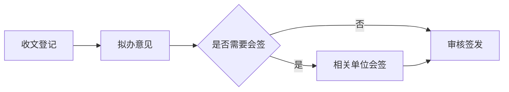

# Mermaid 图表：公文与研究报告的版式及接入方案

## 当前进度与边界

图种已接入七种（Rust 原生，不依赖 Node.js / Chromium）：

- **flowchart / graph**（含泳道分组）：merman 0.7 渲染；
- **sequenceDiagram / gantt / pie / sankey-beta / timeline / radar-beta**：
  mermaid-rs-renderer 0.2.2 渲染（merman 0.7 只支持流程图，甘特等五种由第二个
  纯 Rust 引擎承担，按围栏首行路由）。

配色五选一（见「样式」），字体字号随文种固定。泳道图用 `subgraph` 分组表达；
雷达的轴与曲线直接写中文名（`axis 政治素质, 业务能力`），不要用
`axis a["标签"]` 的 merman 语法；饼图中文扇区名要加英文引号
（`"人员经费" : 45`）。与 Mermaid.js 的语法及像素排版不保证完全一致。

## 用户写法

围栏独占一块，前后与正文空行隔开。图题紧跟结束围栏的下一行，中间不留空行，
以免误连到另一张图；它不写入图形内部，由文种规则排版。研究报告的锚点写在图题
行尾；无图题的图不编号。

````markdown

图：公文办理流程 {#fig:banli-liucheng}

办理顺序见图 {@fig:banli-liucheng}。
````

公文里的图题写 `图：公文办理流程`，不使用 `{#fig:...}` 或 `{@fig:...}`；研究报告
沿用已有图编号和交叉引用规则。图形语义由 `mermaid` 围栏标识，不借用图片路径，也不把
图题、图号写进 Mermaid 节点。围栏内的 `%%{init}%%`、`click` 和 HTML 标签
首期拒绝，避免单图覆盖统一版式或引入外部资源。解析失败时预览显示占位提示；
导出报围栏起始行号与错误。

## 样式

配色与文种排版分成两根轴：**配色**由用户在菜单「图表样式」或设置页「外观」里选，
存在 `AppConfig::diagram_theme`（`DiagramTheme`），全局生效；**字体、字号、线宽**
随文种固定，不开放给单张图。所有配色白底、不用红色（红色留给红头、套红与修订标记），
颜色只帮着分层，黑白打印时靠线框与形状仍可读。

| 样式 | 节点填色 / 边框 | 连线 | 判断框 | 分组框 |
| --- | --- | --- | --- | --- |
| 墨线 | `#FFFFFF` / `#1A1A1A` | `#262626` | 白 | 白底、`#808080` 虚线 |
| 素灰 | `#F2F2F2` / `#4D4D4D` | `#5C5C5C` | `#E1E1E1` | `#FAFAFA`、`#A6A6A6` 虚线 |
| 藏青 | `#EAF0F7` / `#1F3A5F` | `#3E5674` | 米黄 `#FBF2DE` | `#F6F8FB`、`#8EA3BB` 虚线 |
| 青瓷 | `#E6F1ED` / `#2E6A5A` | `#4A7668` | 米白 `#F6F2E6` | `#F4F8F6`、`#90B3A7` 虚线 |

「按文种自动」（默认）：公文用墨线，研究报告用藏青。分类色按图种取：饼图扇区、
桑基节点、雷达曲线直接用分类色序列，时间线分区由主色派生。

| 项目 | 公文 | 研究报告 |
| --- | --- | --- |
| 文字 | 随包仿宋（`FangSong_GB2312`），小四 12 pt | 随包方正黑体（缺时退黑体），小五 9 pt |
| 线宽 | 边框 1.0 pt，连线 0.9 pt | 边框 0.75 pt，连线 0.65 pt |
| 连线 | 圆角折线（`curve: rounded`） | 同左 |
| 间距 | `nodeSpacing` 30、`rankSpacing` 38、`padding` 8 | 同左 |
| 图题 | 图下方居中，不自动编号 | 图下方居中，沿用章节图号与交叉引用 |

配色经 merman 的 `HostThemeProfile`（角色色 + 作用域 CSS）注入，`htmlLabels` 关闭，
不产生 `foreignObject`。围栏内的 `%%{init}%%`、`click` 和 HTML 标签一律拒绝，
单张图改不了统一版式；`<-->` 这类箭头写法不受影响。

mermaid-rs-renderer 一路的配色在 Rust 里直接配它的 `Theme`（主色、线色、序列角色、
饼图扇区等），另外两处引擎写死的调色板在 SVG 成串替换：

- 桑基节点色板（含红/粉）→ 当前配色的分类色，链路透明度 0.5 → 0.85；
- 雷达曲线 `hsl(固定色相, 100%, 76.27%)` → 分类色。

替换常量随 mermaid-rs-renderer 0.2.2 锁定，引擎升级必须重新核对。分类色另用于
饼图扇区（`pie_colors` 按分类色循环）与时间线分区（主色派生）。

## 尺寸：字号不随图变

merman 与 mermaid-rs-renderer 都先按 14 px 排版（它们的内边距、间距按这个字号
设计），再整体缩放到目标字号，摆到一块**画布**上：

- 公文：画布恒为版心宽 156 mm。公文 TeX 写 `width=\textwidth`、Word 按版心宽封顶，
  图片铺满画布时图内文字正好是小四。宽图缩到版心宽，长图缩到版心高的 70%。
- 研究报告：mdx 按 `figure_size` 的四档给插图定宽。`research_placement` 挑一档作
  画布宽，并用 `figure_size::width_fraction` 验证 mdx 对这块画布算出的正是这一档
  （高度 ±1% 也不变，免得 PNG 取整后跳档），于是 TeX、Word、预览都不再缩放。找不到
  时才逐步缩小，最后兜底为满宽画布。

以前各导出器按面积或满宽拉伸，三个节点的小图字被放大两三倍，竖长图在公文 TeX 里
还会高过版心；画布法把这些都收住了，也不必改 mdx。

## 数据与渲染链

```text
Markdown Mermaid 围栏 + 可选图题／锚点
  → 解析器：MarkdownBlock::Diagram { 源码、图题 }，源码范围覆盖整块；
    没有结束围栏时不认成图，免得后文从预览里消失
  → 按围栏首行路由引擎：
      ├─ merman 0.7（flowchart / graph）：
      │   配色（DiagramTheme）+ 文种字体 + 真实字宽的 TextMeasurer → SVG
      └─ mermaid-rs-renderer 0.2.2（序列 / 甘特 / 饼 / 桑基 / 时间线 / 雷达）：
          Rust 侧 Theme 配色 → SVG → 写死色板整串替换成分类色
  → 按文种算画布，嵌入 SVG
      ├─ 预览：300 DPI PNG，与 Word 共用一份缓存
      ├─ TeX／PDF：svg2pdf 单页矢量 PDF（1 单位 = 1 pt），\includegraphics 引入
      └─ DOCX：300 DPI PNG，docx-rs 嵌图
```

- **字体**：PNG / PDF 都用随包字体建的同一个 `fontdb`（进程内只建一次），
  Windows 与麒麟上字形、换行一致；没有 runtime 字体目录时才退到系统字体。
- **字宽**：merman 自带的量法按西文字体字宽表估，仿宋会估窄（字撑出菱形）、
  黑体会估宽。`FontMeasurer` 改用同一支字体的真实字宽，行高与折行仍交给 merman。
  mermaid-rs-renderer 的量宽器只认系统字体，给它与渲染同一条字体族链
  （仿宋/黑体在前、serif/sans-serif 殿后）：量宽落到系统里同度量的那支，渲染用
  随包字体，中西文都是等宽推进，两边只差拉丁字形的几个百分点，框内留白吸收。
- **缓存**：`config_dir()/mermaid-cache/`，键为样式版本 + 引擎版本 + 文种 +
  配色 + 源码，扩展名区分格式；先写临时文件再改名，预览与导出并发不会读到半截。
  渲染失败的源码记在内存里，预览不必每帧重排。换配色即换文件名，预览下一帧重画。
- 研究报告导出时把图块换成 `{#锚点}` 交给 `mdx::convert`，复用
  它的图号、`\caption`、`\label` 与 Word 图题；公文换成图片行，图题排成居中行并在
  其后补空行，避免把紧跟的正文一起居中。

### 已知不足与后续

- 预览在界面线程同步渲染；源码每改一次就排一次，复杂图打字时可能卡顿，后续应把
  渲染挪到后台线程、渲染中显示占位。
- 缓存只增不减，编辑途中每个能排出来的中间态都会留一张图，后续需要按时间清理。
- 花脸稿里改动过的图按新版原样显示，看不出图内哪里变了；删掉的图显示为占位文字。
- 红头呈批件的纸面预览沿用图片的做法，只显示「〔图表：图题〕」占位，导出才有图。
- mermaid-rs-renderer 0.2.2 的 timeline 不渲染 section 标题，阶段信息只能写进
  事件文字；雷达用中文原名，`axis a["标签"]` 语法会原样印出。
- 双引擎的语法与像素不完全一致（如序列图箭头、甘特日期轴刻度），升级任一引擎时
  要重跑 `every_theme_renders_sample` 全量样图核对。

## 原生 Rust 引擎与落地顺序

优先验证 [`merman`](https://github.com/Latias94/merman)：它在 Rust 进程中解析、布局并
输出 SVG，按 feature 可输出 PNG/PDF，无需 Node.js 或 Chromium；还提供可取消请求、
资源上限与宿主文字宽度测量接口。它与官方 Mermaid.js 并非逐像素相同，尤其要核对
中文字宽、HTML 标签、复杂子图与箭头。作为备选，
[`mermaid-rs-renderer`](https://docs.rs/mermaid-rs-renderer/latest/mermaid_rs_renderer/)
能处理候选的流程图、时序图、状态图和类图并输出 SVG/PNG，主题与布局可在 Rust 里配置，但语法覆盖要
逐例检查。两者的最终选型以固定版本实测为准，不在此时锁定某个 crate。
`merman` 的仓库主线 API 与已发布稳定版可能不同；原型须先锁定具体版本，当前项目
Rust 1.97.1 满足其稳定版文档标出的最低 1.95，但仍需实际编译验证。

使用 Rust 原生引擎后，Windows x64 与 Linux ARM64 可以把渲染能力编入应用，不需要
随包分发浏览器。预览、TeX 和 Word 仍从同一 SVG 派生；可用引擎自带的 PNG/PDF
目标，或使用纯 Rust 的 `resvg`、`svg2pdf` 转换。所选路径必须确保图中的中文字体
能被正确测量、嵌入或转曲，并在两平台上保持相同的换行与节点尺寸。

1. 先做原生渲染原型：同一套中文样稿逐一测 `merman` 与备选引擎的四种首期图型，
   核对所选主题、中文字宽、长图、判断菱形、线标签与 SVG→PDF/PNG。
   在 Windows x64 和 Ubuntu 20.04 ARM64 安装测试环境中验证离线构建及运行。
2. 加统一图块解析、源码范围和错误定位；同步 `skills/gongwen-markdown/` 语法文档与
   程序帮助，避免把围栏错误地计入正文或修订建议。
3. 接预览与缓存，再接公文 TeX/DOCX，最后接研究报告的 mdx 图号与交叉引用。
4. 用一份中文流程图做三端版式核对，并检查稿件备份、源码包、缺字、分页和重复锚点。

验收标准：断网安装后可从围栏预览并导出；同一图的节点、连线、字号与图题在预览、
PDF、Word 中一致；源码语法错误能定位到围栏；导出不丢图；黑白打印仍能辨识节点。

## 外部依据

- Mermaid 官方主题说明：<https://mermaid.js.org/config/theming>
- Mermaid CLI 官方说明：<https://github.com/mermaid-js/mermaid-cli/blob/master/README.md>
- Merman 原生渲染说明：<https://github.com/Latias94/merman>
- mermaid-rs-renderer API：<https://docs.rs/mermaid-rs-renderer/latest/mermaid_rs_renderer/>
